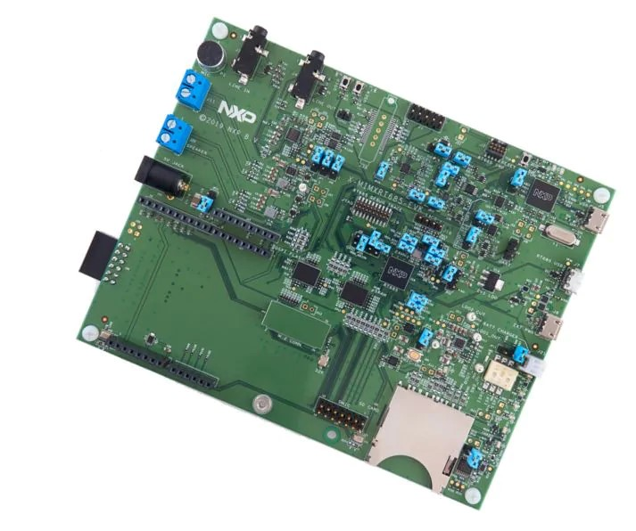

.. _mimxrt685_evk:

NXP MIMXRT685-EVK
##################

Overview
********

The i.MX RT600 is a crossover MCU family optimized for 32-bit immersive audio
playback and voice user interface applications combining a high-performance
Cadence Tensilica HiFi 4 audio DSP core with a next-generation Cortex-M33
core. The i.MX RT600 family of crossover MCUs is designed to unlock the
potential of voice-assisted end nodes with a secure, power-optimized embedded
processor.

The i.MX RT600 family provides up to 4.5MB of on-chip SRAM and several
high-bandwidth interfaces to access off-chip flash, including an Octal/Quad SPI
interface with an on-the-fly decryption engine.

Hardware
********

- MIMXRT685SFVKB Cortex-M33 (300 MHz, 128 KB TCM) core processor with Cadence Xtensa HiFi4 DSP
- Onboard, high-speed USB, Link2 debug probe with CMSIS-DAP protocol (supporting Cortex M33 debug only)
- High speed USB port with micro A/B connector for the host or device functionality
- UART, I2C and SPI port bridging from i.MX RT685 target to USB via the on-board debug probe
- 512 MB Macronix Octal SPI Flash operating at 1.8 V
- 4.5 MB Apmemory PSRAM
- Full size SD card slot (SDIO)
- NXP PCA9420UK PMIC
- User LEDs
- Reset and User buttons
- Arduino and PMod/Host expansion connectors
- NXP FXOS8700CQ accelerometer
- Stereo audio codec with line in/out and electret microphone
- Stereo NXP TFA9894 digital amplifiers, with option for external +5V power for higher performance speakers
- Support for up to eight off-board digital microphones via 12-pin header
- Two on-board DMICS

For more information about the MIMXRT685 SoC and MIMXRT685-EVK board, see
these references:

- `i.MX RT685 Website`_
- `i.MX RT685 Datasheet`_
- `i.MX RT685 Reference Manual`_
- `MIMXRT685-EVK Website`_
- `MIMXRT685-EVK User Guide`_
- `MIMXRT685-EVK Schematics`_

Supported Features
==================

The mimxrt685_evk board configuration supports the following hardware
features:

+-----------+------------+-------------------------------------+
| Interface | Controller | Driver/Component                    |
+===========+============+=====================================+
| NVIC      | on-chip    | nested vector interrupt controller  |
+-----------+------------+-------------------------------------+
| SYSTICK   | on-chip    | systick                             |
+-----------+------------+-------------------------------------+
| IOCON     | on-chip    | pinmux                              |
+-----------+------------+-------------------------------------+
| GPIO      | on-chip    | gpio                                |
+-----------+------------+-------------------------------------+
| USART     | on-chip    | serial port-polling                 |
+-----------+------------+-------------------------------------+
| I2C       | on-chip    | i2c                                 |
+-----------+------------+-------------------------------------+
| SPI       | on-chip    | spi                                 |
+-----------+------------+-------------------------------------+

The default configuration can be found in the defconfig file:

	``boards/arm/mimxrt685_evk/mimxrt685_evk_cm33_defconfig``

Other hardware features are not currently supported by the port.

Connections and IOs
===================

The MIMXRT685 SoC has IOCON registers, which can be used to configure the
functionality of a pin.

+---------+-----------------+----------------------------+
| Name    | Function        | Usage                      |
+=========+=================+============================+
| PIO0_2  | USART           | USART RX                   |
+---------+-----------------+----------------------------+
| PIO0_1  | USART           | USART TX                   |
+---------+-----------------+----------------------------+
| PIO0_14 | GPIO            | GREEN LED                  |
+---------+-----------------+----------------------------+
| PIO1_1  | GPIO            | SW0                        |
+---------+-----------------+----------------------------+
| PIO0_17 | I2C             | I2C SDA                    |
+---------+-----------------+----------------------------+
| PIO0_18 | I2C             | I2C SCL                    |
+---------+-----------------+----------------------------+
| PIO1_5  | GPIO            | FXOS8700 TRIGGER           |
+---------+-----------------+----------------------------+
| PIO1_5  | SPI             | SPI MOSI                   |
+---------+-----------------+----------------------------+
| PIO1_4  | SPI             | SPI MISO                   |
+---------+-----------------+----------------------------+
| PIO1_3  | SPI             | SPI SCK                    |
+---------+-----------------+----------------------------+
| PIO1_6  | SPI             | SPI SSEL                   |
+---------+-----------------+----------------------------+

System Clock
============

The MIMXRT685 SoC is configured to use the internal FRO at 48MHz as a source for
the system clock. Other sources for the system clock are provided in the SOC,
depending on your system requirements.

Serial Port
===========

The MIMXRT685 SoC has 8 FLEXCOMM interfaces for serial communication.  One is
configured as USART for the console and the remaining are not used.

Programming and Debugging
*************************

Build and flash applications as usual (see :ref:`build_an_application` and
:ref:`application_run` for more details).

Configuring a Debug Probe
=========================

A debug probe is used for both flashing and debugging the board. This board is
configured by default to use the LPC-Link2.

:ref:`lpclink2-jlink-onboard-debug-probe`
-----------------------------------------

Install the :ref:`jlink-debug-host-tools` and make sure they are in your search
path.

Follow the instructions in :ref:`lpclink2-jlink-onboard-debug-probe` to program
the J-Link firmware. Please make sure you have the latest firmware for this
board.

Configuring a Console
=====================

Connect a USB cable from your PC to J16, and use the serial terminal of your choice
(minicom, putty, etc.) with the following settings:

- Speed: 115200
- Data: 8 bits
- Parity: None
- Stop bits: 1

Flashing
========

Here is an example for the :ref:`hello_world` application. This example uses the
:ref:`jlink-debug-host-tools` as default.

.. zephyr-app-commands::
   :zephyr-app: samples/hello_world
   :board: mimxrt685_evk_cm33
   :goals: flash

Open a serial terminal, reset the board (press the RESET button), and you should
see the following message in the terminal:

.. code-block:: console

   ***** Booting Zephyr OS v1.14.0 *****
   Hello World! mimxrt685_evk_cm33

Debugging
=========

Here is an example for the :ref:`hello_world` application. This example uses the
:ref:`jlink-debug-host-tools` as default.

.. zephyr-app-commands::
   :zephyr-app: samples/hello_world
   :board: mimxrt685_evk_cm33
   :goals: debug

Open a serial terminal, step through the application in your debugger, and you
should see the following message in the terminal:

.. code-block:: console

   ***** Booting Zephyr OS zephyr-v2.3.0 *****
   Hello World! mimxrt685_evk_cm33

.. _MIMXRT685-EVK Website:
   https://www.nxp.com/design/development-boards/i-mx-evaluation-and-development-boards/i-mx-rt600-evaluation-kit:MIMXRT685-EVK

.. _MIMXRT685-EVK User Guide:
   https://www.nxp.com/docs/en/user-guide/UM11159.pdf

.. _MIMXRT685-EVK Schematics:
   https://www.nxp.com/downloads/en/design-support/RT685-DESIGNFILES.zip

.. _i.MX RT685 Website:
   https://www.nxp.com/products/processors-and-microcontrollers/arm-microcontrollers/i-mx-rt-crossover-mcus/i-mx-rt600-crossover-mcu-with-arm-cortex-m33-and-dsp-cores:i.MX-RT600

.. _i.MX RT685 Datasheet:
   https://www.nxp.com/docs/en/data-sheet/DS-RT600.pdf

.. _i.MX RT685 Reference Manual:
   https://www.nxp.com/docs/en/user-guide/UM11147.pdf
