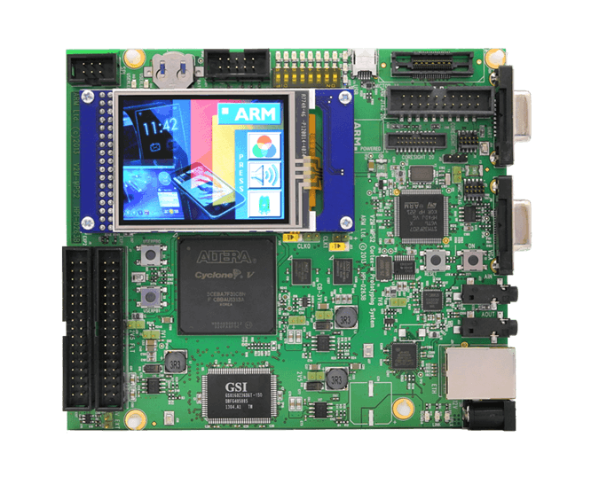

.. _mps2_an521_board:

ARM MPS2+ AN521
###############

Overview
********

The mps2_an521 board configuration is used by Zephyr applications that run
on the MPS2+ AN521 board. It provides support for the MPS2+ AN521 ARM Cortex-M33
CPU and the following devices:

- Nested Vectored Interrupt Controller (NVIC)
- System Tick System Clock (SYSTICK)
- Cortex-M System Design Kit GPIO
- Cortex-M System Design Kit UART

In addition to enabling actual hardware usage, this board configuration can
also use QEMU to emulate the AN521 platform running on the MPS2+.

More information about the board can be found at the `MPS2 FPGA Website`_.

.. note::
   This board configuration makes no claims about its suitability for use
   with actual MPS2 hardware systems using AN521, or any other hardware
   system. It has been tested on actual hardware, but its primary purpose is
   for use with QEMU and unit tests for the ARM Cortex-M33.

Hardware
********

ARM MPS2+ AN521 provides the following hardware components:

- ARM Cortex-M33
- Soft Macro Model (SMM) implementation of SSE-200 subsystem
- Memory

  - 16MB internal memory SRAM
  - 8KB of NVM code
  - 224MB code memory

- Debug

  - P-JTAG, SWD & 16-bit TRACE
  - UART port

- Interface

  - AHB GPIO connected to the EXP port
  - UART
  - SPI
  - I2C
  - I2S
  - Color LCD serial interface
  - Ethernet
  - VGA

- On-board Peripherals

  - Color LCD
  - 8 LEDs
  - 8 Switches
  - External SSRAM1, SSRAM2 & SSRAM3
  - SMSC9220
  - CS42L52

User push buttons
=================

The mps2_an521 board provides the following user push buttons:

- ON power on
- nSRST: Cortex-M33 system reset and CoreSight debug reset
- USERPB0 and USERPB1: User defined buttons

Supported Features
===================

The mps2_an521 board configuration supports the following hardware features:

+-----------+------------+-------------------------------------+
| Interface | Controller | Driver/Component                    |
+===========+============+=====================================+
| NVIC      | on-chip    | nested vector interrupt controller  |
+-----------+------------+-------------------------------------+
| SYSTICK   | on-chip    | systick                             |
+-----------+------------+-------------------------------------+
| UART      | on-chip    | serial port-polling;                |
|           |            | serial port-interrupt               |
+-----------+------------+-------------------------------------+
| PINMUX    | on-chip    | pinmux                              |
+-----------+------------+-------------------------------------+
| GPIO      | on-chip    | gpio                                |
+-----------+------------+-------------------------------------+
| WATCHDOG  | on-chip    | watchdog                            |
+-----------+------------+-------------------------------------+
| TIMER     | on-chip    | timer                               |
+-----------+------------+-------------------------------------+

Other hardware features are not currently supported by the port.
See the `MPS2 FPGA Website`_ for a complete list of MPS2+ AN521 board hardware
features.

The default configuration can be found in the defconfig file:
``boards/arm/mps2_an521/mps2_an521_defconfig``.

Interrupt Controller
====================

MPS2+ AN521 is a Cortex-M33 based SoC and has 15 fixed exceptions and 77 IRQs.

A Cortex-M33-based board uses vectored exceptions. This means each exception
calls a handler directly from the vector table.

Zephyr provides handlers for exceptions 1-7, 11, 12, 14, and 15, as listed
in the following table:

+------+------------+----------------+--------------------------+
| Exc# | Name       | Remarks        | Used by Zephyr Kernel    |
+======+============+================+==========================+
|  1   | Reset      |                | system initialization    |
+------+------------+----------------+--------------------------+
|  2   | NMI        |                | system fatal error       |
+------+------------+----------------+--------------------------+
|  3   | Hard fault |                | system fatal error       |
+------+------------+----------------+--------------------------+
|  4   | MemManage  | MPU fault      | system fatal error       |
+------+------------+----------------+--------------------------+
|  5   | Bus        |                | system fatal error       |
+------+------------+----------------+--------------------------+
|  6   | Usage      | Undefined      | system fatal error       |
|      | fault      | instruction,   |                          |
|      |            | or switch      |                          |
|      |            | attempt to ARM |                          |
|      |            | mode           |                          |
+------+------------+----------------+--------------------------+
|  7   | SecureFault| Unauthorized   | system fatal error       |
|      |            | access to      |                          |
|      |            | secure region  |                          |
|      |            | from ns space  |                          |
+------+------------+----------------+--------------------------+
|  8   | Reserved   |                | not handled              |
+------+------------+----------------+--------------------------+
|  9   | Reserved   |                | not handled              |
+------+------------+----------------+--------------------------+
| 10   | Reserved   |                | not handled              |
+------+------------+----------------+--------------------------+
| 11   | SVC        |                | context switch and       |
|      |            |                | software interrupts      |
+------+------------+----------------+--------------------------+
| 12   | Debug      |                | system fatal error       |
|      | monitor    |                |                          |
+------+------------+----------------+--------------------------+
| 13   | Reserved   |                | not handled              |
+------+------------+----------------+--------------------------+
| 14   | PendSV     |                | context switch           |
+------+------------+----------------+--------------------------+
| 15   | SYSTICK    |                | system clock             |
+------+------------+----------------+--------------------------+
| 16   | Reserved   |                | not handled              |
+------+------------+----------------+--------------------------+
| 17   | Reserved   |                | not handled              |
+------+------------+----------------+--------------------------+
| 18   | Reserved   |                | not handled              |
+------+------------+----------------+--------------------------+

Pin Mapping
===========

The ARM MPS2+ AN521 Board has 4 CMSDK AHB GPIO controllers. Each providing 16
bits of IO. These controllers are responsible for pin-muxing, input/output,
pull-up, etc.

All GPIO controller pins are exposed via the following sequence of pin numbers:

- Pins 0 - 15 are for GPIO0
- Pins 16 -  31 are for GPIO1
- Pins 32 -  47 are for GPIO2
- Pins 48 -  51 are for GPIO3

Mapping from the ARM MPS2+ AN521 Board pins to GPIO controllers:

.. rst-class:: rst-columns

   - D0 : EXT_0
   - D1 : EXT_4
   - D2 : EXT_2
   - D3 : EXT_3
   - D4 : EXT_1
   - D5 : EXT_6
   - D6 : EXT_7
   - D7 : EXT_8
   - D8 : EXT_9
   - D9 : EXT_10
   - D10 : EXT_12
   - D11 : EXT_13
   - D12 : EXT_14
   - D13 : EXT_11
   - D14 : EXT_15
   - D15 : EXT_5
   - D16 : EXT_16
   - D17 : EXT_17
   - D18 : EXT_18
   - D19 : EXT_19
   - D20 : EXT_20
   - D21 : EXT_21
   - D22 : EXT_22
   - D23 : EXT_23
   - D24 : EXT_24
   - D25 : EXT_25
   - D26 : EXT_26
   - D27 : EXT_30
   - D28 : EXT_28
   - D29 : EXT_29
   - D30 : EXT_27
   - D31 : EXT_32
   - D32 : EXT_33
   - D33 : EXT_34
   - D34 : EXT_35
   - D35 : EXT_36
   - D36 : EXT_38
   - D37 : EXT_39
   - D38 : EXT_40
   - D39 : EXT_44
   - D40 : EXT_41
   - D41 : EXT_31
   - D42 : EXT_37
   - D43 : EXT_42
   - D44 : EXT_43
   - D45 : EXT_45
   - D46 : EXT_46
   - D47 : EXT_47
   - D48 : EXT_48
   - D49 : EXT_49
   - D50 : EXT_50
   - D51 : EXT_51

Peripheral Mapping:

.. rst-class:: rst-columns

   - UART_3_RX : D0
   - UART_3_TX : D1
   - SPI_3_CS : D10
   - SPI_3_MOSI : D11
   - SPI_3_MISO : D12
   - SPI_3_SCLK : D13
   - I2C_3_SDA : D14
   - I2C_3_SCL : D15
   - UART_4_RX : D26
   - UART_4_TX : D30
   - SPI_4_CS : D36
   - SPI_4_MOSI : D37
   - SPI_4_MISO : D38
   - SPI_4_SCK : D39
   - I2C_4_SDA : D40
   - I2C_4_SCL : D41

For mode details refer to `MPS2+ AN521 Technical Reference Manual (TRM)`_.

LED
============

MPS2+ has 8 built-in LEDs connected to Serial Configuration Controller (SCC).

.. note:: The SCC register CFG_REG1 Bits [7:0] for LEDa, 0 = OFF 1 = ON.

System Clock
============

MPS2+ AN521 has several clocks connected:

.. rst-class:: rst-columns

   - MAINCLK : 20MHz
   - SYSCLK : 20MHz
   - S32KCLK : 32kHz
   - TRACECLK : 20MHz
   - SWCLKTCK : 20MHz
   - TRACECLKIN : 20MHz

Serial Port
===========

The MPS2+ AN521 has five UARTs. The Zephyr console output by default, uses
UART0, which is J10 on the board.

UART2 is reserved. And UART 1, 3 and 4 are alt-functions on the EXP ports.

Security components
===================

- Implementation Defined Attribution Unit (`IDAU`_). The IDAU is used to define
  secure and non-secure memory maps. By default, all of the memory space is
  defined to be secure accessible only
- Secure and Non-secure peripherals via the Peripheral Protection Controller
  (PPC). Peripherals can be assigned as secure or non-secure accessible
- Secure boot
- Secure `AMBA®`_ interconnect

Serial Configuration Controller (SCC)
=====================================

The MPS2+ AN521 implements a Serial Configuration Control (SCC) register.
The purpose of this register is to allow individual control of clocks,
reset-signals and interrupts to peripherals, and pin-muxing, and the LEDs and
switches.

Programming and Debugging
*************************

MPS2+ AN521 supports the v8m security extension, and by default boots to the
secure state.

When building a secure/non-secure application, the secure application will
have to set the idau/sau and mpc configuration to permit access from the
non-secure application before jumping.

The following system components are required to be properly configured during the
secure firmware:

- AHB5 TrustZone Memory Protection Controller (MPC)
- AHB5 TrustZone Peripheral Protection Controller (PPC)
- Implementation-Defined Attribution Unit (IDAU)

For more details refer to `Corelink SSE-200 Subsystem`_.

Flashing
========

MPS2+ AN521 provides:

- A USB connection to the host computer, which exposes a Mass Storage
- A Serial Port which is J10 on MPS2+ board

Building a secure only application
----------------------------------

You can build applications in the usual way. Here is an example for
the :ref:`hello_world` application.

.. zephyr-app-commands::
   :zephyr-app: samples/hello_world
   :board: mps2_an521
   :goals: build

Open a serial terminal (minicom, putty, etc.) with the following settings:

- Speed: 115200
- Data: 8 bits
- Parity: None
- Stop bits: 1

Reset the board, and you should see the following message on the corresponding
serial port:

.. code-block:: console

   Hello World! mps2_an521

Building a secure/non-secure with Trusted Firmware
--------------------------------------------------

The process requires five steps:

1. Build Trusted Firmware (tfm).
2. Import it as a library to the Zephyr source folder.
3. Build Zephyr with a non-secure configuration.
4. Merge the two binaries together and sign them.
5. Concatenate the bootloader with the signed image blob.

To build tfm, refer to `Trusted Firmware M Guide`_. Follow the build steps
for the AN521 target while replacing the platform with
``-DTARGET_PLATFORM=AN521`` and the compiler (if required) with
``-DCOMPILER=GNUARM``.

Copy over tfm as a library to the Zephyr project source and create a shortcut
for the secure veneers and necessary header files. All files are in the install
folder after TF-M has been built.

Uploading an application to MPS2+ AN521
---------------------------------------

Applications can be in elf, hex or bin format. The binaries are flashed when
the board boots up, using files stored on the on-board Micro SD card. The
Motherboard Configuration Controller (MCC) is responsible for loading the FPGA
image and binaries.

Connect the MPS2+ to your host computer using the USB port. You should see a
USB connection exposing a Mass Storage (``V2M_MPS2`` by default).

The update requires 3 steps:

1. Copy application files to ``<MPS2 device name>/SOFTWARE/``.
2. Open ``<MPS2 device name>/MB/HBI0263C/AN521/images.txt``.
3. Update the ``AN521/images.txt`` file as follows:

.. code-block:: bash

   TITLE: Versatile Express Images Configuration File

   [IMAGES]
   TOTALIMAGES: 1 ;Number of Images (Max: 32)

   IMAGE0ADDRESS: 0x10000000 ;Please select the required executable program

   IMAGE0FILE: \SOFTWARE\zephyr.bin

Reset the board, and you should see the following message on the corresponding
serial port:

.. code-block:: console

   Hello World! mps2_an521

.. note:: Refer to the tfm_integration sample for more details about integrating with TF-M and multiple images scenario.

.. _MPS2 FPGA Website:
   https://developer.arm.com/tools-and-software/development-boards/fpga-prototyping-boards/mps2

.. _MPS2+ AN521 Technical Reference Manual (TRM):
   http://infocenter.arm.com/help/topic/com.arm.doc.dai0521c/DAI0521C_Example_SSE200_Subsystem_for_MPS2plus.pdf

.. _Cortex M33 Generic User Guide:
   http://infocenter.arm.com/help/topic/com.arm.doc.100235_0004_00_en/arm_cortex_m33_dgug_100235_0004_00_en.pdf

.. _Trusted Firmware M Guide:
   https://git.trustedfirmware.org/trusted-firmware-m.git/tree/docs/user_guides/tfm_build_instruction.rst

.. _Corelink SSE-200 Subsystem:
   https://developer.arm.com/products/system-design/subsystems/corelink-sse-200-subsystem

.. _IDAU:
   https://developer.arm.com/docs/100690/latest/attribution-units-sau-and-idau

.. _AMBA®:
   https://developer.arm.com/products/architecture/system-architectures/amba
