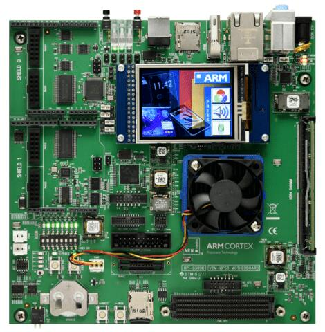

.. _mps3_an547_board:

ARM MPS3 AN547
###############

Overview
********

The mps3_an547 board configuration is used by Zephyr applications that run
on the MPS3 AN547 board. It provides support for the MPS3 AN547 ARM Cortex-M55
CPU and the following devices:

- Nested Vectored Interrupt Controller (NVIC)
- System Tick System Clock (SYSTICK)
- Cortex-M System Design Kit GPIO
- Cortex-M System Design Kit UART
- Ethos-U55 NPU

This board configuration also supports using the `Corstone-300 FVP`_ to emulate
a MPS3 AN547 hardware platform.

The Corstone-300 FVP (Fixed Virtual Platform) is a complete simulation of the
Arm system, including processor, memory and peripherals. It is a available free
of charge for Linux and Windows systems. The FVP has been selected for
simulation since it provides access to the Ethos-U55 NPU, which is unavailable
in QEMU or other simulation platforms.

To run the Fixed Virtual Platform simulation tool you must download "FVP model
for the Corstone-300 MPS3" from Arm and install it on your host PC. This board
has been tested with version 11.12.57 (Nov  2 2020).

Zephyr board options
====================

The MPS3+ AN547 is an SoC with Cortex-M55 architecture. Zephyr provides support
for building for both Secure and Non-Secure firmware.

The BOARD options are summarized below:

+----------------------+-----------------------------------------------+
|   BOARD              | Description                                   |
+======================+===============================================+
| ``mps3/an547``       | For building Secure (or Secure-only) firmware |
+----------------------+-----------------------------------------------+
| ``mps3/an547/ns``    | For building Non-Secure firmware              |
+----------------------+-----------------------------------------------+

Hardware
********

ARM MPS3 AN547 provides the following hardware components:

- ARM Cortex-M55
- Soft Macro Model (SMM) implementation of SSE-300 subsystem
- Memory

  - 8MB BRAM
  - 4GB DDR4 SODIMM (by default, upgradeable to 8GB)
  - 16GB eMMC
  - 8MB QSPI Flash

- Debug

  - P‐JTAG, F-JTAG, SWD, 4-bit trace, 16-bit trace
  - Four serial ports over USB

- Interface

  - AHB GPIO
  - UART
  - SPI
  - I2C
  - I2S
  - Color LCD serial interface
  - Ethernet
  - VGA

- On-board Peripherals

  - Color LCD
  - 10 LEDs
  - 8 Switches
  - 2 user push buttons

Supported Features
===================

The ``mps3/an547`` board configuration supports the following hardware features:

+-----------+------------+-------------------------------------+
| Interface | Controller | Driver/Component                    |
+===========+============+=====================================+
| NVIC      | on-chip    | nested vector interrupt controller  |
+-----------+------------+-------------------------------------+
| SYSTICK   | on-chip    | systick                             |
+-----------+------------+-------------------------------------+
| UART      | on-chip    | serial port-polling;                |
|           |            | serial port-interrupt               |
+-----------+------------+-------------------------------------+
| GPIO      | on-chip    | gpio                                |
+-----------+------------+-------------------------------------+

Other hardware features are not currently supported by the port.
See the `MPS3 FPGA Website`_ for a complete list of MPS3 AN547 board hardware
features.

The default configuration can be found in
:zephyr_file:`boards/arm/mps3/mps3_an547_defconfig`.

For more details refer to `MPS3 AN547 Technical Reference Manual (TRM)`_.

Serial Port
===========

The MPS3 AN547 has six UARTs. The Zephyr console output by default, uses
UART0, which is exposed over the Debug USB interface (J8).

Serial port 0 on the Debug USB interface is the MCC board control console.

Serial port 1 on the Debug USB interface is connected to UART 0.

Serial port 2 on the Debug USB interface is connected to UART 1.

Serial port 3 on the Debug USB interface is connected to UART 2.

Programming and Debugging
*************************

Flashing
========

MPS3 AN547 provides:

- A USB connection to the host computer, which exposes Mass Storage and
  CMSIS-DAP, and serial ports.

Building an application
-----------------------

You can build applications in the usual way. Here is an example for
the :ref:`hello_world` application.

.. zephyr-app-commands::
   :zephyr-app: samples/hello_world
   :board: mps3/an547
   :goals: build

Open a serial terminal (minicom, putty, etc.) with the following settings:

- Speed: 115200
- Data: 8 bits
- Parity: None
- Stop bits: 1

Reset the board, and you should see the following message on the corresponding
serial port:

.. code-block:: console

   Hello World! mps3

Uploading an application to MPS3 AN547
---------------------------------------

Applications can be in elf, hex or bin format. The binaries are flashed when
the board boots up, using files stored on the on-board Micro SD card. The
Motherboard Configuration Controller (MCC) is responsible for loading the FPGA
image and binaries.

Connect the MPS3 to your host computer using the USB port. You should see a
USB connection exposing a Mass Storage (``V2M-MPS3`` by default).

The update requires 3 steps:

1. Copy application files to ``<MPS3 device name>/SOFTWARE/``.
2. Open ``<MPS3 device name>/MB/HBI0309C/AN547/images.txt``.
3. Update the ``AN547/images.txt`` file as follows:

.. code-block:: bash

   TITLE: Versatile Express Images Configuration File

   [IMAGES]
   TOTALIMAGES: 1 ;Number of Images (Max: 32)

   IMAGE0ADDRESS: 0x01000000 ;Please select the required executable program

   IMAGE0FILE: \SOFTWARE\zephyr.elf

Reset the board, and you should see the following message on the corresponding
serial port:

.. code-block:: console

   Hello World! mps3

FVP Usage
=========

To run with the FVP, first set environment variable ``ARMFVP_BIN_PATH`` before
using it. Then you can run it with ``west build -t run``.

.. code-block:: bash

   export ARMFVP_BIN_PATH=/path/to/fvp/directory
   west build -t run

QEMU Usage
==========

To run with QEMU instead of the default FVP, override the emulator selection
at build time via:

.. code-block:: bash

   $ west build -b mps3_an547 samples/hello_world -DEMU_PLATFORM=qemu -t run

Note, however, that the Ethos-U55 NPU is not available in QEMU. If you require
the use of the NPU, please use the default FVP for device emulation.

.. _Corstone-300 FVP:
   https://developer.arm.com/tools-and-software/open-source-software/arm-platforms-software/arm-ecosystem-fvps

.. _MPS3 FPGA Website:
   https://developer.arm.com/tools-and-software/development-boards/fpga-prototyping-boards/mps3

.. _MPS3 AN547 Technical Reference Manual (TRM):
   https://developer.arm.com/-/media/Arm%20Developer%20Community/PDF/DAI0547B_SSE300_PLUS_U55_FPGA_for_mps3.pdf

.. _MPS3 FPGA Prototyping Board Technical Reference Manual (TRM):
   https://developer.arm.com/documentation/100765/latest

.. _Cortex M55 Generic User Guide:
   https://developer.arm.com/documentation/101051/latest

.. _Corelink SSE-300 Example Subsystem:
   https://developer.arm.com/documentation/101772/latest
