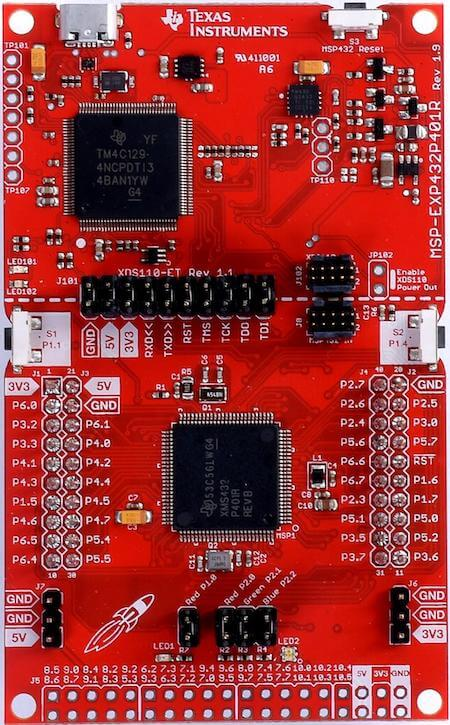

.. _msp_exp432p401r_launchxl:

MSP-EXP432P401R LaunchXL
########################

Overview
********

The SimpleLink MSP‐EXP432P401R LaunchPad development kit is an easy-to-use evaluation
module for the SimpleLink MSP432P401R microcontroller. It contains everything needed to start
developing on the SimpleLink MSP432 low-power + performance ARM |reg| 32-bit Cortex |reg|-M4F
microcontroller (MCU).

Features:
=========

* Low-power ARM Cortex-M4F MSP432P401R
* 40-pin LaunchPad development kit standard that leverages the BoosterPack plug-in module ecosystem
* XDS110-ET, an open-source onboard debug probe featuring EnergyTrace+ technology and application
  UART
* Two buttons and two LEDs for user interaction
* Backchannel UART through USB to PC

Details on the MSP-EXP432P401R LaunchXL development board can be found in the
MSP-EXP432P401R LaunchXL User's Guide.

Supported Features
==================

* The on-board 32-kHz crystal allows for lower LPM3 sleep currents and a higher-precision clock source than the
  default internal 32-kHz REFOCLK. Therefore, the presence of the crystal allows the full range of low-
  power modes to be used.
* The on-board 48-MHz crystal allows the device to run at its maximum operating speed for MCLK and HSMCLK.

The MSP-EXP432P401R LaunchXL development board configuration supports the following hardware features:

+-----------+------------+-----------------------+
| Interface | Controller | Driver/Component      |
+===========+============+=======================+
| NVIC      | on-chip    | nested vectored       |
|           |            | interrupt controller  |
+-----------+------------+-----------------------+
| SYSTICK   | on-chip    | system clock          |
+-----------+------------+-----------------------+
| UART      | on-chip    | serial port           |
+-----------+------------+-----------------------+

More details about the supported peripherals are available in MSP432P4XX TRM
Other hardware features are not currently supported by the Zephyr kernel.

Building and Flashing
*********************

Building
========

Follow the :ref:`getting_started` instructions for Zephyr application
development.

For example, to build the :ref:`hello_world` application for the
MSP-EXP432P401R LaunchXL:

.. zephyr-app-commands::
   :zephyr-app: samples/hello_world
   :board: msp_exp432p401r_launchxl
   :goals: build

The resulting ``zephyr.elf`` binary in the build directory can be flashed onto
MSP-EXP432P401R LaunchXL using the command line utility mentioned below.

Flashing
========

For Linux:
----------

`UniFlash`_ command line utility is used to program the flash memory. Only
elf loading is currently supported.

The following command will flash the ``zephyr.elf`` binary to the MSP-EXP432P401R LaunchXL board:

.. code-block:: console

   $ ./dslite.sh --config=MSP432P401R.ccxml zephyr.elf

.. note:: The ccxml configuration file is included in boards/arm/msp_exp432p401r_launchxl/support.

Debugging
=========

MSP-EXP432P401R LaunchXL board supports debugging primarily using `CCS IDE`_. More information
on debugging using CCS can be found in CCS Debug Handbook.

Launchpad also supports debugging using GDB. See section 3.3 of GCC ARM Toolchain Guide.

References
**********

TI MSP432 Wiki:
   https://en.wikipedia.org/wiki/TI_MSP432

TI MSP432P401R Product Page:
   http://www.ti.com/product/msp432p401r

TI MSP432 SDK:
   http://www.ti.com/tool/SIMPLELINK-MSP432-SDK

.. _UniFlash:
   http://processors.wiki.ti.com/index.php/UniFlash_v4_Quick_Guide#Command_Line_Interface

.. _CCS IDE:
   http://www.ti.com/tool/ccstudio
