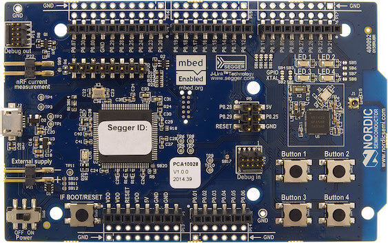

.. _nrf51_pca10028:

nRF51-PCA10028
##############

Overview
********

Zephyr applications use the nrf51_pca10028 board configuration to run on the
nRF51 Development Kit (PCA10028) hardware. It provides support for the Nordic Semiconductor
nRF51822 ARM Cortex-M0 CPU and the following devices:

* :abbr:`NVIC (Nested Vectored Interrupt Controller)`
* :abbr:`RTC (nRF RTC System Clock)`
* UART
* GPIO
* FLASH
* RADIO (Bluetooth Low Energy)
* Segger RTT (RTT Console)

     nRF51 PCA10028 DK (Credit: Nordic Semi)

More information about the board can be found at the
`nRF51 DK website`_. The `Nordic Semiconductor Infocenter`_
contains the processor's information and the datasheet.

Hardware
********

nRF51 DK has two external oscillators. The frequency of
the slow clock is 32.768 kHz. The frequency of the main clock
is 16 MHz.

Supported Features
==================

The nrf51_pca10028 board configuration supports the following nRF51
hardware features:

+-----------+------------+----------------------+
| Interface | Controller | Driver/Component     |
+===========+============+======================+
| NVIC      | on-chip    | nested vectored      |
|           |            | interrupt controller |
+-----------+------------+----------------------+
| RTC       | on-chip    | system clock         |
+-----------+------------+----------------------+
| UART      | on-chip    | serial port          |
+-----------+------------+----------------------+
| GPIO      | on-chip    | gpio                 |
+-----------+------------+----------------------+
| FLASH     | on-chip    | flash                |
+-----------+------------+----------------------+
| RADIO     | on-chip    | Bluetooth            |
+-----------+------------+----------------------+
| RTT       | on-chip    | console              |
+-----------+------------+----------------------+

Other hardware features are not supported by the Zephyr kernel.
See `nRF51 DK website`_ and `Nordic Semiconductor Infocenter`_
for a complete list of nRF51 Development Kit board hardware features.

Connections and IOs
===================

LED
---

* LED1 (green) = P0.21
* LED2 (green) = P0.22
* LED3 (green) = P0.23
* LED4 (green) = P0.24

Push buttons
------------

* BUTTON1 = SW1 = P0.17
* BUTTON2 = SW2 = P0.18
* BUTTON3 = SW3 = P0.19
* BUTTON4 = SW4 = P0.20
* BOOT = SW5 = boot/reset

Programming and Debugging
*************************

Flashing
========

Follow the instructions in the :ref:`nordic_segger` page to install
and configure all the necessary software. Further information can be
found in :ref:`nordic_segger_flashing`. Then build and flash
applications as usual (see :ref:`build_an_application` and
:ref:`application_run` for more details).

Here is an example for the :ref:`hello_world` application.

First, run your favorite terminal program to listen for output.

.. code-block:: console

   $ minicom -D <tty_device> -b 115200

Replace :code:`<tty_device>` with the port where the board nRF51 DK
can be found. For example, under Linux, :code:`/dev/ttyACM0`.

Then build and flash the application in the usual way.

.. zephyr-app-commands::
   :zephyr-app: samples/hello_world
   :board: nrf51_pca10028
   :goals: build flash

Debugging
=========

Refer to the :ref:`nordic_segger` page to learn about debugging Nordic boards with a
Segger IC.

Testing the LEDs and buttons in the nRF51 DK
********************************************

There are 2 samples that allow you to test that the buttons (switches) and LEDs on
the board are working properly with Zephyr:

.. code-block:: console

   samples/basic/blinky
   samples/basic/button

You can build and flash the examples to make sure Zephyr is running correctly on
your board. The button and LED definitions can be found in :file:`boards/arm/nrf51_pca10028/board.h`.

References
**********

.. target-notes::

.. _nRF51 DK website: http://www.nordicsemi.com/eng/Products/nRF51-DK
.. _Nordic Semiconductor Infocenter: http://infocenter.nordicsemi.com/

