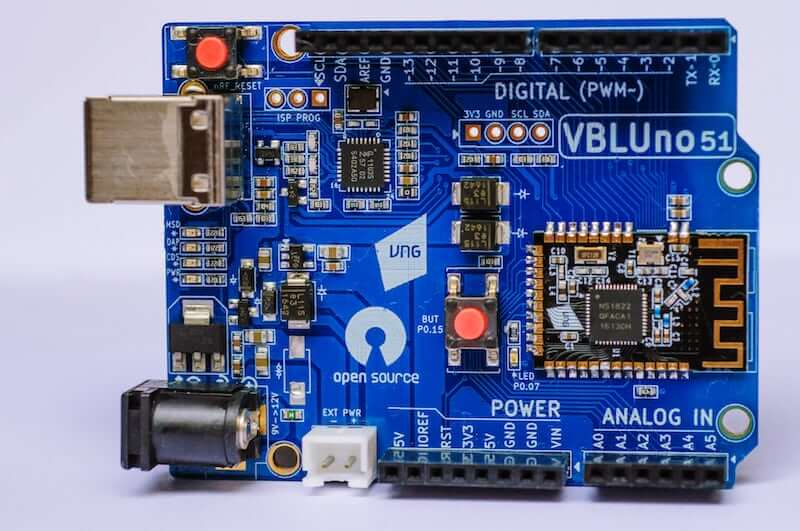
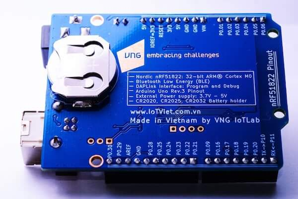
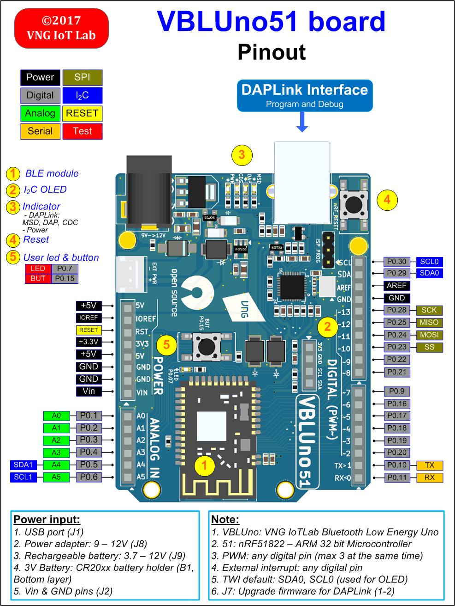
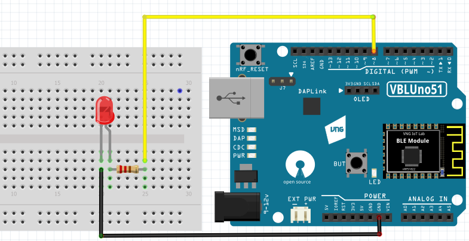

.. _nrf51_vbluno51:

nRF51-VBLUno51
##############

Overview
********

Zephyr applications use the nrf51_vbluno51 board configuration to run on the
VBLUno51 board - VNG Bluetooth Low Energy UNO nRF51822 hardware. It provides support for the Nordic Semiconductor
nRF51822 ARM Cortex-M0 CPU and the following devices:

* :abbr:`NVIC (Nested Vectored Interrupt Controller)`
* :abbr:`RTC (nRF RTC System Clock)`
* UART
* GPIO
* FLASH
* RADIO (Bluetooth Low Energy)
* Segger RTT (RTT Console)

     nrf51_vbluno51 Top

     nrf51_vbluno51 Bottom

More information about the board can be found at the
`VBLUno51 wiki page`_.

Hardware
********

VBLUno51 board has two external oscillators. The frequency of
the slow clock is 32.768 kHz. The frequency of the main clock
is 16 MHz.

Supported Features
==================

- CPU:
	+ Nordic nRF51822: ARM® Cortex™ M0 32bit.
	+ *Bluetooth Low Energy interface.*
	+ 256KB Flash, 32KB Ram.
	+ UART(1), I2C(2), SPI(1), PWM(3), SWD, Timer 16bit(3).
	+ 21 digital channels, 6 ADC 10bit channels.
	+ 1 Led and 1 Button onboard.
	+ GPIO Voltage: 0 – 3.3V.
- DAPLink (CMSIS-DAP) interface for program and debug: 
	+ USB MSD: Drag and Drop programming flash memory.
	+ USB HID (DAP): CMSIS-DAP compilant debug channel.
	+ USB CDC: Virtual COM port for log, trace and terminal emulation. Supports hardware flow control features (RTS/CTS).
- *Energy monitoring for BLE module by current measurement (Only VBLUno51_EM)*
- FOTA (Firmware over the air): Upgrade firmware over BLE interface.
- Build good applications with:
	+ Compiler and IDE: GCC, Keil MDK, IAR, Eclipse, Qt Creator.
	+ Frameworks: Arduino, ARM mbed-OS, Zephyr-OS, Nordic SDK, RIOT-OS, MyNewt-OS, ChibiOS, NuttX RTOS
	+ A lot of tutorials for Arduino, mbed-os and more.
- Pinout: Arduino Uno Rev3 compilant.
- Power:
	+ USB port.
	+ Power adapter: +9 -> +12V.
	+ 3V Battery: CR20xx holder
	+ Recharageable battery jump: +3.7 -> +12V
- Open source: Hardware design, firmware, packages, tutorial and example codes

See `VBLUno51 wiki page`_ for full documents and tutorials about the VBLUno51 board.

Connections and IOs
===================

LED
---

* LED = LED0 (green) = P0.7

Push buttons
------------

* BUTTON = BUT = SW0 = P0.15

More details
------------

     nrf51_vbluno51 Pinout

     nrf51_vbluno51 Frizting part

Programming and Debugging
*************************

Flashing
========

The VBLUno51 board have on-board DAPLink (CMSIS-DAP) interface for flashing and debugging. You do not need any other programming device.
You only need to install pyOCD tool (https://pypi.python.org/pypi/pyOCD)

This tutorial uses the sample application
blinky :file:`$ZEPHYR_BASE/samples/basic/blinky`.

See getting started page: https://www.zephyrproject.org/doc/getting_started/getting_started.html

#. To build the Zephyr kernel, enter:

   .. code-block:: console

      $ cd $ZEPHYR_BASE/samples/basic/blinky
      $ make BOARD=nrf51_vbluno51

#. To build and flash hex file to board

   .. code-block:: console

      $ make BOARD=nrf51_vbluno51 flash

Testing the VBLUno51
********************************************

There are 5 samples that allow you to test that the buttons, LEDs, UART, BLE on
the board are working properly with Zephyr:

.. code-block:: console
   samples/hello_world
   samples/basic/blinky
   samples/basic/button
   samples/bluetooth/beacon
   samples/bluetooth/peripheral_hr

You can build and flash the examples to make sure Zephyr is running correctly on
your board. The button and LED definitions can be found in :file:`boards/arm/nrf51_vbluno51/board.h`.

References
**********

.. target-notes::

.. _VBLUno51 website: http://iotviet.com.vn/store/detail?id=2
.. _VBLUno51 wiki page: https://vngiotlab.github.io/vbluno/

