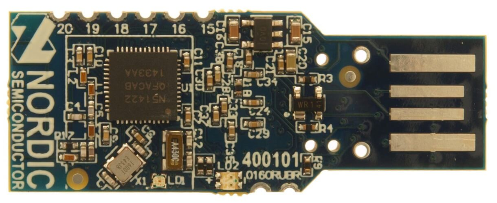

.. _nrf51dongle_nrf51422:

nRF51 Dongle
############

Overview
********

The nRF51 Dongle (PCA10031) hardware provides support for the Nordic
Semiconductor nRF51822 ARM Cortex-M0 CPU and the following devices:

* :abbr:`ADC (Analog to Digital Converter)`
* CLOCK
* FLASH
* :abbr:`GPIO (General Purpose Input Output)`
* :abbr:`I2C (Inter-Integrated Circuit)`
* :abbr:`NVIC (Nested Vectored Interrupt Controller)`
* RADIO (Bluetooth Low Energy)
* :abbr:`RTC (nRF RTC System Clock)`
* Segger RTT (RTT Console)
* :abbr:`SPI (Serial Peripheral Interface)`
* :abbr:`UART (Universal asynchronous receiver-transmitter)`
* :abbr:`WDT (Watchdog Timer)`

     nRF51 Dongle (Credit: Nordic Semiconductor)

More information about the board can be found at the
`nRF51 Dongle website`_. The `Nordic Semiconductor Infocenter`_
contains the processor's information and the datasheet.

Hardware
********

nRF51 Dongle has two external oscillators. The frequency of
the slow clock is 32.768 kHz. The frequency of the main clock
is 16 MHz.

Supported Features
==================

The nrf51dongle_nrf51422 board configuration supports the following nRF51
hardware features:

+-----------+------------+----------------------+
| Interface | Controller | Driver/Component     |
+===========+============+======================+
| ADC       | on-chip    | adc                  |
+-----------+------------+----------------------+
| CLOCK     | on-chip    | clock_control        |
+-----------+------------+----------------------+
| FLASH     | on-chip    | flash                |
+-----------+------------+----------------------+
| GPIO      | on-chip    | gpio                 |
+-----------+------------+----------------------+
| I2C(M)    | on-chip    | i2c                  |
+-----------+------------+----------------------+
| NVIC      | on-chip    | arch/arm             |
+-----------+------------+----------------------+
| RADIO     | on-chip    | Bluetooth            |
+-----------+------------+----------------------+
| RTC       | on-chip    | system clock         |
+-----------+------------+----------------------+
| RTT       | Segger     | console              |
+-----------+------------+----------------------+
| SPI(M/S)  | on-chip    | spi                  |
+-----------+------------+----------------------+
| UART      | on-chip    | serial               |
+-----------+------------+----------------------+
| WDT       | on-chip    | watchdog             |
+-----------+------------+----------------------+

Other hardware features are not supported by the Zephyr kernel.
See `nRF51 Dongle website`_ and `Nordic Semiconductor Infocenter`_
for a complete list of nRF51 Dongle hardware features.

Connections and IOs
===================

LED
---

* LED1 (red)   = P0.21
* LED1 (green) = P0.22
* LED1 (blue)  = P0.23

Push buttons
------------

* BOOT = SW1 = boot/reset

Programming and Debugging
*************************

Flashing
========

Follow the instructions in the :ref:`nordic_segger` page to install
and configure all the necessary software. Further information can be
found in :ref:`nordic_segger_flashing`. Then build and flash
applications as usual (see :ref:`build_an_application` and
:ref:`application_run` for more details).

Here is an example for the :ref:`hello_world` application.

First, run your favorite terminal program to listen for output.

.. code-block:: console

   $ minicom -D <tty_device> -b 115200

Replace :code:`<tty_device>` with the port where the board nRF51 Dongle
can be found. For example, under Linux, :code:`/dev/ttyACM0`.

Then build and flash the application in the usual way.

.. zephyr-app-commands::
   :zephyr-app: samples/hello_world
   :board: nrf51dongle_nrf51422
   :goals: build flash

Debugging
=========

Refer to the :ref:`nordic_segger` page to learn about debugging Nordic boards with a
Segger IC.

Testing the LEDs on the nRF51 Dongle
************************************

Build and flash the :ref:`blinky-sample` sample to test that the onboard LED
is working properly with Zephyr.

References
**********

.. target-notes::

.. _nRF51 Dongle website: http://www.nordicsemi.com/eng/Products/nRF51-Dongle
.. _Nordic Semiconductor Infocenter: http://infocenter.nordicsemi.com/
