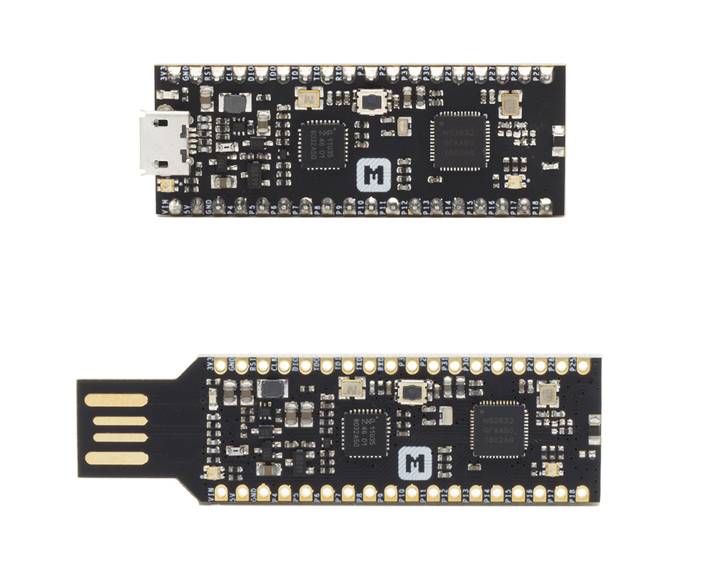
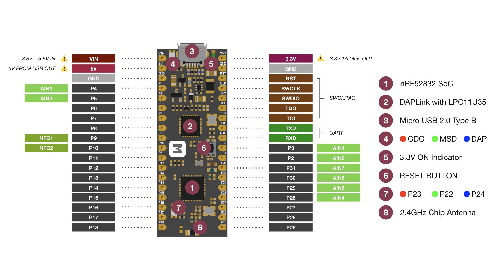
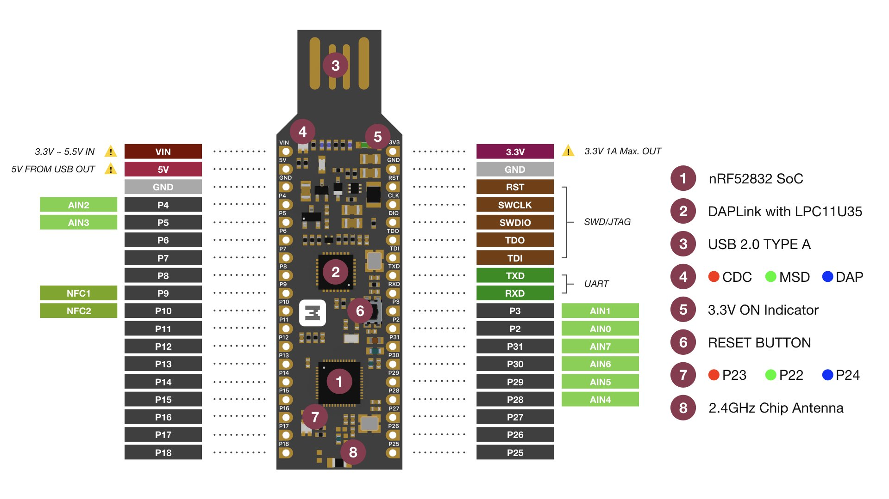

.. _nrf52832_mdk:

nRF52832-MDK
##############

Description
********

The nRF52832-MDK is a fully open-source, versatile single board development kit for Bluetooth® low energy, ANT and 2.4GHz proprietary applications using the nRF52832 SoC.

The kit comes with a fully integrated debugger (also known as `DAPLink`_) that provides USB drag-and-drop programming, USB Virtual COM port and CMSIS-DAP interface.

The kit gives access to 24 I/Os and interfaces via headers and has a programmable RGB LED. It also has a 2.4GHz chip antenna on-board which is quite convenient to develop IoT wireless applications.

There are two form factor available for nRF52832-MDK: *Micro USB form factor* and *USB Dongle form factor*.

See `nRF52832-MDK website`_ for more information about the development board and `nRF52832 website`_ for the official reference on the IC itself.

Hardware Features
********

- Nordic Semiconductor nRF52832

  - ARM® Cortex™-M4F
  - 512kB Flash Memory + 64kB RAM
  - Bluetooth low energy, ANT and 2.4GHz
  - NFC™-A tag

- Program/Debug options with DAPLink

  - MSC - drag-n-drop programming flash memory
  - CDC - virtual com port for log, trace and terminal emulation
  - HID - CMSIS-DAP compliant debug channel

- Up to 24 GPIOs at headers
- Reset Button
- RGB LED
- 2.4GHz chip antenna
- 3.3V regulator with 1A peak current output
- VBUS & VIN Power-Path Management
- Breadboard-friendly

Pinout Diagram
********

Programming and Debugging
********

Drag-n-drop Programming
=========

Drag and drop the hex file into the **DAPLINK** removable drive mentioned above. The file contains firmware which will be automatically programmed onto the nRF52832 SoC. This happens immediately. The explorer window may close when programming starts. When programming is completed, the unit will be re-detected by the computer. The application will run after pressing the RESET button.

.. figure:: img/drag-n-drop_programming.png
     :width: 600px
     :align: center
     :alt: Drag-n-drop Programming

Using pyOCD
=========

pyOCD is an Open Source python 2.7 based library for programming and debugging ARM Cortex-M microcontrollers using CMSIS-DAP. Linux, OSX and Windows are supported.

The latest stable version of pyOCD may be done via `pip`_ as follows:

.. code-block:: console

   $ pip install --pre -U pyocd

Alternatively, to install the latest development version (master branch), you can do the following:

.. code-block:: console

   $ pip install --pre -U https://github.com/mbedmicro/pyOCD/archive/master.zip

Note that you may run into permissions issues running these commands. You have a few options here:

* Run with ``sudo -H`` to install pyOCD and dependencies globally

* Specify the ``--user`` option to install local to your user

* Run the command in a `virtualenv`_ local to a specific project working set.

You can verify that your board is detected by pyOCD by running:

.. code-block:: console

   $ pyocd-flashtool -l

and then flash the board by running:

.. code-block:: console

   $ pyocd-flashtool -d debug -t nrf52 -se your-hex-file.hex

Debugging with GDB
==================

You can debug an application in the usual way.  Here is an example for the
:ref:`hello_world` application. This also requires pyOCD.

.. zephyr-app-commands::
   :zephyr-app: samples/hello_world
   :board: nrf52832_mdk
   :maybe-skip-config:
   :goals: debug

References
**********

.. target-notes::

.. _DAPLink: https://github.com/ARMmbed/DAPLink
.. _nRF52832-MDK website: https://wiki.makerdiary.com/nrf52832-mdk/
.. _nRF52832 website: https://www.nordicsemi.com/index.php/eng/Products/Bluetooth-low-energy/nRF52832
.. _pip: https://pip.pypa.io/en/stable/index.html
.. _virtualenv: https://virtualenv.pypa.io/en/latest/
