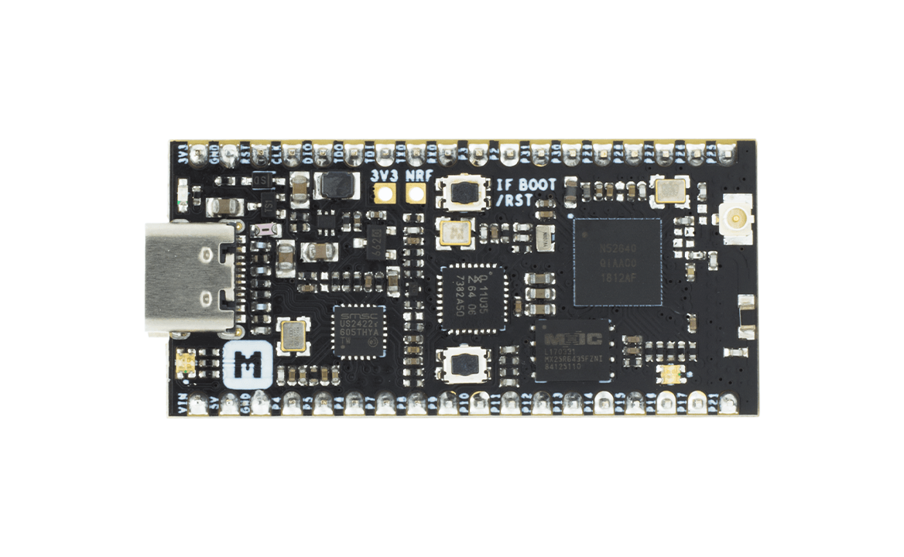
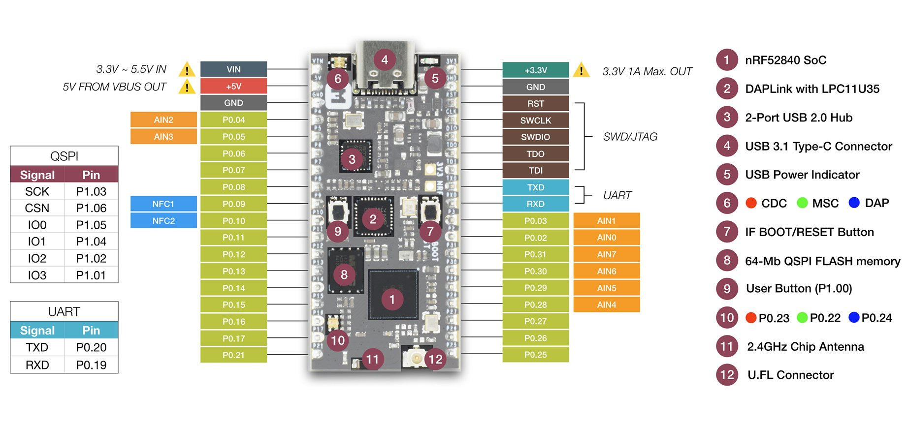
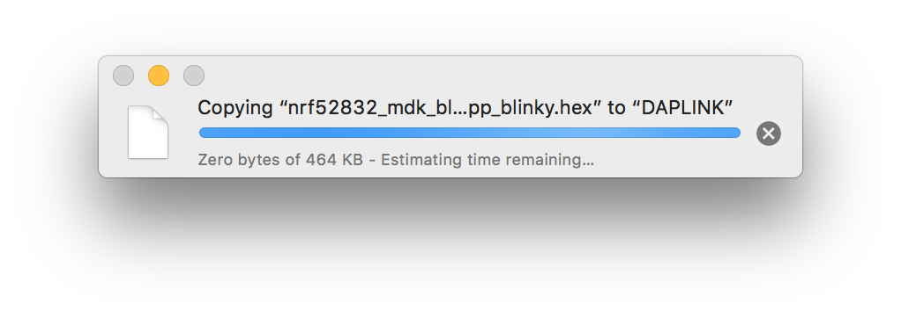

.. _nrf52840_mdk:

nRF52840-MDK
##############

Description
********

The nRF52840-MDK is a versatile, easy-to-use IoT hardware platform
for Bluetooth 5, Bluetooth Mesh, Thread, IEEE 802.15.4, ANT, and
2.4GHz proprietary wireless applications using the nRF52840 SoC.

The development kit comes with a fully integrated debugger (also known as `DAPLink`_)that provides USB drag-and-drop programming, USB Virtual COM port and CMSIS-DAP interface.

The kit contains a Microchip USB 2.0 Hi-Speed hub controller with two downstream ports: one for DAPLink interface and one for nRF52840 USB device controller. The kit also features ultra-low power 64-Mb QSPI FLASH memory, programmable user button, RGB LED, up to 24 GPIOs, antenna selection for custom applications.

See `nRF52840-MDK website`_ for more information about the development board and `nRF52840 website`_ for the official reference on the IC itself.

Hardware Features
********

- Nordic nRF52840 System-on-Chip

  - ARM® Cortex®-M4F processor optimized for ultra-low power operation
  - Combining Bluetooth 5, Bluetooth Mesh, Thread, IEEE 802.15.4, ANT and 2.4GHz proprietary
  - On-chip NFC-A tag
  - On-chip USB 2.0 (Full speed) controller
  - ARM TrustZone® Cryptocell 310 security subsystem
  - 1 MB FLASH and 256 kB RAM

- Program/Debug options with DAPLink

  - MSC - drag-n-drop programming flash memory
  - CDC - virtual com port for log, trace and terminal emulation
  - HID - CMSIS-DAP compliant debug channel
  - WEBUSB HID - CMSIS-DAP compliant debug channel

- Microchip 2-Port USB 2.0 Hi-Speed Hub Controller
- External ultra-low power 64-Mb QSPI FLASH memory
- Up to 24 GPIOs available via headers
- IF Boot/Reset Button
- User programmable Button and RGB LED
- On-board 2.4G chip antenna
- U.FL connector selectable for external antenna
- 3.3V regulator with 1A peak current output
- VBUS & VIN Power-Path Management
- Reversible USB 3.1 Type-C Connector
- Breadboard-friendly with dual 18-Pin headers
- Measures 1.97" x 0.9" x 0.51" (50mm x 23mm x 13mm) with headers soldered in

Pinout Diagram
********

Programming and Debugging
********

Drag-n-drop Programming
=========

Drag and drop the hex file into the **DAPLINK** removable drive mentioned above. The file contains firmware which will be automatically programmed onto the nRF52840 SoC. This happens immediately. The explorer window may close when programming starts. When programming is completed, the unit will be re-detected by the computer. The application will run after pressing the RESET button.

Using pyOCD
=========

pyOCD is an Open Source python 2.7 based library for programming and debugging ARM Cortex-M microcontrollers using CMSIS-DAP. Linux, OSX and Windows are supported.

The latest stable version of pyOCD may be done via `pip`_ as follows:

.. code-block:: console

   $ pip install --pre -U pyocd

Alternatively, to install the latest development version (master branch), you can do the following:

.. code-block:: console

   $ pip install --pre -U https://github.com/mbedmicro/pyOCD/archive/master.zip

Note that you may run into permissions issues running these commands. You have a few options here:

* Run with ``sudo -H`` to install pyOCD and dependencies globally

* Specify the ``--user`` option to install local to your user

* Run the command in a `virtualenv`_ local to a specific project working set.

You can verify that your board is detected by pyOCD by running:

.. code-block:: console

   $ pyocd-flashtool -l

and then flash the board by running:

.. code-block:: console

   $ pyocd-flashtool -d debug -t nrf52 -se your-hex-file.hex

Debugging with GDB
==================

You can debug an application in the usual way.  Here is an example for the
:ref:`hello_world` application. This also requires pyOCD.

.. zephyr-app-commands::
   :zephyr-app: samples/hello_world
   :board: nrf52840_mdk
   :maybe-skip-config:
   :goals: debug

References
**********

.. target-notes::

.. _DAPLink: https://github.com/ARMmbed/DAPLink
.. _nRF52840-MDK website: https://wiki.makerdiary.com/nrf52840-mdk/
.. _nRF52840 website: https://www.nordicsemi.com/eng/Products/nRF52840
.. _pip: https://pip.pypa.io/en/stable/index.html
.. _virtualenv: https://virtualenv.pypa.io/en/latest/
