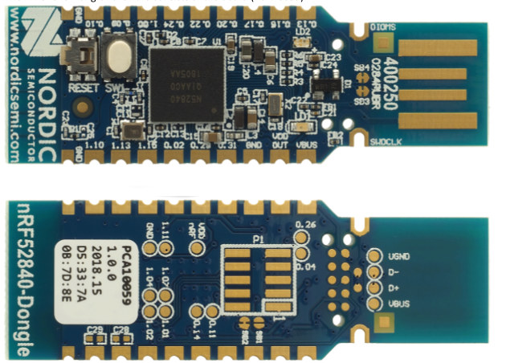

.. _nrf52840_pca10059:

nRF52840-PCA10059
#################

Overview
********

Zephyr applications use the nrf52840_pca10059 board configuration
to run on the nRF52840 PCA10059 (USB Dongle) hardware. It provides
support for the Nordic Semiconductor nRF52840 ARM Cortex-M4F CPU and
the following devices:

* :abbr:`ADC (Analog to Digital Converter)`
* CLOCK
* FLASH
* :abbr:`GPIO (General Purpose Input Output)`
* :abbr:`I2C (Inter-Integrated Circuit)`
* :abbr:`MPU (Memory Protection Unit)`
* :abbr:`NVIC (Nested Vectored Interrupt Controller)`
* :abbr:`PWM (Pulse Width Modulation)`
* RADIO (Bluetooth Low Energy and 802.15.4)
* :abbr:`RTC (nRF RTC System Clock)`
* :abbr:`SPI (Serial Peripheral Interface)`
* :abbr:`UART (Universal asynchronous receiver-transmitter)`
* :abbr:`USB (Universal Serial Bus)`
* :abbr:`WDT (Watchdog Timer)`

     nRF52840 PCA10059

More information about the board can be found at the
`nRF52840 Dongle website`_. The `Nordic Semiconductor Infocenter`_
contains the processor's information and the datasheet.

Hardware
********

The ``nrf52840_pca10059`` has two external oscillators. The frequency of
the slow clock is 32.768 kHz. The frequency of the main clock
is 32 MHz.

Supported Features
==================

The ``nrf52840_pca10059`` board configuration supports the following
hardware features:

+-----------+------------+----------------------+
| Interface | Controller | Driver/Component     |
+===========+============+======================+
+-----------+------------+----------------------+
| ADC       | on-chip    | adc                  |
+-----------+------------+----------------------+
| CLOCK     | on-chip    | clock_control        |
+-----------+------------+----------------------+
| FLASH     | on-chip    | flash                |
+-----------+------------+----------------------+
| GPIO      | on-chip    | gpio                 |
+-----------+------------+----------------------+
| I2C(M)    | on-chip    | i2c                  |
+-----------+------------+----------------------+
| MPU       | on-chip    | arch/arm             |
+-----------+------------+----------------------+
| NVIC      | on-chip    | arch/arm             |
+-----------+------------+----------------------+
| PWM       | on-chip    | pwm                  |
+-----------+------------+----------------------+
| RADIO     | on-chip    | Bluetooth,           |
|           |            | ieee802154           |
+-----------+------------+----------------------+
| RTC       | on-chip    | system clock         |
+-----------+------------+----------------------+
| SPI(M/S)  | on-chip    | spi                  |
+-----------+------------+----------------------+
| UART      | on-chip    | serial               |
+-----------+------------+----------------------+
| USB       | on-chip    | usb                  |
+-----------+------------+----------------------+
| WDT       | on-chip    | watchdog             |
+-----------+------------+----------------------+

Other hardware features are not supported by the Zephyr kernel.
See `nRF52840 Dongle website`_ and `Nordic Semiconductor Infocenter`_
for a complete list of nRF52840 PCA10059 Development Kit board hardware features.

Connections and IOs
===================

LED
---

* LED0 (green) = P0.6
* LED1 (red)   = P0.8
* LED1 (green) = P1.9
* LED1 (blue)  = P0.12

Push buttons
------------

* BUTTON1 = SW1 = P1.6
* RESET   = SW2 = P0.18

Programming and Debugging
*************************

Applications for the ``nrf52840_pca10059`` board configuration can be
built in the usual way (see :ref:`build_an_application` for more details);
however, an external debugger IC is necessary to program the device,
and the standard debugging targets are not currently available.

Flashing
========

Flashing Zephyr onto the ``nrf52840_pca10059`` board requires an external
J-Link programmer. The programmer is attached to the SWD header on the back
side of the board.

Follow the instructions in the :ref:`nordic_segger` page to install
and configure all the necessary software. Further information can be
found in :ref:`nordic_segger_flashing`. Then build and flash
applications as usual (see :ref:`build_an_application` and
:ref:`application_run` for more details).

Here is an example for the :ref:`blinky-sample` application.

.. zephyr-app-commands::
   :zephyr-app: samples/basic/blinky
   :board: nrf52840_pca10059
   :goals: build flash

Observe the LED on the board blinking.

Debugging
=========

The ``nrf52840_pca10059`` board does not have an on-board J-Link debug IC
as some nRF5x development boards, however, instructions from the
:ref:`nordic_segger` page also apply to this board, with the additional step
of connecting an external debugger.

Testing the LEDs and buttons on the nRF52840 PCA10059
*****************************************************

There are 2 samples that allow you to test that the buttons (switches) and LEDs on
the board are working properly with Zephyr:

* :ref:`blinky-sample`

You can build and program the examples to make sure Zephyr is running correctly on
your board. The button and LED definitions can be found in :file:`boards/arm/nrf52840_pca10059/board.h`.

References
**********

.. target-notes::

.. _nRF52840 Dongle website: https://www.nordicsemi.com/eng/Products/nRF52840-Dongle
.. _Nordic Semiconductor Infocenter: http://infocenter.nordicsemi.com/
.. _J-Link Software and documentation pack: https://www.segger.com/jlink-software.html

