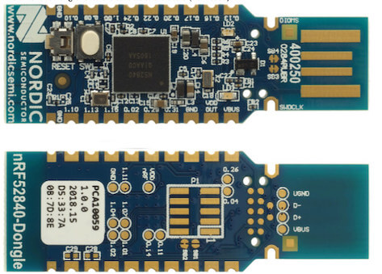

.. _nrf52840dongle_nrf52840:

nRF52840 Dongle
###############

Overview
********

The nRF52840 Dongle (PCA10059) hardware provides support for the Nordic
Semiconductor nRF52840 ARM Cortex-M4F CPU and the following devices:

* :abbr:`ADC (Analog to Digital Converter)`
* CLOCK
* FLASH
* :abbr:`GPIO (General Purpose Input Output)`
* :abbr:`I2C (Inter-Integrated Circuit)`
* :abbr:`MPU (Memory Protection Unit)`
* :abbr:`NVIC (Nested Vectored Interrupt Controller)`
* :abbr:`PWM (Pulse Width Modulation)`
* RADIO (Bluetooth Low Energy and 802.15.4)
* :abbr:`RTC (nRF RTC System Clock)`
* :abbr:`SPI (Serial Peripheral Interface)`
* :abbr:`UART (Universal asynchronous receiver-transmitter)`
* :abbr:`USB (Universal Serial Bus)`
* :abbr:`WDT (Watchdog Timer)`

     nRF52840 Dongle

More information about the board can be found at the
`nRF52840 Dongle website`_. The `Nordic Semiconductor Infocenter`_
contains the processor's information and the datasheet.

Hardware
********

The ``nrf52840dongle_nrf52840`` has two external oscillators. The frequency of
the slow clock is 32.768 kHz. The frequency of the main clock
is 32 MHz.

Supported Features
==================

The ``nrf52840dongle_nrf52840`` board configuration supports the following
hardware features:

+-----------+------------+----------------------+
| Interface | Controller | Driver/Component     |
+===========+============+======================+
| ADC       | on-chip    | adc                  |
+-----------+------------+----------------------+
| CLOCK     | on-chip    | clock_control        |
+-----------+------------+----------------------+
| FLASH     | on-chip    | flash                |
+-----------+------------+----------------------+
| GPIO      | on-chip    | gpio                 |
+-----------+------------+----------------------+
| I2C(M)    | on-chip    | i2c                  |
+-----------+------------+----------------------+
| MPU       | on-chip    | arch/arm             |
+-----------+------------+----------------------+
| NVIC      | on-chip    | arch/arm             |
+-----------+------------+----------------------+
| PWM       | on-chip    | pwm                  |
+-----------+------------+----------------------+
| RADIO     | on-chip    | Bluetooth,           |
|           |            | ieee802154           |
+-----------+------------+----------------------+
| RTC       | on-chip    | system clock         |
+-----------+------------+----------------------+
| SPI(M/S)  | on-chip    | spi                  |
+-----------+------------+----------------------+
| UART      | on-chip    | serial               |
+-----------+------------+----------------------+
| USB       | on-chip    | usb                  |
+-----------+------------+----------------------+
| WDT       | on-chip    | watchdog             |
+-----------+------------+----------------------+

Other hardware features have not been enabled yet for this board.
See `nRF52840 Dongle website`_ and `Nordic Semiconductor Infocenter`_
for a complete list of nRF52840 Dongle board hardware features.

Connections and IOs
===================

LED
---

* LED0 (green) = P0.6
* LED1 (red)   = P0.8
* LED1 (green) = P1.9
* LED1 (blue)  = P0.12

Push buttons
------------

* BUTTON1 = SW1 = P1.6
* RESET   = SW2 = P0.18

Programming and Debugging
*************************

Applications for the ``nrf52840dongle_nrf52840`` board configuration can be
built in the usual way (see :ref:`build_an_application` for more details).

Flashing
========

The board supports the following programming options:

1. Using the built-in bootloader only
2. Using MCUboot in serial recovery mode
3. Using an external :ref:`debug probe <debug-probes>`

These instructions use the :ref:`west <west>` tool and assume you are in the
root directory of your :term:`west installation`.

Option 1: Using the Built-In Bootloader Only
--------------------------------------------

The board is factory-programmed with Nordic's bootloader from Nordic's nRF5
SDK. With this option, you'll use Nordic's `nrfutil`_ program to create
firmware packages supported by this bootloader and flash them to the
device. Make sure ``nrfutil`` is installed before proceeding.

#. Reset the board into the Nordic bootloader by pressing the RESET button.

   The push button is on the far side of the board from the USB connector. Note
   that the button does not face up. You will have to push it from the outside
   in, towards the USB connector:

   .. image:: img/nRF52840_dongle_press_reset.svg
      :alt: Location of RESET button and direction of push

   The red LED should start a fade pattern, signalling the bootloader is
   running.

#. Compile a Zephyr application; we'll use :zephyr:code-sample:`blinky`.

   .. zephyr-app-commands::
      :app: zephyr/samples/basic/blinky
      :board: nrf52840dongle_nrf52840
      :goals: build

#. Package the application for the bootloader using ``nrfutil``:

   .. code-block:: console

      nrfutil pkg generate --hw-version 52 --sd-req=0x00 \
              --application build/zephyr/zephyr.hex \
              --application-version 1 blinky.zip

#. Flash it onto the board. Note :file:`/dev/ttyACM0` is for Linux; it will be
   something like ``COMx`` on Windows, and something else on macOS.

   .. code-block:: console

      nrfutil dfu usb-serial -pkg blinky.zip -p /dev/ttyACM0

   When this command exits, observe the green LED on the board blinking,
   instead of the red LED used by the bootloader.

For more information, see `Nordic Semiconductor USB DFU`_.

Option 2: Using MCUboot in Serial Recovery Mode
-----------------------------------------------

It is also possible to use the MCUboot bootloader with this board to flash
Zephyr applications. You need to do some one-time set-up to build and flash
MCUboot on your board. From that point on, you can build and flash other Zephyr
applications using MCUboot's serial recovery mode. This process does not
overwrite the built-in Nordic bootloader, so you can always go back to using
Option 1 later.

Install `nrfutil`_ and `mcumgr`_ first, and make sure MCUboot's ``imgtool`` is
available for signing your binary for MCUboot as described on :ref:`west-sign`.

Next, do the **one-time setup** to flash MCUboot. We'll assume you've cloned
the `MCUboot`_ repository into the directory ``mcuboot``, and that it is next
to the zephyr repository on your computer.

#. Reset the board into the Nordic bootloader as described above.

#. Compile MCUboot as a Zephyr application.

   .. zephyr-app-commands::
      :app: mcuboot/boot/zephyr
      :board: nrf52840dongle_nrf52840
      :build-dir: mcuboot
      :goals: build

#. Package the application for the bootloader using ``nrfutil``:

   .. code-block:: console

      nrfutil pkg generate --hw-version 52 --sd-req=0x00 \
              --application build/mcuboot/zephyr/zephyr.hex \
              --application-version 1 mcuboot.zip

#. Flash it onto the board. Note :file:`/dev/ttyACM0` is for Linux; it will be
   something like ``COMx`` on Windows, and something else on macOS.

   .. code-block:: console

      nrfutil dfu usb-serial -pkg mcuboot.zip -p /dev/ttyACM0

You can now flash a Zephyr application to the board using MCUboot's serial
recovery mode. We'll use the :zephyr:code-sample:`smp-svr` sample since it's ready to be
compiled for chain-loading by MCUboot (and itself supports firmware updates
over Bluetooth).

#. Boot into MCUboot serial recovery mode by plugging the board in with the SW1
   button pressed down. See above for a picture showing where SW1 is.

   **Do not press RESET**; that will run the Nordic bootloader, which is
   different than MCUboot.

   A serial port will enumerate on your board. On Windows, "MCUBOOT" should
   appear under "Other Devices" in the Device Manager (in addition to the usual
   ``COMx`` device). On Linux, something like
   :file:`/dev/serial/by-id/usb-ZEPHYR_MCUBOOT_0.01-if00` should be created.

   If no serial port appears, try plugging it in again, making sure SW1 is
   pressed. If it still doesn't appear, retry the one-time MCUboot setup.

#. Compile ``smp_svr``.

   .. zephyr-app-commands::
      :app: zephyr/samples/subsys/mgmt/mcumgr/smp_svr
      :board: nrf52840dongle_nrf52840
      :build-dir: smp_svr
      :goals: build

#. Sign ``smp_svr`` for chain-loading by MCUboot.

   .. code-block:: console

      west sign -t imgtool --bin --no-hex -d build/smp_svr \
                -B smp_svr.signed.bin -- --key mcuboot/root-rsa-2048.pem

#. Flash the application to the MCUboot serial port using ``mcumgr``:

   .. code-block:: console

      mcumgr --conntype=serial --connstring='dev=/dev/ttyACM0,baud=115200' \
             image upload -e smp_svr.signed.bin

#. Reset the device:

   .. code-block:: console

      mcumgr --conntype=serial --connstring='dev=/dev/ttyACM0,baud=115200' reset

You should now be able to scan for Bluetooth devices using a smartphone or
computer. The device you just flashed will be listed with ``Zephyr`` in its
name.

.. note::

   This board supports building other Zephyr applications for flashing with
   MCUboot in this way also. Just make sure :kconfig:option:`CONFIG_BOOTLOADER_MCUBOOT`
   is set when building your application. For example, to compile blinky for
   loading by MCUboot, use this:

   .. zephyr-app-commands::
      :app: zephyr/samples/basic/blinky
      :board: nrf52840dongle_nrf52840
      :build-dir: blinky
      :goals: build
      :gen-args: -DCONFIG_BOOTLOADER_MCUBOOT=y

   You can then sign and flash it using the steps above.

Option 3: Using an External Debug Probe
---------------------------------------

If you have one, you can also use an external :ref:`debug probe <debug-probes>`
to flash and debug Zephyr applications, but you need to solder an SWD header
onto the back side of the board.

For Segger J-Link debug probes, follow the instructions in the
:ref:`nordic_segger` page to install and configure all the necessary
software. Further information can be found in :ref:`nordic_segger_flashing`.

Locate the DTS file for the board under: boards/arm/nrf52840dongle_nrf52840.
This file requires a small modification to use a different partition table.
Edit the include directive to include "fstab-debugger" instead of "fstab-stock".

In addition, the Kconfig file in the same directory must be modified by setting
``BOARD_HAS_NRF5_BOOTLOADER`` to be default ``n``, otherwise the code will be
flashed with an offset.

Then build and flash applications as usual (see :ref:`build_an_application` and
:ref:`application_run` for more details).

Here is an example for the :zephyr:code-sample:`blinky` application.

.. zephyr-app-commands::
   :zephyr-app: samples/basic/blinky
   :board: nrf52840dongle_nrf52840
   :goals: build flash

Observe the LED on the board blinking.

Debugging
=========

The ``nrf52840dongle_nrf52840`` board does not have an on-board J-Link debug IC
as some nRF5x development boards, however, instructions from the
:ref:`nordic_segger` page also apply to this board, with the additional step
of connecting an external debugger.

Testing the LEDs and buttons on the nRF52840 Dongle
***************************************************

There are 2 samples that allow you to test that the buttons (switches) and LEDs on
the board are working properly with Zephyr:

* :zephyr:code-sample:`blinky`

You can build and program the examples to make sure Zephyr is running correctly
on your board.

References
**********

.. target-notes::

.. _nRF52840 Dongle website:
   https://www.nordicsemi.com/Software-and-Tools/Development-Kits/nRF52840-Dongle
.. _Nordic Semiconductor Infocenter:
   https://infocenter.nordicsemi.com
.. _J-Link Software and documentation pack:
   https://www.segger.com/jlink-software.html
.. _Nordic Semiconductor USB DFU:
   https://infocenter.nordicsemi.com/index.jsp?topic=%2Fcom.nordic.infocenter.sdk5.v15.2.0%2Fsdk_app_serial_dfu_bootloader.html
.. _nrfutil:
   https://github.com/NordicSemiconductor/pc-nrfutil
.. _MCUboot:
   https://github.com/JuulLabs-OSS/mcuboot
.. _mcumgr:
   https://github.com/apache/mynewt-mcumgr-cli
