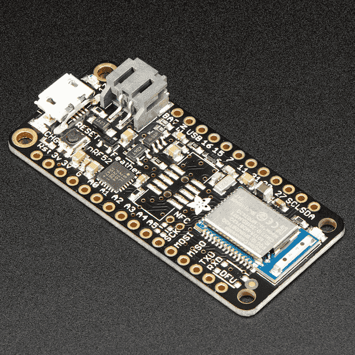

.. _nrf52_adafruit_feather:

nRF52 Adafruit Feather
######################

Overview
********

The nRF52 Adafruit Bluefruit Feather hardware provides
support for the Nordic Semiconductor nRF52832 ARM Cortex-M4F CPU and
the following devices:

* :abbr:`NVIC (Nested Vectored Interrupt Controller)`
* :abbr:`RTC (nRF RTC System Clock)`
* UART
* GPIO
* FLASH
* RADIO (Bluetooth Low Energy)
* Segger RTT (RTT Console)

     nRF52 Adafruit Feather Board (Credit: Adafruit)

More information about the board and its features can be found at the
`Adafruit Feather nRF52 Bluefruit Learning Guide`_. The `Nordic Semiconductor Infocenter`_
contains the processor's information and the datasheet.

Hardware
********

- nRF52832 ARM Cortex-M4F processor at 64 MHz
- 32.768 kHz crystal oscillator
- 512 KiB flash memory and 64 KiB of SRAM
- Battery connector and charger for 3.7 V lithium polymer batteries
- Charging indicator LED
- 2 User LEDs
- Reset button
- SWD connector
- USB serial converter

Supported Features
==================

The nRF52 Adafruit Feather board configuration supports the following
hardware features:

+-----------+------------+----------------------+
| Interface | Controller | Driver/Component     |
+===========+============+======================+
| NVIC      | on-chip    | nested vectored      |
|           |            | interrupt controller |
+-----------+------------+----------------------+
| RTC       | on-chip    | system clock         |
+-----------+------------+----------------------+
| UART      | on-chip    | serial port          |
+-----------+------------+----------------------+
| GPIO      | on-chip    | gpio                 |
+-----------+------------+----------------------+
| FLASH     | on-chip    | flash                |
+-----------+------------+----------------------+
| RADIO     | on-chip    | Bluetooth            |
+-----------+------------+----------------------+
| RTT       | on-chip    | console              |
+-----------+------------+----------------------+

Other hardware features have not been enabled yet for this board.

Connections and IOs
===================

The `Adafruit Feather nRF52 Bluefruit Learning Guide`_ has detailed
information about the board including `pinouts`_ and the `schematic`_.

LED
---

* LED0 (red) = P0.17
* LED1 (blue) = P0.19

Push buttons
------------

* DFU = SW0 = P0.20
* RESET = SW1 = P0.21/reset

Programming and Debugging
*************************

The ``nrf52_adafruit_feather`` board is available in two different versions:

- `Adafruit Feather nRF52 Pro with myNewt Bootloader`_
   This board version is the recommended one to use. It has the SWD header
   already populated and comes with the  Mynewt serial bootloader installed by
   default.

- `Adafruit Feather nRF52 Bluefruit LE`_
   This board is identical to the board above, but the SWD header is not
   populated and ships with an Arduino friendly bootloader. To be able to work
   with this version a 2*5pin 0.5" SWD header (e.g. `Adafruit SWD connector`_)
   needs to be soldered.

Applications for the ``nrf52_adafruit_feather`` board configuration can be
built, flashed, and debugged in the usual way. See :ref:`build_an_application`
and :ref:`application_run` for more details on building and running.

Flashing
========

Flashing Zephyr onto the ``nrf52_adafruit_feather`` board requires an external
J-Link programmer. The programmer is attached to the X1 SWD header.

Follow the instructions in the :ref:`nordic_segger` page to install
and configure all the necessary software. Further information can be
found in :ref:`nordic_segger_flashing`. Then build and flash
applications as usual (see :ref:`build_an_application` and
:ref:`application_run` for more details).

Here is an example for the :ref:`hello_world` application.

#. Build the Zephyr kernel and the :ref:`hello_world` sample application:

   .. zephyr-app-commands::
      :zephyr-app: samples/hello_world
      :board: nrf52_adafruit_feather
      :goals: build
      :compact:

#. Connect the Adafruit nRF52 Feather to your host computer using USB

#. Run your favorite terminal program to listen for output.

   .. code-block:: console

      $ minicom -D <tty_device> -b 115200

   Replace :code:`<tty_device>` with the port where the nRF52 Adafruit Feather
   board can be found. For example, under Linux, :code:`/dev/ttyUSB0`.

#. Flash the image:

   .. zephyr-app-commands::
      :zephyr-app: samples/hello_world
      :board: nrf52_adafruit_feather
      :goals: flash
      :compact:

   You should see "Hello World! arm" in your terminal.

Debugging
=========

The ``nrf52_adafruit_feather`` board does not have an on-board J-Link debug IC
as some nRF5x development boards, however, instructions from the
:ref:`nordic_segger` page also apply to this board, with the additional step
of connecting an external debugger.

Testing the LEDs and buttons on the nRF52 Adafruit Feather
**********************************************************

There are several samples that allow you to test that the buttons (switches) and LEDs on
the board are working properly with Zephyr:

- :ref:`blinky-sample`
- :ref:`button-sample`
- :ref:`fade-led-sample`
- :ref:`blink-led-sample`
- :ref:`96b_carbon_multi_thread_blinky`

You can build and flash the examples to make sure Zephyr is running correctly on
your board. The button and LED definitions can be found in
:zephyr_file:`boards/arm/nrf52_adafruit_feather/board.h`.

References
**********

.. target-notes::

.. _Adafruit Feather nRF52 Bluefruit Learning Guide: https://learn.adafruit.com/bluefruit-nrf52-feather-learning-guide/introduction
.. _schematic: https://learn.adafruit.com/assets/39913
.. _pinouts: https://cdn-learn.adafruit.com/assets/assets/000/046/210/original/Feather_NRF52_Pinout_v1.2.pdf?1504807075
.. _Nordic Semiconductor Infocenter: https://infocenter.nordicsemi.com
.. _J-Link Software and documentation pack: https://www.segger.com/jlink-software.html
.. _Adafruit Feather nRF52 Bluefruit LE: https://www.adafruit.com/product/3406
.. _Adafruit Feather nRF52 Pro with myNewt Bootloader: https://www.adafruit.com/product/3574
.. _Adafruit SWD connector: https://www.adafruit.com/product/752
