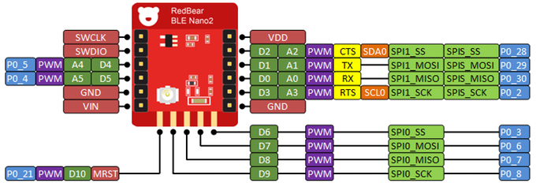
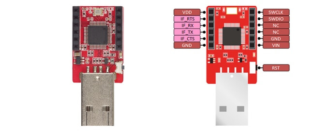

.. _nrf52_blenano2:

Redbear Labs Nano v2
####################

Overview
********
The Nano v2 is a development board equipped with Nordic's next generation nRF52832 Bluetooth Low Energy SOC.
This board was designed as a 'drop-in' replacement of BLE Nano with exactly the same form factor.
This board will be available for Kickstart backers on February 2017.
It is also available on Redbear store.
https://redbear.cc/product/ble/ble-nano-kit-2.html

Hardware
********
- nRF52832 SoC is built around a 32-bit ARM Cortex-M4F CPU with 512kB flash + 64kB RAM
- 11 x Digital I/0
- 1 UART with hardware flow control ( 4 I/O pins occupied )
- 1 I2C ( 2 I/O pins occupied )

Supported Features
==================
The BLE Nano v2 board configuration supports the following hardware features:

+-----------+------------+--------------------------------------+
| Interface | Controller |      Driver/Component                |
+===========+============+======================================+
| NVIC      | on-chip    | nested vectored interrupt controller |
+-----------+------------+--------------------------------------+
| UART      | on-chip    | serial port                          |
+-----------+------------+--------------------------------------+
| GPIO      | on-chip    | gpio                                 |
+-----------+------------+--------------------------------------+
| FLASH     | on-chip    | flash                                |
+-----------+------------+--------------------------------------+
| RADIO     | on-chip    | Bluetooth                            |
+-----------+------------+--------------------------------------+
| I2C       | on-chip    | i2c                                  |
+-----------+------------+--------------------------------------+

Connections and IOs
====================

BLE nano v2 pinout

DAPLink board

The DAPLink USB board acts as a dongle. DAPLink debug probes appear on the host computer as a USB disk.
It also regulates 5V from USB to 3.3V via the onboard LDO to power Nano v2.

Programming and Debugging
*************************

Flashing
========

Build the Zephyr kernel and BLE sample application:

.. code-block:: console

   $ cd $ZEPHYR_BASE
   $ . zephyr-env.sh
   $ make -C samples/bluetooth/beacon BOARD=nrf52_blenano2

- Mount your BLE Nano v2 onto the DAPLink USB dongle correctly.
- Connect DAPLink USB dongle to your host computer.
- The PC will prompt a new mass storage disk.
- Copy the generated file zephyr.bin on folder samples/bluetooth/beacon/outdir/nrf52_blenano2 to the DAPLink drive.
- Open nRF Connect application to check advertising packets.

References
**********

.. target-notes::

.. _Kickstarter: https://www.kickstarter.com/projects/redbearinc/bluetooth-5-ready-ble-module-nano-2-and-blend-2
.. _Github: https://github.com/redbear/nRF5x
.. _RedBear Forum: discuss.redbear.cc
