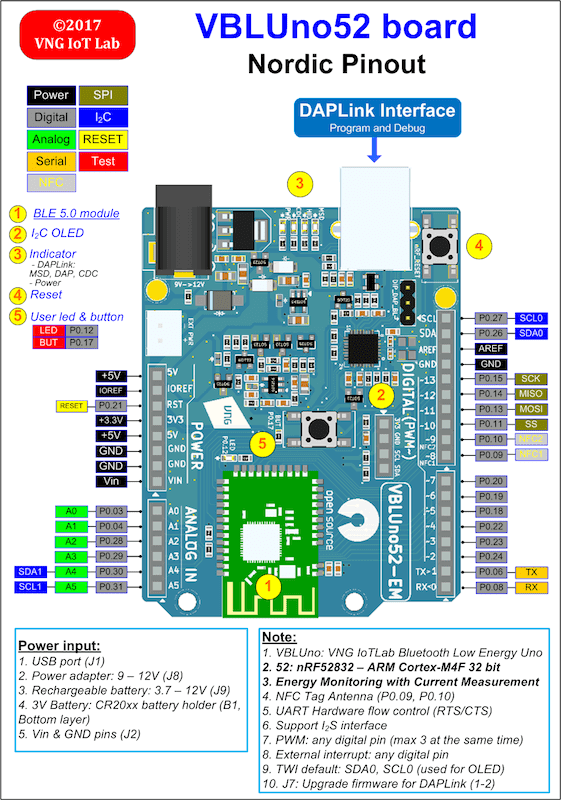

.. _nrf52_vbluno52:

nRF52-VBLUno52
##############

Overview
********

Zephyr can use the nrf52_vbluno52 board configuration to run on the VBLUno52 board,
a VNG Bluetooth Low Energy UNO using an nRF52832 ARM Cortex-M4F processor.
It provides support for the Nordic Semiconductor nRF52832 ARM Cortex-M4F CPU and
the following devices:

* :abbr:`NVIC (Nested Vectored Interrupt Controller)`
* :abbr:`RTC (nRF RTC System Clock)`
* UART
* GPIO
* FLASH
* RADIO (Bluetooth Low Energy 5.0)

     nRF52_VBLUno52 board

Hardware
********

The VBLUno52 board has two external oscillators. The frequency of
the slow clock is 32.768 kHz. The frequency of the main clock
is 64 MHz.

Supported Features
==================

The nrf52_vbluno52 board configuration supports the following
hardware features:

+-----------+------------+----------------------+
| Interface | Controller | Driver/Component     |
+===========+============+======================+
| NVIC      | on-chip    | nested vectored      |
|           |            | interrupt controller |
+-----------+------------+----------------------+
| RTC       | on-chip    | system clock         |
+-----------+------------+----------------------+
| UART      | on-chip    | serial port          |
+-----------+------------+----------------------+
| GPIO      | on-chip    | gpio                 |
+-----------+------------+----------------------+
| FLASH     | on-chip    | flash                |
+-----------+------------+----------------------+
| RADIO     | on-chip    | Bluetooth            |
+-----------+------------+----------------------+
| I2C       | on-chip    | i2c                  |
+-----------+------------+----------------------+
| SPI       | on-chip    | spi                  |
+-----------+------------+----------------------+

Other hardware features have not been enabled yet for this board.

Connections and IOs
===================

LED
---

* LED = LED0 (green) = P0.12

Push buttons
------------

* BUTTON = BUT = SW0 = P0.17

Programming and Debugging
*************************

Flashing
========

The VBLUno52 board has an on-board DAPLink (CMSIS-DAP) interface for flashing and debugging.
You do not need any other programming device.
You only need to install the pyOCD tool (https://pypi.python.org/pypi/pyOCD)

See the :ref:`getting_started` for general information on setting up
your development environment.

You can build and flash applications in the usual way. Here is an
example for the :ref:`hello_world` application.

.. zephyr-app-commands::
   :zephyr-app: samples/hello_world
   :board: nrf52_vbluno52
   :goals: build flash

Testing the VBLUno52 with Zephyr: buttons, LEDs, UART, BLE
**********************************************************

Here are some sample applications that you can use to test different
components on the VBLUno52 board:

* :ref:`hello_world`
* :ref:`blinky-sample`
* :ref:`button-sample`
* :ref:`bluetooth-beacon-sample`
* :ref:`peripheral_hr`
