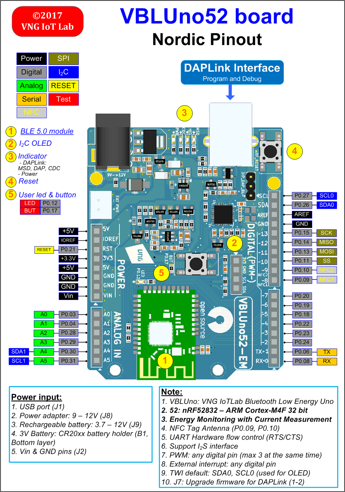

.. _nrf52_vbluno52:

nRF52-VBLUno52
##############

Overview
********

Zephyr can use the nrf52_vbluno52 board configuration to run on the VBLUno52 board,
a VNG Bluetooth Low Energy UNO using an nRF52832 ARM Cortex-M4F processor.

     nRF52_VBLUno52 board

Hardware
********

The VBLUno52 board has two external oscillators. The frequency of
the slow clock is 32.768 kHz. The frequency of the main clock
is 64 MHz.

Supported Features
==================

- CPU:
	+ Nordic nRF52832: ARM® Cortex™ M4F 32bit.
	+ *Bluetooth Low Energy 5.0 interface.*
	+ 512KB Flash, 64KB Ram.
	+ UART(1), I2C(2), SPI(3), PWM(3), SWD, I2S, Timer 32bit(5), RTC(3).
	+ Support EasyDMA.
	+ NFC Tag.
	+ 21 digital channels, 6 ADC 10bit channels.
	+ 1 Led and 1 Button onboard.
	+ GPIO Voltage: 0 – 3.3V.
- *DAPLink (CMSIS-DAP) interface for program and debug*:
	+ USB MSD: Drag and Drop programming flash memory.
	+ USB HID (DAP): CMSIS-DAP compliant debug channel.
	+ USB CDC: Virtual COM port for log, trace and terminal emulation.
- Supports hardware flow control features (RTS/CTS).
- *Energy monitoring for BLE module by current measurement*
- FOTA (Firmware over the air): Upgrade firmware over BLE interface.
- Build good applications with:
	+ Compiler and IDE: GCC, Keil MDK, IAR, Eclipse, Qt Creator.
	+ Frameworks: Arduino, ARM mbed-OS, Zephyr-OS, Nordic SDK, RIOT-OS, MyNewt-OS, ChibiOS, NuttX RTOS
	+ A lot of tutorials for Arduino, mbed-OS, Zephyr-OS and more.
- Pinout: Arduino Uno Rev3 compliant.
- Power:
	+ USB port.
	+ Power adapter: +9 -> +12V.
	+ 3V Battery: CR20xx holder
	+ Recharageable battery jump: +3.7 -> +12V
- Open source: Hardware design, firmware, packages, tutorial and example codes

Connections and IOs
===================

LED
---

* LED = LED0 (green) = P0.12

Push buttons
------------

* BUTTON = BUT = SW0 = P0.17

Programming and Debugging
*************************

Flashing
========

The VBLUno52 board has on-board DAPLink (CMSIS-DAP) interface for flashing and debugging.
You do not need any other programming device.
You only need to install the pyOCD tool (https://pypi.python.org/pypi/pyOCD)

This tutorial uses the blinky application :ref:`blinky-sample`

See the :ref:`getting_started` for general information on setting up
 your development environment.

#. To build the Zephyr kernel along with the blinky sample app, enter:

   .. code-block:: console

      $ cd $ZEPHYR_BASE/samples/basic/blinky
      $ make BOARD=nrf52_vbluno52

#. To build and flash the generated binary image to the board, enter:

   .. code-block:: console

      $ make BOARD=nrf52_vbluno52 flash

Testing the VBLUno52 with Zephyr: buttons, LEDs, UART, BLE
**********************************************************

 Here are some sample applications that you can use to test different
 components on the VBLUno52 board:

 * :ref:`hello_world`
 * :ref:`blinky-sample`
 * :ref:`button-sample`
 * :ref:`bluetooth-beacon-sample`
 * :ref:`peripheral_hr`

