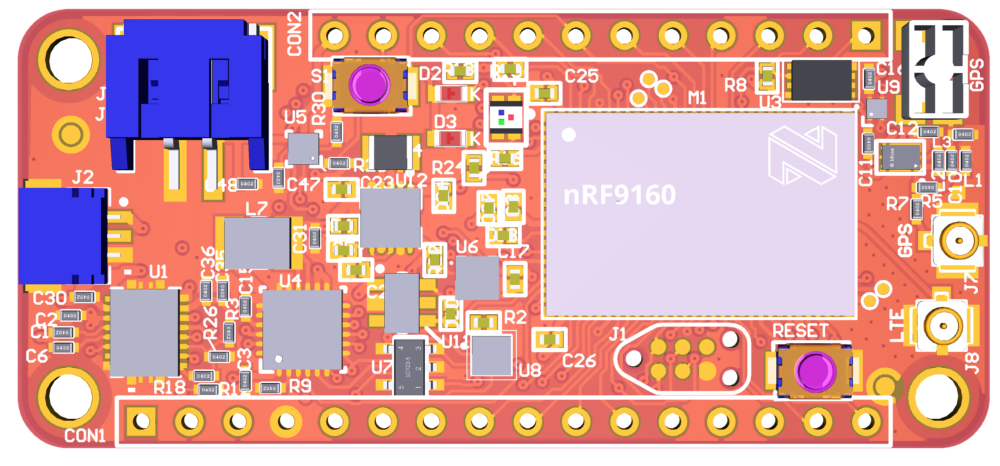

.. _nrf9160_innblue22:

nRF9160 INNBLUE22
#################

Overview
********

The nRF9160 innblue22 is a cellular IoT sensor development board, which
is based on the nRF9160 SiP, and features NB-IoT and LTE-M connectivity.

	 nRF9160 innblue22 (Credit: innblue)

Hardware
********

The following parts are built into the board:

* Accelerometer: ST LIS2DH12
* CryptoElement: Atmel ATECC608a
* Humidity Sensor: ST HTS221
* Qi charger: TI BQ51013
* Battery fuel gauge: TI BQ27421

Supported Features
==================

The nrf9160_innblue22 board configuration supports the following
hardware (as of nRF9160) features:

+-----------+------------+----------------------+
| Interface | Controller | Driver/Component     |
+-----------+------------+----------------------+
| CLOCK     | on-chip    | clock_control        |
+-----------+------------+----------------------+
| FLASH     | on-chip    | flash                |
+-----------+------------+----------------------+
| GPIO      | on-chip    | gpio                 |
+-----------+------------+----------------------+
| I2C(M)    | on-chip    | i2c                  |
+-----------+------------+----------------------+
| MPU       | on-chip    | arch/arm             |
+-----------+------------+----------------------+
| NVIC      | on-chip    | arch/arm             |
+-----------+------------+----------------------+
| PWM       | on-chip    | pwm                  |
+-----------+------------+----------------------+
| RTT       | Segger     | console              |
+-----------+------------+----------------------+
| SPU       | on-chip    | system protection    |
+-----------+------------+----------------------+
| UARTE     | on-chip    | serial               |
+-----------+------------+----------------------+
| WDT       | on-chip    | watchdog             |
+-----------+------------+----------------------+

Connections and IOs
===================

LED
---

* LED1 ( red ) = P0.7
* LED2 (green) = P0.6
* LED3 ( blue) = P0.5
* LED4 ( red ) = P0.4

Push buttons and Switches
-------------------------

* BUTTON1 = P0.31

Security components
===================

- Implementation Defined Attribution Unit. The IDAU is implemented
  with the System Protection Unit and is used to define secure and non-secure
  memory maps.  By default, all of the memory space  (Flash, SRAM, and
  peripheral address space) is defined to be secure accessible only.
- Secure boot.

Programming and Debugging
*************************

nrf9160_innblue22 supports the Armv8m Security Extension, and by default boots
in the Secure state.

Building Secure/Non-Secure Zephyr applications
==============================================

The process requires the following steps:

1. Build the Secure Zephyr application using ``-DBOARD=nrf9160_innblue22`` and
   ``CONFIG_TRUSTED_EXECUTION_SECURE=y`` in the the application project configuration file.
2. Build the Non-Secure Zephyr application using ``-DBOARD=nrf9160_innblue22ns``.
3. Merge the two binaries together.

When building a Secure/Non-Secure application, the Secure application will
have to set the IDAU (SPU) configuration to allow Non-Secure access to all
CPU resources utilized by the Non-Secure application firmware. SPU
configuration shall take place before jumping to the Non-Secure application.

Building a Secure only application
==================================

Build the Zephyr app in the usual way (see :ref:`build_an_application`
and :ref:`application_run`), using ``-DBOARD=nrf9160_innblue22``.

Flashing
========

Follow the instructions in the :ref:`nordic_segger` page to install
and configure all the necessary software. Further information can be
found in :ref:`nordic_segger_flashing`. Then build and flash
applications as usual (see :ref:`build_an_application` and
:ref:`application_run` for more details).

Here is an example for the :ref:`hello_world` application.

First, run your favorite terminal program to listen for output.

.. code-block:: console

   $ minicom -D <tty_device> -b 115200

Replace :code:`<tty_device>` with the port where the nRF9160 innblue22
can be found. For example, under Linux, :code:`/dev/ttyACM0`.

Then build and flash the application in the usual way.

.. zephyr-app-commands::
   :zephyr-app: samples/hello_world
   :board: nrf9160_innblue22
   :goals: build flash

Debugging
=========

Refer to the :ref:`nordic_segger` page to learn about debugging Nordic boards with a
Segger IC.
