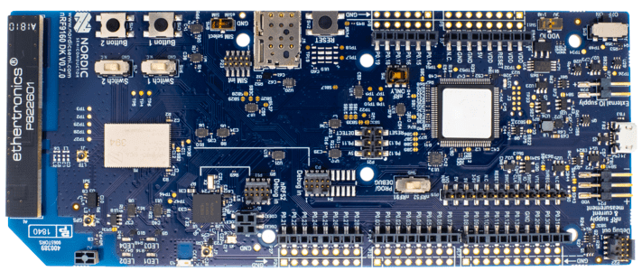

.. _nrf9160dk_nrf9160:

nRF9160 DK
##########

Overview
********

The nRF9160 DK (PCA10090) is a single-board development kit for evaluation and
development on the nRF9160 SiP for LTE-M and NB-IoT. The nrf9160dk_nrf9160
board configuration provides support for the Nordic Semiconductor nRF9160 ARM
Cortex-M33F CPU with ARMv8-M Security Extension and the following devices:

* :abbr:`ADC (Analog to Digital Converter)`
* CLOCK
* FLASH
* :abbr:`GPIO (General Purpose Input Output)`
* :abbr:`I2C (Inter-Integrated Circuit)`
* :abbr:`MPU (Memory Protection Unit)`
* :abbr:`NVIC (Nested Vectored Interrupt Controller)`
* :abbr:`PWM (Pulse Width Modulation)`
* :abbr:`RTC (nRF RTC System Clock)`
* Segger RTT (RTT Console)
* :abbr:`SPI (Serial Peripheral Interface)`
* :abbr:`UARTE (Universal asynchronous receiver-transmitter with EasyDMA)`
* :abbr:`WDT (Watchdog Timer)`
* :abbr:`IDAU (Implementation Defined Attribution Unit)`

     nRF9160 DK (Credit: Nordic Semiconductor)

More information about the board can be found at the
`nRF9160 DK website`_. The `Nordic Semiconductor Infocenter`_
contains the processor's information and the datasheet.

Hardware
********

nRF9160 DK has two external oscillators. The frequency of
the slow clock is 32.768 kHz. The frequency of the main clock
is 32 MHz.

Supported Features
==================

The nrf9160dk_nrf9160 board configuration supports the following
hardware features:

+-----------+------------+----------------------+
| Interface | Controller | Driver/Component     |
+===========+============+======================+
| ADC       | on-chip    | adc                  |
+-----------+------------+----------------------+
| CLOCK     | on-chip    | clock_control        |
+-----------+------------+----------------------+
| FLASH     | on-chip    | flash                |
+-----------+------------+----------------------+
| GPIO      | on-chip    | gpio                 |
+-----------+------------+----------------------+
| I2C(M)    | on-chip    | i2c                  |
+-----------+------------+----------------------+
| MPU       | on-chip    | arch/arm             |
+-----------+------------+----------------------+
| NVIC      | on-chip    | arch/arm             |
+-----------+------------+----------------------+
| PWM       | on-chip    | pwm                  |
+-----------+------------+----------------------+
| RTC       | on-chip    | system clock         |
+-----------+------------+----------------------+
| RTT       | Segger     | console              |
+-----------+------------+----------------------+
| SPI(M/S)  | on-chip    | spi                  |
+-----------+------------+----------------------+
| SPU       | on-chip    | system protection    |
+-----------+------------+----------------------+
| UARTE     | on-chip    | serial               |
+-----------+------------+----------------------+
| WDT       | on-chip    | watchdog             |
+-----------+------------+----------------------+

.. _nrf9160dk_additional_hardware:

Additional hardware in v0.14.0+
-------------------------------

Starting from v0.14.0, additional hardware is available on the DK:

* External flash memory (MX25R6435F, 64 Mb)
* I/O expander (PCAL6408A) that can be used to interface LEDs, slide switches,
  and buttons

To use this additional hardware, specify the revision of the board that
should be used when building your application (for more information, see
:ref:`application_board_version`). For example, to build for nRF9160 DK v1.0.0:

.. zephyr-app-commands::
   :tool: all
   :cd-into:
   :board: nrf9160dk_nrf9160@1.0.0
   :goals: build
   :compact:

Remember to also enable routing for this additional hardware in the firmware for
:ref:`nrf9160dk_nrf52840` (see :ref:`nrf9160dk_board_controller_firmware`).

Other hardware features are not supported by the Zephyr kernel.
See `nRF9160 DK website`_ and `Nordic Semiconductor Infocenter`_
for a complete list of nRF9160 DK board hardware features.

Connections and IOs
===================

LED
---

* LED1 (green) = P0.2
* LED2 (green) = P0.3
* LED3 (green) = P0.4
* LED4 (green) = P0.5

Push buttons and Switches
-------------------------

* BUTTON1 = P0.6
* BUTTON2 = P0.7
* SWITCH1 = P0.8
* SWITCH2 = P0.9
* BOOT = SW5 = boot/reset

Security components
===================

- Implementation Defined Attribution Unit (`IDAU`_).  The IDAU is implemented
  with the System Protection Unit and is used to define secure and non-secure
  memory maps.  By default, all of the memory space  (Flash, SRAM, and
  peripheral address space) is defined to be secure accessible only.
- Secure boot.

Programming and Debugging
*************************

nrf9160dk_nrf9160 supports the Armv8m Security Extension, and by default boots
in the Secure state.

Building Secure/Non-Secure Zephyr applications with Arm |reg| TrustZone |reg|
=============================================================================

Applications on the nRF9160 may contain a Secure and a Non-Secure firmware
image. The Secure image can be built using either Zephyr or
`Trusted Firmware M`_ (TF-M). Non-Secure firmware images are always built
using Zephyr. The two alternatives are described below.

Building the Secure firmware using Zephyr
-----------------------------------------

The process requires the following steps:

1. Build the Secure Zephyr application using ``-DBOARD=nrf9160dk_nrf9160`` and
   ``CONFIG_TRUSTED_EXECUTION_SECURE=y`` in the the application project configuration file.
2. Build the Non-Secure Zephyr application using ``-DBOARD=nrf9160dk_nrf9160ns``.
3. Merge the two binaries together.

Building the Secure firmware with TF-M
--------------------------------------

The process to build the Secure firmware image using TF-M and the Non-Secure
firmware image using Zephyr requires the following action:

* Build the Non-Secure Zephyr application
   using ``-DBOARD=nrf9160dk_nrf9160ns`` and
   ``CONFIG_BUILD_WITH_TFM=y`` in the application project configuration file.
   The Zephyr build system will perform the following steps automatically:

      * Build the Non-Secure firmware image as a regular Zephyr application
      * Build a TF-M (secure) firmware image
      * Merge the output binaries together
      * Optionally build a bootloader image (MCUboot)

.. note::

   Depending on the TF-M configuration, an application DTS overlay may be
   required, to adjust the Non-Secure image Flash and SRAM starting address
   and sizes.

When building a Secure/Non-Secure application, the Secure application will
have to set the IDAU (SPU) configuration to allow Non-Secure access to all
CPU resources utilized by the Non-Secure application firmware. SPU
configuration shall take place before jumping to the Non-Secure application.

Building a Secure only application
==================================

Build the Zephyr app in the usual way (see :ref:`build_an_application`
and :ref:`application_run`), using ``-DBOARD=nrf9160dk_nrf9160``.

Flashing
========

Follow the instructions in the :ref:`nordic_segger` page to install
and configure all the necessary software. Further information can be
found in :ref:`nordic_segger_flashing`. Then build and flash
applications as usual (see :ref:`build_an_application` and
:ref:`application_run` for more details).

Here is an example for the :ref:`hello_world` application.

First, run your favorite terminal program to listen for output.

.. code-block:: console

   $ minicom -D <tty_device> -b 115200

Replace :code:`<tty_device>` with the port where the nRF9160 DK
can be found. For example, under Linux, :code:`/dev/ttyACM0`.

Then build and flash the application in the usual way.

.. zephyr-app-commands::
   :zephyr-app: samples/hello_world
   :board: nrf9160dk_nrf9160
   :goals: build flash

Debugging
=========

Refer to the :ref:`nordic_segger` page to learn about debugging Nordic boards with a
Segger IC.

Testing the LEDs and buttons in the nRF9160 DK
**********************************************

There are 2 samples that allow you to test that the buttons (switches) and LEDs on
the board are working properly with Zephyr:

* :ref:`blinky-sample`
* :ref:`button-sample`

You can build and flash the examples to make sure Zephyr is running correctly on
your board. The button and LED definitions can be found in
:zephyr_file:`boards/arm/nrf9160dk_nrf9160/nrf9160dk_nrf9160_common.dts`.

References
**********

.. target-notes::

.. _IDAU:
   https://developer.arm.com/docs/100690/latest/attribution-units-sau-and-idau
.. _nRF9160 DK website: https://www.nordicsemi.com/Software-and-Tools/Development-Kits/nRF9160-DK
.. _Nordic Semiconductor Infocenter: https://infocenter.nordicsemi.com
.. _Trusted Firmware M: https://www.trustedfirmware.org/projects/tf-m/
