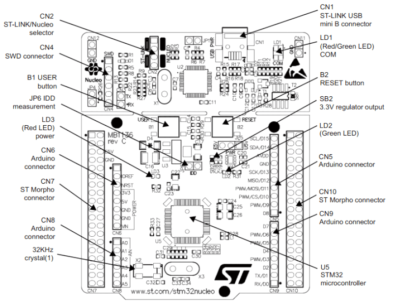

.. _nucleo_f302r8_board:

ST Nucleo F302R8
################

Overview
********

The STM32 Nucleo board provides an affordable and flexible way for users to try
out new concepts and build prototypes with the STM32 microcontroller, choosing
from the various combinations of performance, power consumption and features.
For the compatible boards, the SMPS significantly reduces power consumption in
Run mode.

The Arduino* Uno V3 connectivity support and the ST morpho headers allow the
easy expansion of the functionality of the STM32 Nucleo open development
platform with a wide choice of specialized shields.

The STM32 Nucleo board does not require any separate probe as it integrates the
ST-LINK/V2-1 debugger and programmer.

The STM32 Nucleo board comes with the STM32 comprehensive software HAL library
together with various packaged software examples, as well as direct access to
the Arm* Mbed* online resources at http://mbed.org.

.. image:: img/nucleo_f302r8_board.jpg
   :width: 500px
   :height: 367px
   :align: center
   :alt: Nucleo F302R8

More information about the board can be found at the `Nucleo F302R8 website`_.

Hardware
********
Nucleo F302R8 provides the following hardware components:

- STM32 microcontroller in LQFP64 package
- External SMPS to generate Vcore logic supply (only available on '-P' suffixed
  boards)
- 1 user LED shared with Arduino*
- 1 user and 1 reset push-buttons
- 32.768 kHz LSE crystal oscillator
- Two types of extension resources:

  - Arduino* Uno V3 connectivity
  - ST morpho extension pin headers for full access to all STM32 I/Os
- External SMPS experimentation dedicated connector (only available on '-P'
  suffixed boards)

- Flexible power-supply options: ST-LINK USB VBUS or external sources
- On-board ST-LINK/V2-1 debugger/programmer with USB re-enumeration capability.
  Three different interfaces supported on USB: mass storage, virtual COM port
  and debug port
- Comprehensive free software libraries and examples available with the
  STM32Cube MCU Package
- Support of a wide choice of Integrated Development Environments (IDEs)
  including IAR* , Keil* , GCC-based IDEs, Arm* Mbed*
- Arm* Mbed Enabled* compliant (only for some Nucleo part numbers)

More information about STM32F302R8 can be found in the
`STM32F302 reference manual`_

Supported Features
==================

The Zephyr nucleo_f302r8 board configuration supports the following hardware features:

+-----------+------------+-------------------------------------+
| Interface | Controller | Driver/Component                    |
+===========+============+=====================================+
| NVIC      | on-chip    | nested vector interrupt controller  |
+-----------+------------+-------------------------------------+
| UART      | on-chip    | serial port-polling;                |
|           |            | serial port-interrupt               |
+-----------+------------+-------------------------------------+
| PINMUX    | on-chip    | pinmux                              |
+-----------+------------+-------------------------------------+
| GPIO      | on-chip    | gpio                                |
+-----------+------------+-------------------------------------+
| CLOCK     | on-chip    | reset and clock control             |
+-----------+------------+-------------------------------------+
| FLASH     | on-chip    | flash memory                        |
+-----------+------------+-------------------------------------+
| IWDG      | on-chip    | independent watchdog                |
+-----------+------------+-------------------------------------+

Other hardware features are not yet supported in this Zephyr port.

The default configuration can be found in the defconfig file:
``boards/arm/nucleo_f302r8/nucleo_f302r8_defconfig``

Connections and IOs
===================

Each of the GPIO pins can be configured by software as output (push-pull or open-drain), as
input (with or without pull-up or pull-down), or as peripheral alternate function. Most of the
GPIO pins are shared with digital or analog alternate functions. All GPIOs are high current
capable except for analog inputs.

Board connectors:
-----------------

Default Zephyr Peripheral Mapping:
----------------------------------

- UART_1_TX : PA9
- UART_1_RX : PA10
- UART_2_TX : PA2
- UART_2_RX : PA3
- PWM_1_CH1 : PA8
- USER_PB   : PC13
- LD2       : PB13

For mode details please refer to `STM32 Nucleo-64 board User Manual`_.

Programming and Debugging
*************************

Applications for the ``nucleo_f302r8`` board configuration can be built and
flashed in the usual way (see :ref:`build_an_application` and
:ref:`application_run` for more details).

Flashing
========

Nucleo F302R8 board includes an ST-LINK/V2-1 embedded debug tool interface.
This interface is supported by the openocd version included in Zephyr SDK.

Flashing an application to Nucleo F302R8
----------------------------------------

Connect the Nucleo F302R8 to your host computer using the USB port,
then build and flash an application. Here is an example for the
:ref:`blinky-sample` application.

.. zephyr-app-commands::
   :zephyr-app: samples/basic/blinky
   :board: nucleo_f302r8
   :goals: build flash

You will see the LED blinking every second.

Debugging
=========

You can debug an application in the usual way.  Here is an example for
the :ref:`blinky-sample` application.

.. zephyr-app-commands::
   :zephyr-app: samples/basic/blinky
   :board: nucleo_f302r8
   :maybe-skip-config:
   :goals: debug

References
**********

.. target-notes::

.. _Nucleo F302R8 website:
   http://www.st.com/en/evaluation-tools/nucleo-f302r8.html

.. _STM32F302 reference manual:
   http://www.st.com/resource/en/reference_manual/dm00094349.pdf

.. _STM32 Nucleo-64 board User Manual:
   http://www.st.com/resource/en/user_manual/dm00105823.pdf
