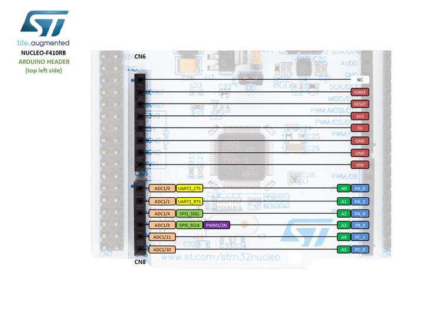
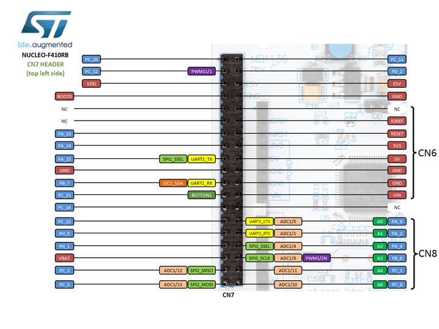
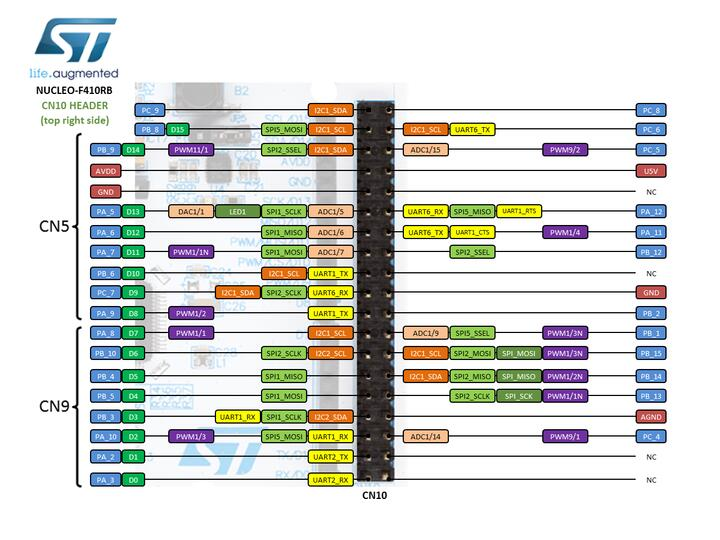

.. _nucleo_f410rb_board:

ST Nucleo F410RB
################

Overview
********

The Nucleo F410RB board features an ARM Cortex-M4 based STM32F410RB MCU
with a wide range of connectivity support and configurations. Here are
some highlights of the Nucleo F410RB board:

- STM32 microcontroller in QFP64 package
- Two types of extension resources:

  - Arduino Uno V3 connectivity
  - ST morpho extension pin headers for full access to all STM32 I/Os

- On-board ST-LINK/V2-1 debugger/programmer with SWD connector
- Flexible board power supply:

  - USB VBUS or external source(3.3V, 5V, 7 - 12V)
  - Power management access point

- Three LEDs: USB communication (LD1), user LED (LD2), power LED (LD3)
- Two push-buttons: USER and RESET

.. image:: img/nucleo_f410rb.jpg
   :align: center
   :alt: Nucleo F410RB

More information about the board can be found at the `Nucleo F410RB website`_.

Hardware
********

Nucleo F410RB provides the following hardware components:

- STM32F410RBT6 in LQFP64 package
- ARM |reg| 32-bit Cortex |reg|-M4 CPU with FPU
- Adaptive real-time accelerator (ART Accelerator)
- 100 MHz max CPU frequency
- VDD from 1.7 V to 3.6 V
- 128 KB Flash
- 32 KB SRAM
- General purpose timer (4)
- Low-power timer (1)
- Advanced-control timer (1)
- Random number generator (TRNG for HW entropy)
- SPI/I2S (3)
- I2C (3)
- USART (3)
- GPIO (50) with external interrupt capability
- 12-bit ADC with 16 channels
- 12-bit DAC with 1 channel
- RTC

More information about STM32F410RB can be found here:

- `STM32F410RB on www.st.com`_
- `STM32F410 reference manual`_

Supported Features
==================

The Zephyr nucleo_f410rb board configuration supports the following hardware features:

+-----------+------------+-------------------------------------+
| Interface | Controller | Driver/Component                    |
+===========+============+=====================================+
| NVIC      | on-chip    | nested vector interrupt controller  |
+-----------+------------+-------------------------------------+
| UART      | on-chip    | serial port                         |
+-----------+------------+-------------------------------------+
| PINMUX    | on-chip    | pinmux                              |
+-----------+------------+-------------------------------------+
| GPIO      | on-chip    | gpio                                |
+-----------+------------+-------------------------------------+
| PWM       | on-chip    | pwm                                 |
+-----------+------------+-------------------------------------+
| I2C       | on-chip    | i2c                                 |
+-----------+------------+-------------------------------------+
| I2S       | on-chip    | i2s                                 |
+-----------+------------+-------------------------------------+
| SPI       | on-chip    | spi                                 |
+-----------+------------+-------------------------------------+
| ADC       | on-chip    | ADC Controller                      |
+-----------+------------+-------------------------------------+
| DAC       | on-chip    | DAC Controller                      |
+-----------+------------+-------------------------------------+
| WATCHDOG  | on-chip    | window & independent                |
+-----------+------------+-------------------------------------+

Other hardware features are not yet supported on this Zephyr port.

The default configuration can be found in the defconfig file:
``boards/arm/nucleo_f410rb/nucleo_f410rb_defconfig``

Connections and IOs
===================

Nucleo F410RB Board has 8 GPIO controllers. These controllers are responsible for pin muxing,
input/output, pull-up, etc.

Available pins:
---------------

.. image:: img/nucleo_f410rb_arduino_top_right.jpg
   :align: center
   :alt: Nucleo F410RB Arduino connectors (top right)

For mode details please refer to `STM32 Nucleo-64 board User Manual`_.

Default Zephyr Peripheral Mapping:
----------------------------------

- UART_1_TX : PB6
- UART_1_RX : PB7
- UART_2_TX : PA2
- UART_2_RX : PA3
- USER_PB : PC13
- LD2 : PA5
- I2C1_SDA : PB9
- I2C1_SCL : PB8
- I2C2_SDA : PB3
- I2C2_SCL : PB10

System Clock
------------

Nucleo F410RB System Clock could be driven by an internal or external oscillator,
as well as the main PLL clock. By default, the System clock is driven by the PLL clock at 84MHz,
driven by an 8MHz high-speed external clock.

Serial Port
-----------

Nucleo F410RB board has 3 USARTs. The Zephyr console output is assigned to UART2.
Default settings are 115200 8N1.

Programming and Debugging
*************************

Applications for the ``nucleo_f410rb`` board configuration can be built and
flashed in the usual way (see :ref:`build_an_application` and
:ref:`application_run` for more details).

Flashing
========

Nucleo F410RB board includes an ST-LINK/V2-1 embedded debug tool interface.
This interface is supported by the openocd version included in the Zephyr SDK.

Flashing an application to Nucleo F410RB
----------------------------------------

Here is an example for the :ref:`hello_world` application.

Run a serial host program to connect with your Nucleo board.

.. code-block:: console

   $ minicom -b 115200 -D /dev/ttyACM0

Build and flash the application:

.. zephyr-app-commands::
   :zephyr-app: samples/hello_world
   :board: nucleo_f410rb
   :goals: build flash

You should see the following message on the console:

.. code-block:: console

   $ Hello World! arm

Debugging
=========

You can debug an application in the usual way.  Here is an example for the
:ref:`hello_world` application.

.. zephyr-app-commands::
   :zephyr-app: samples/hello_world
   :board: nucleo_f410rb
   :maybe-skip-config:
   :goals: debug

.. _Nucleo F410RB website:
   http://www.st.com/en/evaluation-tools/nucleo-F410RB.html

.. _STM32 Nucleo-64 board User Manual:
   http://www.st.com/resource/en/user_manual/dm00105823.pdf

.. _STM32F410RB on www.st.com:
   http://www.st.com/en/microcontrollers/stm32f410rb.html

.. _STM32F410 reference manual:
   https://www.st.com/resource/en/reference_manual/dm00180366.pdf
