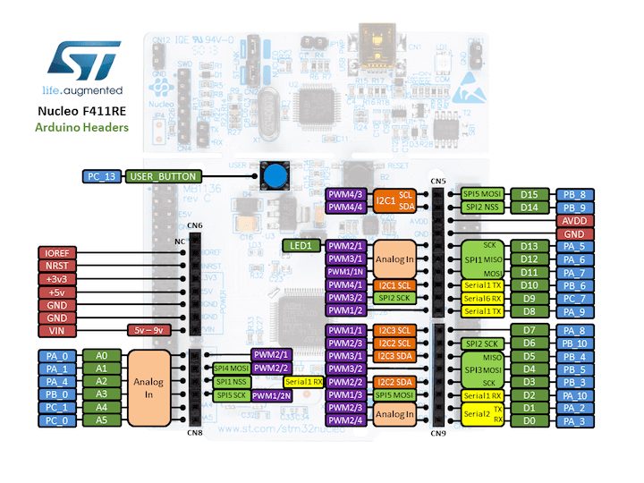
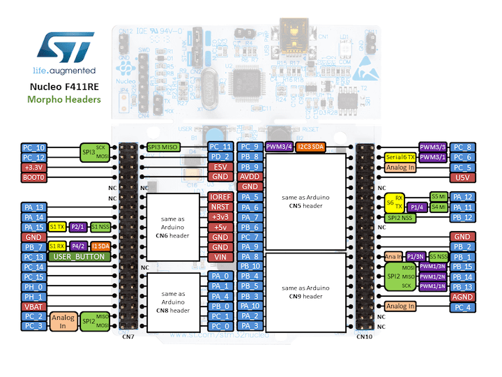

.. _nucleo_f411re_board:

ST Nucleo F411RE
################

Overview
********

The Nucleo F411RE board features an ARM Cortex-M4 based STM32F411RE MCU
with a wide range of connectivity support and configurations. Here are
some highlights of the Nucleo F411RE board:

- STM32 microcontroller in QFP64 package
- Two types of extension resources:
       - Arduino Uno V3 connectivity
       - ST morpho extension pin headers for full access to all STM32 I/Os
- On-board ST-LINK/V2-1 debugger/programmer with SWD connector
- Flexible board power supply:
       - USB VBUS or external source(3.3V, 5V, 7 - 12V)
       - Power management access point
- Three LEDs: USB communication (LD1), user LED (LD2), power LED (LD3)
- Two push-buttons: USER and RESET

.. image:: img/nucleo64_perf_logo_1024.png
     :width: 720px
     :align: center
     :height: 720px
     :alt: Nucleo F411RE

More information about the board can be found at the `Nucleo F411RE website`_.

Hardware
********

Nucleo F411RE provides the following hardware components:

- STM32F411RET6 in LQFP64 package
- ARM®32-bit Cortex®-M4 CPU with FPU
- 100 MHz max CPU frequency
- VDD from 1.7 V to 3.6 V
- 512 KB Flash
- 128 KB SRAM
- GPIO with external interrupt capability
- 12-bit ADC with 16 channels, with FIFO and burst support
- RTC
- 8 General purpose timers
- 2 watchdog timers (independent and window)
- SysTick timer
- USART/UART (3)
- I2C (3)
- SPI (5)
- SDIO
- USB 2.0 OTG FS
- DMA Controller
- CRC calculation unit

More information about STM32F411RE can be found here:
       - `STM32F411RE on www.st.com`_
       - `STM32F411 reference manual`_

Supported Features
==================

The Zephyr nucleo_411re board configuration supports the following hardware features:

+-----------+------------+-------------------------------------+
| Interface | Controller | Driver/Component                    |
+===========+============+=====================================+
| NVIC      | on-chip    | nested vector interrupt controller  |
+-----------+------------+-------------------------------------+
| UART      | on-chip    | serial port-polling;                |
|           |            | serial port-interrupt               |
+-----------+------------+-------------------------------------+
| PINMUX    | on-chip    | pinmux                              |
+-----------+------------+-------------------------------------+
| GPIO      | on-chip    | gpio                                |
+-----------+------------+-------------------------------------+
| PWM       | on-chip    | pwm                                 |
+-----------+------------+-------------------------------------+

Other hardware features are not yet supported on this Zephyr port.

The default configuration can be found in the defconfig file:

	``boards/arm/nucleo_f411re/nucleo_f411re_defconfig``

Connections and IOs
===================

Nucleo F411RE Board has 8 GPIO controllers. These controllers are responsible for pin muxing,
input/output, pull-up, etc.

Available pins:
---------------

For mode details please refer to `STM32 Nucleo-64 board User Manual`_.

Default Zephyr Peripheral Mapping:
----------------------------------
- UART_1_TX : PB6
- UART_1_RX : PB7
- UART_2_TX : PA2
- UART_2_RX : PA3
- PWM_2_CH1 : PA0
- USER_PB : PC13
- LD2 : PA5

System Clock
------------

Nucleo F411RE System Clock could be driven by internal or external oscillator,
as well as main PLL clock. By default System clock is driven by PLL clock at 84MHz,
driven by 8MHz high speed external clock.

Serial Port
-----------

Nucleo F411RE board has 3 UARTs. The Zephyr console output is assigned to UART2.
Default settings are 115200 8N1.

Programming and Debugging
*************************

Flashing
========

Nucleo F411RE board includes an ST-LINK/V2-1 embedded debug tool interface.
This interface is supported by the openocd version included in Zephyr SDK.

Flashing an application to Nucleo F411RE
----------------------------------------

The sample application hello_world is being used in this tutorial:

.. code-block:: console

   $<zephyr_root_path>/samples/hello_world

To build the Zephyr kernel and application, enter:

.. code-block:: console

   $ cd <zephyr_root_path>
   $ source zephyr-env.sh
   $ cd $ZEPHYR_BASE/samples/hello_world/
   $ make BOARD=nucleo_f411re

Connect the Nucleo F411RE to your host computer using the USB port.
Then, enter the following command:

.. code-block:: console

   $ make BOARD=nucleo_f411re flash

Run a serial host program to connect with your Nucleo board.

.. code-block:: console

   $ minicom -D /dev/ttyACM0

You should see the following message:

.. code-block:: console

   $ Hello World! arm

Debugging
=========

Access gdb with the following make command:

.. code-block:: console

   $ make BOARD=nucleo_f411re debug

.. _Nucleo F411RE website:
   http://www.st.com/en/evaluation-tools/nucleo-f411re.html

.. _STM32 Nucleo-64 board User Manual:
   http://www.st.com/resource/en/user_manual/dm00105823.pdf

.. _STM32F411RE on www.st.com:
   http://www.st.com/en/microcontrollers/stm32f411re.html

.. _STM32F411 reference manual:
   http://www.st.com/resource/en/reference_manual/dm00119316.pdf
