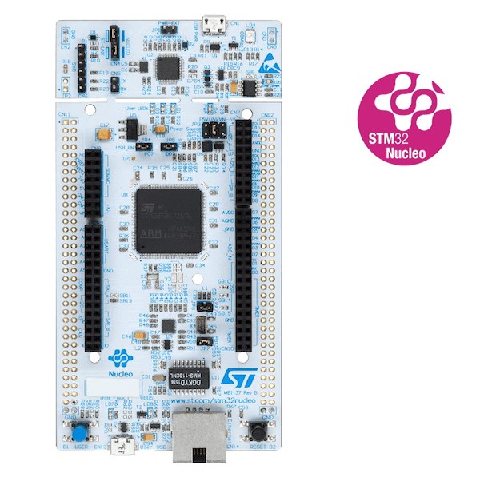
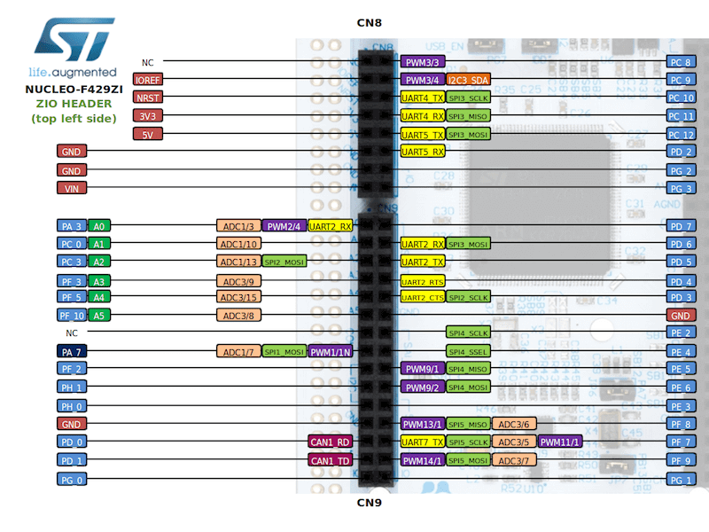
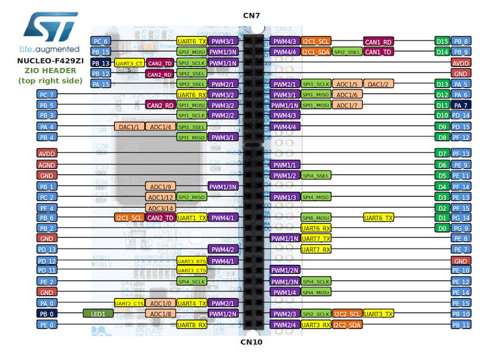
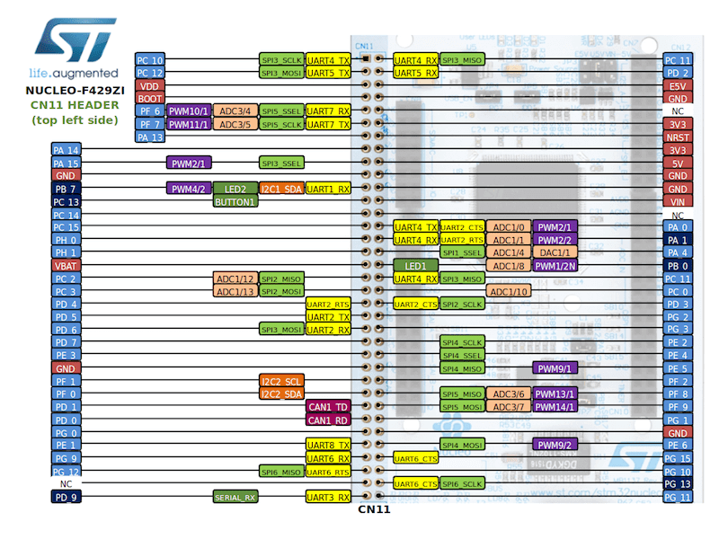
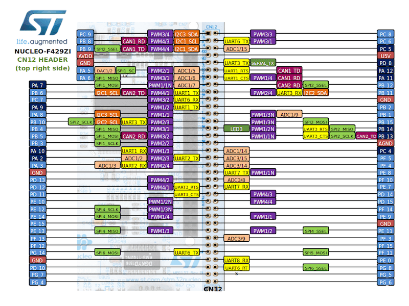

.. _nucleo_f429zi_board:

ST Nucleo F429ZI
################

Overview
********

The Nucleo F429ZI board features an ARM Cortex-M4 based STM32F429ZI MCU
with a wide range of connectivity support and configurations. Here are
some highlights of the Nucleo F429ZI board:

- STM32 microcontroller in LQFP144 package
- LSE crystal: 32.768 kHz crystal oscillator
- USB OTG
- Ethernet compliant with IEEE-802.3-2002
- Two types of extension resources:

  - ST Zio connector including: support for Arduino* Uno V3 connectivity
    (A0 to A5, D0 to D15) and additional signals exposing a wide range of
    peripherals
  - ST morpho extension pin headers for full access to all STM32 I/Os

- On-board ST-LINK/V2-1 debugger/programmer with SWD connector
- Flexible board power supply:

  - 5 V from ST-LINK/V2-1 USB VBUS
  - External power sources: 3.3 V and 7 - 12 V on ST Zio or ST morpho
    connectors, 5 V on ST morpho connector

- Three user LEDs
- Two push-buttons: USER and RESET

More information about the board can be found at the `Nucleo F429ZI website`_.

Hardware
********

The Nucleo F429ZI provides the following hardware components:

- STM32F429ZIT6 in LQFP144 package
- ARM |reg| 32-bit Cortex |reg| -M4 CPU with FPU
- 180 MHz max CPU frequency
- VDD from 1.8 V to 3.6 V
- 2 MB Flash
- 256+4 KB SRAM including 64-Kbyte of core coupled memory
- GPIO with external interrupt capability
- 3x12-bit ADC with 24 channels
- 2x12-bit D/A converters
- RTC
- Advanced-control Timer
- General Purpose Timers (17)
- Watchdog Timers (2)
- USART/UART (4/4)
- I2C (3)
- SPI (6)
- SDIO
- 2xCAN
- USB 2.0 OTG FS with on-chip PHY
- USB 2.0 OTG HS/FS with dedicated DMA, on-chip full-speed PHY and ULPI
- 10/100 Ethernet MAC with dedicated DMA
- 8- to 14-bit parallel camera
- CRC calculation unit
- True random number generator
- DMA Controller

More information about STM32F429ZI can be found here:

- `STM32F429ZI on www.st.com`_
- `STM32F429 reference manual`_
- `STM32F429 datasheet`_

Supported Features
==================

The Zephyr nucleo_f429zi board configuration supports the following hardware features:

+-----------+------------+-------------------------------------+
| Interface | Controller | Driver/Component                    |
+===========+============+=====================================+
| NVIC      | on-chip    | nested vector interrupt controller  |
+-----------+------------+-------------------------------------+
| UART      | on-chip    | serial port-polling;                |
|           |            | serial port-interrupt               |
+-----------+------------+-------------------------------------+
| PINMUX    | on-chip    | pinmux                              |
+-----------+------------+-------------------------------------+
| GPIO      | on-chip    | gpio                                |
+-----------+------------+-------------------------------------+
| ETHERNET  | on-chip    | Ethernet                            |
+-----------+------------+-------------------------------------+
| PWM       | on-chip    | pwm                                 |
+-----------+------------+-------------------------------------+
| I2C       | on-chip    | i2c                                 |
+-----------+------------+-------------------------------------+
| USB       | on-chip    | usb                                 |
+-----------+------------+-------------------------------------+
| SPI       | on-chip    | spi                                 |
+-----------+------------+-------------------------------------+
| WATCHDOG  | on-chip    | independent watchdog                |
+-----------+------------+-------------------------------------+
| ADC       | on-chip    | adc                                 |
+-----------+------------+-------------------------------------+

Other hardware features are not yet supported on this Zephyr port.

The default configuration can be found in the defconfig file:
``boards/arm/nucleo_f429zi/nucleo_f429zi_defconfig``

Connections and IOs
===================

The Nucleo F429ZI Board has 8 GPIO controllers. These controllers are responsible for pin muxing,
input/output, pull-up, etc.

Available pins:
---------------

For mode details please refer to `STM32 Nucleo-144 board User Manual`_.

Default Zephyr Peripheral Mapping:
----------------------------------

The Nucleo F429ZI board features a ST Zio connector (extended Arduino Uno V3)
and a ST morpho connector. Board is configured as follows

- UART_3 TX/RX : PD8/PD9 (ST-Link Virtual Port Com)
- UART_6 TX/RX : PG14/PG9 (Arduino Serial)
- I2C1 SCL/SDA : PB8/PB9 (Arduino I2C)
- SPI1 NSS/SCK/MISO/MOSI : PA4/PA5/PA6/PA7 (Arduino SPI)
- PWM_2_CH1 : PE13
- ETH : PA1, PA2, PA7, PB13, PC1, PC4, PC5, PG11, PG13
- USER_PB : PC13
- LD1 : PB0
- LD2 : PB7
- LD3 : PB14
- USB DM : PA11
- USB DP : PA12
- ADC1 : PA0

System Clock
------------

The Nucleo F429ZI System Clock could be driven by an internal or external oscillator,
as well as by the main PLL clock. By default System clock is driven by PLL clock at 180MHz,
driven by an 8MHz high speed external clock.

Serial Port
-----------

The Nucleo F429ZI board has 8 UARTs. The Zephyr console output is assigned to UART3.
Default settings are 115200 8N1.

Programming and Debugging
*************************

The Nucleo F429ZI board includes an ST-LINK/V2-1 embedded debug tool interface.
This interface is supported by the openocd version included in Zephyr SDK.

Flash partitions for MCUBoot bootloader
***************************************

The on-board STM32F429ZI MCU has 2MBs of internal flash memory. To use `MCUboot`_,
define a :ref:`Zephyr partition table <flash_map_api>` for the flash memory in
its devicetree file ``nucleo_f429zi.dts``. As a reference, a partition table for
MCUBoot is already defined in the devicetree file, with these settings:

- `MCUBoot`_ bootloader partition takes 64K bytes.
- Zephyr settings partition takes 64K bytes.
- Application image takes 256K bytes in Slot 0 partition.
- Updating image takes another 256K bytes in Slot 1 partition.
- A scratch partition with 128K is required for image swap.

A specific application can adjust each partition size based on its needs.

.. _Nucleo F429ZI website:
   http://www.st.com/en/evaluation-tools/nucleo-f429zi.html

.. _STM32 Nucleo-144 board User Manual:
   http://www.st.com/resource/en/user_manual/dm00244518.pdf

.. _STM32F429ZI on www.st.com:
   http://www.st.com/en/microcontrollers/stm32f429zi.html

.. _STM32F429 reference manual:
   http://www.st.com/resource/en/reference_manual/dm00031020.pdf

.. _STM32F429 datasheet:
   http://www.st.com/resource/en/datasheet/DM00071990.pdf

.. _MCUBoot:
   https://github.com/JuulLabs-OSS/mcuboot/blob/master/README.md
