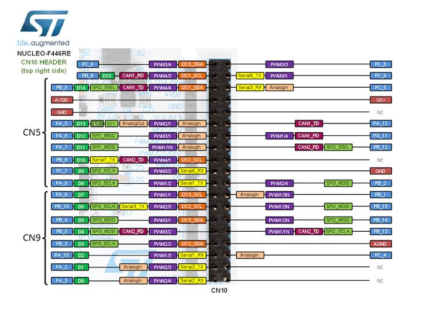

.. _nucleo_f446re_board:

ST Nucleo F446RE
################

Overview
********

The Nucleo F446RE board features an ARM Cortex-M4 based STM32F446RE MCU
with a wide range of connectivity support and configurations. Here are
some highlights of the Nucleo F446RE board:

- STM32 microcontroller in QFP64 package
- Two types of extension resources:

  - Arduino Uno V3 connectivity
  - ST morpho extension pin headers for full access to all STM32 I/Os

- On-board ST-LINK/V2-1 debugger/programmer with SWD connector
- Flexible board power supply:

  - USB VBUS or external source(3.3V, 5V, 7 - 12V)
  - Power management access point

- Three LEDs: USB communication (LD1), user LED (LD2), power LED (LD3)
- Two push-buttons: USER and RESET

.. image:: img/nucleo_f446re.jpg
   :align: center
   :alt: Nucleo F446RE

More information about the board can be found at the `Nucleo F446RE website`_.

Hardware
********

Nucleo F446RE provides the following hardware components:

- STM32F446RET6 in LQFP64 package
- ARM |reg| 32-bit Cortex |reg|-M4 CPU with FPU
- Adaptive real-time accelerator (ART Accelerator)
- 180 MHz max CPU frequency
- VDD from 1.7 V to 3.6 V
- 512 KB Flash
- 128 KB SRAM
- 10 General purpose timers
- 2 Advanced control timers
- 2 basic timers
- SPI(4)
- I2C(3)
- USART(4)
- UART(2)
- USB OTG Full Speed and High Speed
- CAN(2)
- SAI(2)
- SPDIF_Rx(1)
- HDMI_CEC(1)
- Quad SPI(1)
- Camera Interface
- GPIO(50) with external interrupt capability
- 12-bit ADC(3) with 16 channels
- 12-bit DAC with 2 channels

More information about STM32F446RE can be found here:

- `STM32F446RE on www.st.com`_
- `STM32F446 reference manual`_

Supported Features
==================

The Zephyr nucleo_f446re board configuration supports the following hardware features:

+-------------+------------+-------------------------------------+
| Interface   | Controller | Driver/Component                    |
+=============+============+=====================================+
| NVIC        | on-chip    | nested vector interrupt controller  |
+-------------+------------+-------------------------------------+
| UART        | on-chip    | serial port                         |
+-------------+------------+-------------------------------------+
| PINMUX      | on-chip    | pinmux                              |
+-------------+------------+-------------------------------------+
| GPIO        | on-chip    | gpio                                |
+-------------+------------+-------------------------------------+
| PWM         | on-chip    | pwm                                 |
+-------------+------------+-------------------------------------+
| I2C         | on-chip    | i2c                                 |
+-------------+------------+-------------------------------------+
| Backup SRAM | on-chip    | Backup SRAM                         |
+-------------+------------+-------------------------------------+
| CAN 1/2     | on-chip    | Controller Area Network             |
+-------------+------------+-------------------------------------+

Other hardware features are not yet supported on this Zephyr port.

The default configuration can be found in the defconfig file:
``boards/arm/nucleo_f446re/nucleo_f446re_defconfig``

Connections and IOs
===================

Nucleo F446RE Board has 8 GPIO controllers. These controllers are responsible for pin muxing,
input/output, pull-up, etc.

Available pins:
---------------
.. image:: img/nucleo_f446re_arduino_top_left.jpg
   :align: center
   :alt: Nucleo F446RE Arduino connectors (top left)
.. image:: img/nucleo_f446re_arduino_top_right.jpg
   :align: center
   :alt: Nucleo F446RE Arduino connectors (top right)
.. image:: img/nucleo_f446re_morpho_top_left.jpg
   :align: center
   :alt: Nucleo F446RE Morpho connectors (top left)

For mode details please refer to `STM32 Nucleo-64 board User Manual`_.

Default Zephyr Peripheral Mapping:
----------------------------------

- UART_1_TX : PB6
- UART_1_RX : PB7
- UART_2_TX : PA2
- UART_2_RX : PA3
- USER_PB   : PC13
- LD2       : PA5
- I2C1_SDA  : PB9
- I2C1_SCL  : PB8
- I2C2_SDA  : PB3
- I2C2_SCL  : PB10
- I2C3_SDA  : PB4
- I2C3_SCL  : PA8

System Clock
------------

Nucleo F446RE System Clock could be driven by an internal or external oscillator,
as well as the main PLL clock. By default, the System clock is driven by the PLL clock at 84MHz,
driven by an 8MHz high-speed external clock.

Serial Port
-----------

Nucleo F446RE board has 2 UARTs and 4 USARTs. The Zephyr console output is assigned to UART2.
Default settings are 115200 8N1.

Backup SRAM
-----------

In order to test backup SRAM you may want to disconnect VBAT from VDD. You can
do it by removing ``SB45`` jumper on the back side of the board.

Controller Area Network
-----------------------

The TX/RX wires connected with D14/D15 of CN5 connector. Thus the board can be
used with `RS485 CAN Shield`_.

Programming and Debugging
*************************

Applications for the ``nucleo_f446re`` board configuration can be built and
flashed in the usual way (see :ref:`build_an_application` and
:ref:`application_run` for more details).

Flashing
========

Nucleo F446RE board includes an ST-LINK/V2-1 embedded debug tool interface.
This interface is supported by the openocd version included in the Zephyr SDK.

Flashing an application to Nucleo F446RE
----------------------------------------

Here is an example for the :ref:`hello_world` application.

Run a serial host program to connect with your Nucleo board.

.. code-block:: console

   $ minicom -b 115200 -D /dev/ttyACM0

Build and flash the application:

.. zephyr-app-commands::
   :zephyr-app: samples/hello_world
   :board: nucleo_f446re
   :goals: build flash

You should see the following message on the console:

.. code-block:: console

   $ Hello World! arm

Debugging
=========

You can debug an application in the usual way.  Here is an example for the
:ref:`hello_world` application.

.. zephyr-app-commands::
   :zephyr-app: samples/hello_world
   :board: nucleo_f446re
   :maybe-skip-config:
   :goals: debug

.. _Nucleo F446RE website:
   http://www.st.com/en/evaluation-tools/nucleo-f446re.html

.. _STM32 Nucleo-64 board User Manual:
   http://www.st.com/resource/en/user_manual/dm00105823.pdf

.. _STM32F446RE on www.st.com:
   http://www.st.com/en/microcontrollers/stm32f446re.html

.. _STM32F446 reference manual:
   http://www.st.com/resource/en/reference_manual/dm00135183.pdf

.. _RS485 CAN Shield:
   https://www.waveshare.com/wiki/RS485_CAN_Shield
