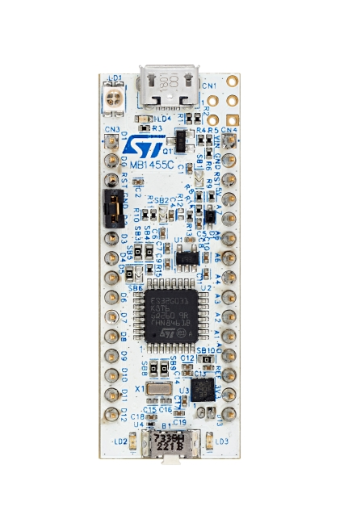

.. _nucleo_g031k8_board:

ST Nucleo G031K8
################

Overview
********
The STM32 Nucleo-32 board provides an affordable and flexible way for users to try
out new concepts and build prototypes by choosing from the various combinations of
performance and power consumption features, provided by the STM32
microcontroller.

The Arduino™ Nano V3 connectivity support allows the easy expansion of the
functionality of the STM32 Nucleo open development platform with a wide choice of
specialized shields.

The STM32 Nucleo-32 board does not require any separate probe as it integrates the
ST-LINK debugger/programmer.

The STM32 Nucleo-32 board comes with the STM32 comprehensive free software
libraries and examples available with the STM32Cube MCU Package.

More information about the board can be found at the `Nucleo G031K8 website`_.

Hardware
********
Nucleo G031K8 provides the following hardware components:

- STM32 microcontroller in 32-pin package featuring 64 Kbytes of Flash memory
  and 8 Kbytes of SRAM.
- Extension resource:

  - Arduino* Nano V3 connectivity

- On-board ST-LINK/V2-1 debugger/programmer with SWD connector:

- Flexible board power supply:

  - USB VBUS or external source (3.3V, 5V, 7 - 12V)
  - Current consumption measurement (IDD)

- Four LEDs:

  - USB communication (LD1), power LED (LD2), user LED (LD3),
    USB power fault LED (LD4)

- One push-button: RESET

- USB re-enumeration capability. Three different interfaces supported on USB:

  - Virtual COM port
  - Mass storage
  - Debug port

More information about STM32G031K8 can be found in the
`STM32G0x1 reference manual`_

Supported Features
==================

The Zephyr nucleo_g031k8 board configuration supports the following hardware features:

+-----------+------------+-------------------------------------+
| Interface | Controller | Driver/Component                    |
+===========+============+=====================================+
| NVIC      | on-chip    | nested vector interrupt controller  |
+-----------+------------+-------------------------------------+
| UART      | on-chip    | serial port-polling;                |
|           |            | serial port-interrupt               |
+-----------+------------+-------------------------------------+
| PINMUX    | on-chip    | pinmux                              |
+-----------+------------+-------------------------------------+
| GPIO      | on-chip    | gpio                                |
+-----------+------------+-------------------------------------+
| CLOCK     | on-chip    | reset and clock control             |
+-----------+------------+-------------------------------------+
| I2C       | on-chip    | i2c controller                      |
+-----------+------------+-------------------------------------+
| SPI       | on-chip    | spi controller                      |
+-----------+------------+-------------------------------------+

Other hardware features are not yet supported in this Zephyr port.

The default configuration can be found in the defconfig file:
``boards/arm/nucleo_g031k8/nucleo_g031k8_defconfig``

Connections and IOs
===================

Each of the GPIO pins can be configured by software as output (push-pull or open-drain), as
input (with or without pull-up or pull-down), or as peripheral alternate function. Most of the
GPIO pins are shared with digital or analog alternate functions. All GPIOs are high current
capable except for analog inputs.

Default Zephyr Peripheral Mapping:
----------------------------------

- UART_2 TX/RX : PA2/PA3 (ST-Link Virtual Port Com)
- I2C2 SCL/SDA : PA9/PA10 (Arduino I2C)
- SPI1 SCK/MISO/MOSI : PB3/PB4/PB5 (Arduino SPI)
- LD3       : PC6

For mode details please refer to `STM32 Nucleo-32 board User Manual`_.

Programming and Debugging
*************************

Applications for the ``nucleo_g031k8`` board configuration can be built and
flashed in the usual way (see :ref:`build_an_application` and
:ref:`application_run` for more details).

Flashing
========

Nucleo G031K8 board includes an ST-LINK/V2-1 embedded debug tool interface.
This interface is supported by the openocd version included in the Zephyr SDK.

Flashing an application to Nucleo G031K8
----------------------------------------

Here is an example for the :zephyr:code-sample:`blinky` application.

.. zephyr-app-commands::
   :zephyr-app: samples/basic/blinky
   :board: nucleo_g031k8
   :goals: build flash

You will see the LED blinking every second.

Debugging
=========

You can debug an application in the usual way.  Here is an example for the
:ref:`hello_world` application.

.. zephyr-app-commands::
   :zephyr-app: samples/hello_world
   :board: nucleo_g031k8
   :maybe-skip-config:
   :goals: debug

Restriction
***********

On some boards, the board reset line is not used by the controller.
Therefore the reset button, reset-pin and the ST-Link reset have no effect.
To enable those functionalities, the option byte NRST_mode in the User
Configuration needs to be changed from 2 to 1 or 3 - depending on the
requirements.

References
**********

.. target-notes::

.. _Nucleo G031K8 website:
   https://www.st.com/en/evaluation-tools/nucleo-g031k8.html

.. _STM32G0x1 reference manual:
   https://www.st.com/resource/en/reference_manual/rm0444-stm32g0x1-advanced-armbased-32bit-mcus-stmicroelectronics.pdf

.. _STM32 Nucleo-32 board User Manual:
   https://www.st.com/resource/en/user_manual/um2591-stm32g0-nucleo32-board-mb1455-stmicroelectronics.pdf
