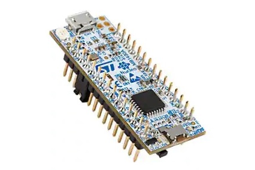

.. _nucleo_g431kb_board:

ST Nucleo G431KB
################

Overview
********

The Nucleo G431KB board features an ARM Cortex-M4 based STM32G431KB MCU
with a wide range of connectivity support and configurations. Here are
some highlights of the Nucleo G431KB board:

- STM32 microcontroller in UFQFPN32 package
- Arduino Nano V3 connectivity
- On-board ST-LINK/V3E debugger/programmer with SWD connector
- Flexible board power supply:

  - USB VBUS or external source(3.3V, 5V, 7 - 12V)
  - Power management access point

- Three LEDs: USB communication (LD1), power LED (LD4), user LED (LD2), overcurrent (LD3)
- One push-button: RESET

More information about the board can be found at the `Nucleo G431KB website`_.

Hardware
********

The STM32G431KB SoC provides the following hardware IPs:

- Core: ARM |reg| 32-bit Cortex |reg| -M4 CPU with FPU, frequency up to 170 MHz
- Clock Sources:

  - 4 to 48 MHz crystal oscillator (HSE)
  - 32 kHz crystal oscillator for RTC (LSE)
  - Internal 16 MHz factory-trimmed RC ( |plusminus| 1%)
  - Internal low-power 32 kHz RC ( |plusminus| 5%)
  
- RTC with HW calendar, alarms and calibration
- 14x timers:

  - 1x 32-bit timer and 2x 16-bit timers with up to four IC/OC/PWM or pulse counter and quadrature (incremental) encoder input
  - 2x 16-bit 8-channel advanced motor control timers, with up to 8x PWM channels, dead time generation and emergency stop
  - 1x 16-bit timer with 2x IC/OCs, one OCN/PWM, dead time generation and emergency stop
  - 2x 16-bit timers with IC/OC/OCN/PWM, dead time generation and emergency stop
  - 2x watchdog timers (independent, window)
  - 2x 16-bit basic timers
  - SysTick timer
  - 1x low-power timer

- Up to 86 fast I/Os, most 5 V-tolerant
- Memories

  - Up to 128 KB single bank Flash, proprietary code readout protection
  - Up to 22 KB of SRAM including 16 KB with hardware parity check

- Rich analog peripherals (independent supply)

  - 2x 12-bit ADC 5 MSPS, up to 16-bit with hardware oversampling, 200
    |micro| A/MSPS
  - 4x 12-bit DAC, low-power sample and hold
  - 3x operational amplifiers with built-in PGA
  - 4x ultra-fast rail-to-rail analog comparators

- 16x communication interfaces

  - 1 x FDCAN controller supporting flexible data rate
  - 3x I2C FM+(1 Mbit/s), SMBus/PMBus
  - 4x USARTs (ISO 7816, LIN, IrDA, modem)
  - 1x LPUART
  - 3x SPIs (2x with multiplexed half duplex I2S interface)
  - 1x SAI (serial audio interface)
  - USB 2.0 full-speed interface with LPM and BCD support
  - IRTIM (Infrared interface)
  - USB Type-C™ /USB power delivery controller (UCPD)

- 12-channel DMA controller
- True random number generator (RNG)
- CRC calculation unit, 96-bit unique ID
- Development support: serial wire debug (SWD), JTAG, Embedded Trace Macrocell*

More information about STM32G431KB can be found here:

- `STM32G431KB on www.st.com`_
- `STM32G4 reference manual`_

Supported Features
==================

The Zephyr nucleo_g431kb board configuration supports the following hardware features:

+-----------+------------+-------------------------------------+
| Interface | Controller | Driver/Component                    |
+===========+============+=====================================+
| NVIC      | on-chip    | nested vector interrupt controller  |
+-----------+------------+-------------------------------------+
| UART      | on-chip    | serial port-polling;                |
|           |            | serial port-interrupt               |
+-----------+------------+-------------------------------------+
| PINMUX    | on-chip    | pinmux                              |
+-----------+------------+-------------------------------------+
| GPIO      | on-chip    | gpio                                |
+-----------+------------+-------------------------------------+
| I2C       | on-chip    | i2c                                 |
+-----------+------------+-------------------------------------+
| PWM       | on-chip    | pwm                                 |
+-----------+------------+-------------------------------------+
| DAC       | on-chip    | dac                                 |
+-----------+------------+-------------------------------------+
| COUNTER   | on-chip    | rtc                                 |
+-----------+------------+-------------------------------------+
| SPI       | on-chip    | spi                                 |
+-----------+------------+-------------------------------------+

Other hardware features are not yet supported on this Zephyr port.

The default configuration can be found in the defconfig file:
``boards/arm/nucleo_g431kb/nucleo_g431kb_defconfig``

Connections and IOs
===================
For details please refer to `STM32G4 Nucleo-32 board User Manual`_.

Default Zephyr Peripheral Mapping:
----------------------------------

.. rst-class:: rst-columns

- USART_1_TX : PA9
- USART_1_RX : PA10
- USART_2_TX : PA2
- USART_2_RX : PA3
- I2C_1_SCL : PA13
- I2C_1_SDA : PA14
- SPI_1_SCK : PA5
- SPI_1_MISO : PA6
- SPI_1_MOSI : PA7
- FDCAN1_TX : PA12
- FDCAN1_RX : PA11
- PWM_2_CH1 : PA15
- LD2 : PB8
- DAC1_OUT1 : PA4

System Clock
------------

Nucleo G431KB System Clock could be driven by internal or external oscillator,
as well as main PLL clock. By default System clock is driven by PLL clock at 170MHz,
driven by 16MHz high speed internal oscillator. 

Serial Port
-----------

Nucleo G431KB board has 2 U(S)ARTs. The Zephyr console output is assigned to USART2.
Default settings are 115200 8N1.

Programming and Debugging
*************************

Applications for the ``nucleo_g431kb`` board configuration can be built and
flashed in the usual way (see :ref:`build_an_application` and
:ref:`application_run` for more details).

Flashing an application to Nucleo G431KB
----------------------------------------

Connect the Nucleo G431KB to your host computer using the USB port,
then run a serial host program to connect with your Nucleo board.

.. code-block:: console

   $ minicom -D /dev/ttyACM0

Now build and flash an application. Here is an example for
:ref:`hello_world`.

.. zephyr-app-commands::
   :zephyr-app: samples/hello_world
   :board: nucleo_g431kb
   :goals: build flash

You should see the following message on the console:

.. code-block:: console

   $ Hello World! arm

Debugging
=========

You can debug an application in the usual way.  Here is an example for the
:ref:`hello_world` application.

.. zephyr-app-commands::
   :zephyr-app: samples/hello_world
   :board: nucleo_g431kb
   :maybe-skip-config:
   :goals: debug

.. _Nucleo G431KB website:
   https://www.st.com/en/evaluation-tools/nucleo-g431kb.html

.. _STM32G4 Nucleo-32 board User Manual:
   https://www.st.com/resource/en/user_manual/um2397-stm32g4-nucleo32-board-mb1430-stmicroelectronics.pdf

.. _STM32G431KB on www.st.com:
   https://www.st.com/en/microcontrollers-microprocessors/stm32g431kb.html

.. _STM32G4 reference manual:
   https://www.st.com/resource/en/reference_manual/rm0440-stm32g4-series-advanced-armbased-32bit-mcus-stmicroelectronics.pdf
