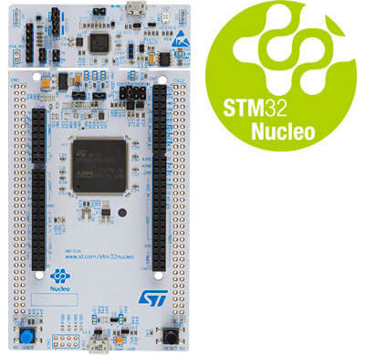
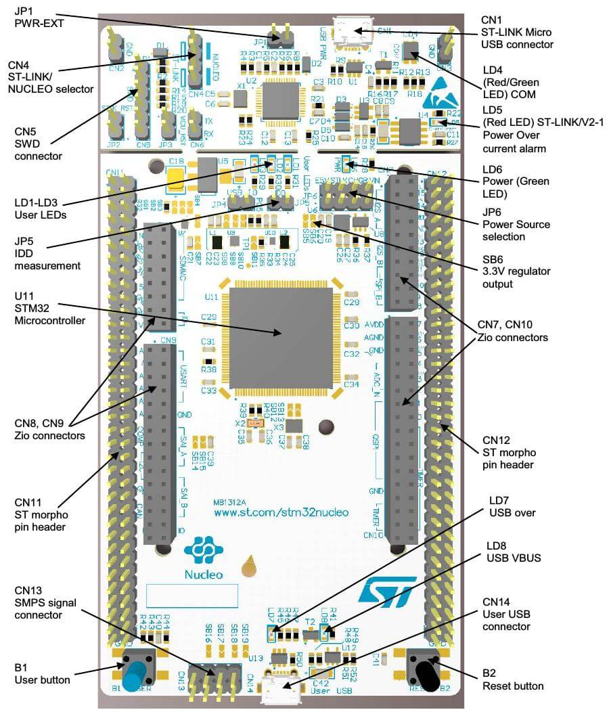

.. _nucleo_l4r5zi_board:

ST Nucleo L4R5ZI
################

Overview
********

The Nucleo L4R5ZI board features an ARM Cortex-M4 based STM32L4R5ZI MCU
with a wide range of connectivity support and configurations. Here are
some highlights of the Nucleo L4R5ZI board:

- STM32 microcontroller in LQFP144 package
- Two types of extension resources:

  - Arduino Uno V3 connectivity
  - ST morpho extension pin headers for full access to all STM32 I/Os

- On-board ST-LINK/V2-1 debugger/programmer with SWD connector
- Flexible board power supply:

  - USB VBUS or external source(3.3V, 5V, 7 - 12V)
  - Power management access point

- Three User LEDs: LD1 (Green), LD2 (Blue), LD3 (Red)
- Two push-buttons: USER and RESET

More information about the board can be found at the `Nucleo L4R5ZI website`_.

Hardware
********

The STM32L4R5ZI SoC provides the following hardware IPs:

- Ultra-low-power with FlexPowerControl (down to 130 nA Standby mode
  and 100 uA/MHz run mode)
- Core: ARM |reg| 32-bit Cortex |reg|-M4 CPU with FPU, adaptive
  real-time accelerator (ART Accelerator) allowing 0-wait-state
  execution from Flash memory, frequency up to 120 MHz, MPU, 150
  DMIPS/1.25 DMIPS/MHz (Dhrystone 2.1), and DSP instructions
- Clock Sources:

  - 4 to 48 MHz crystal oscillator
  - 32 kHz crystal oscillator for RTC (LSE)
  - Internal 16 MHz factory-trimmed RC ( |plusminus| 1%)
  - Internal low-power 32 kHz RC ( |plusminus| 5%)
  - Internal multispeed 100 kHz to 48 MHz oscillator, auto-trimmed by
    LSE (better than |plusminus| 0.25 % accuracy)
  - Internal 48 MHz with clock recovery
  - 3 PLLs for system clock, USB, audio, ADC

- RTC with HW calendar, alarms and calibration
- Up to 24 capacitive sensing channels: support touchkey, linear and
  rotary touch sensors
- Advanced graphics features

  - Chrom-ART Accelerator™ (DMA2D) for enhanced graphic content creation
  - Chrom-GRC™ (GFXMMU) allowing up to 20% of graphic resources optimization
  - MIPI® DSI Host controller with two DSI lanes running at up to 500
    Mbits/s each
  - LCD-TFT controller

- 16x timers

  - 2 x 16-bit advanced motor-control
  - 2 x 32-bit and 5 x 16-bit general purpose
  - 2x 16-bit basic
  - 2x low-power 16-bit timers (available in Stop mode)
  - 2x watchdogs
  - SysTick timer

- Up to 136 fast I/Os, most 5 V-tolerant, up to 14 I/Os with
  independent supply down to 1.08 V
- Memories

  - 2-Mbyte Flash, 2 banks read-while-write, proprietary code readout protection
  - 640 Kbytes of SRAM including 64 Kbytes with hardware parity check
  - External memory interface for static memories supporting SRAM,
    PSRAM, NOR, NAND and FRAM memories
  - 2 x OctoSPI memory interface

- 4x digital filters for sigma delta modulator
- Rich analog peripherals (independent supply)

  - 12-bit ADC 5 Msps, up to 16-bit with hardware oversampling, 200 μA/Msps
  - 2x 12-bit DAC, low-power sample and hold
  - 2x operational amplifiers with built-in PGA
  - 2x ultra-low-power comparators

- 20x communication interfaces

  - USB OTG 2.0 full-speed, LPM and BCD
  - 2x SAIs (serial audio interface)
  - 4x I2C FM+(1 Mbit/s), SMBus/PMBus
  - 6x USARTs (ISO 7816, LIN, IrDA, modem)
  - 3x SPIs (5x SPIs with the dual OctoSPI)
  - CAN (2.0B Active) and SDMMC

- 14-channel DMA controller
- True random number generator
- CRC calculation unit, 96-bit unique ID
- 8- to 14-bit camera interface up to 32 MHz (black and white) or 10 MHz (color)
- Development support: serial wire debug (SWD), JTAG, Embedded Trace
  Macrocell (ETM)

More information about STM32L4R5ZI can be found here:

- `STM32L4R5ZI on www.st.com`_
- `STM32L4R5 reference manual`_

Supported Features
==================

The Zephyr nucleo_l4r5zi board configuration supports the following
hardware features:

+-----------+------------+-------------------------------------+
| Interface | Controller | Driver/Component                    |
+===========+============+=====================================+
| NVIC      | on-chip    | nested vector interrupt controller  |
+-----------+------------+-------------------------------------+
| UART      | on-chip    | serial port-polling;                |
|           |            | serial port-interrupt               |
+-----------+------------+-------------------------------------+
| PINMUX    | on-chip    | pinmux                              |
+-----------+------------+-------------------------------------+
| GPIO      | on-chip    | gpio                                |
+-----------+------------+-------------------------------------+
| I2C       | on-chip    | i2c                                 |
+-----------+------------+-------------------------------------+
| PWM       | on-chip    | pwm                                 |
+-----------+------------+-------------------------------------+
| SPI       | on-chip    | spi                                 |
+-----------+------------+-------------------------------------+
| USB       | on-chip    | usb                                 |
+-----------+------------+-------------------------------------+

Other hardware features are not yet supported on this Zephyr port.

The default configuration can be found in the defconfig file:
``boards/arm/nucleo_l4r5zi/nucleo_l4r5zi_defconfig``

Connections and IOs
===================

Nucleo L4R5ZI Board has 8 GPIO controllers. These controllers are
responsible for pin muxing, input/output, pull-up, etc.

Available pins:
---------------

For mode details please refer to `STM32 Nucleo-144 board User Manual`_.

Default Zephyr Peripheral Mapping:
----------------------------------

.. rst-class:: rst-columns

- UART_1_TX : PA9
- UART_1_RX : PA10
- UART_2_TX : PA2
- UART_2_RX : PA3
- UART_3_TX : PB10
- UART_3_RX : PB11
- I2C_1_SCL : PB6
- I2C_1_SDA : PB7
- SPI_1_NSS : PA4
- SPI_1_SCK : PB3
- SPI_1_MISO : PA6
- SPI_1_MOSI : PA7
- SPI_2_NSS : PB12
- SPI_2_SCK : PB13
- SPI_2_MISO : PB14
- SPI_2_MOSI : PB15
- SPI_3_NSS : PB12
- SPI_3_SCK : PC10
- SPI_3_MISO : PC11
- SPI_3_MOSI : PC12
- PWM_2_CH1 : PA0
- USER_PB : PC13
- LD1 : PC7
- LD2 : PB7
- LD3 : PB14
- USB DM : PA11
- USB DP : PA12

System Clock
------------

Nucleo L4R5ZI System Clock could be driven by internal or external
oscillator, as well as main PLL clock. By default, the System clock is
driven by the PLL clock at 80MHz, driven by a 16MHz high speed
internal oscillator. The clock can be boosted to 120MHz if boost mode
is selected.

Serial Port
-----------

Nucleo L4R5ZI board has 5 U(S)ARTs. The Zephyr console output is
assigned to UART2.  Default settings are 115200 8N1.

Network interface
-----------------

Ethernet over USB is configured as the default network interface (EEM)

Programming and Debugging
*************************

Connect the Nucleo L4R5ZI to your host computer using the USB port.
Then build and flash an application. Here is an example for the
:ref:`hello_world` application.

Run a serial host program to connect with your Nucleo board:

.. code-block:: console

   $ minicom -D /dev/ttyACM0

Then build and flash the application.

.. zephyr-app-commands::
   :zephyr-app: samples/hello_world
   :board: nucleo_l4r5zi
   :goals: build flash

You should see the following message on the console:

.. code-block:: console

   Hello World! arm

.. _Nucleo L4R5ZI website:
   http://www.st.com/en/evaluation-tools/nucleo-l4r5zi.html

.. _STM32 Nucleo-144 board User Manual:
   http://www.st.com/resource/en/user_manual/dm00368330.pdf

.. _STM32L4R5ZI on www.st.com:
   http://www.st.com/en/microcontrollers/stm32l4r5zi.html

.. _STM32L4R5 reference manual:
   http://www.st.com/resource/en/reference_manual/DM00310109.pdf

.. _STM32 ST-LINK utility:
   http://www.st.com/content/st_com/en/products/development-tools/software-development-tools/stm32-software-development-tools/stm32-programmers/stsw-link004.html
