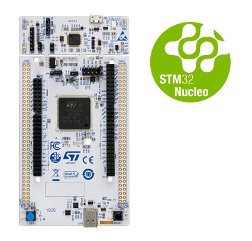
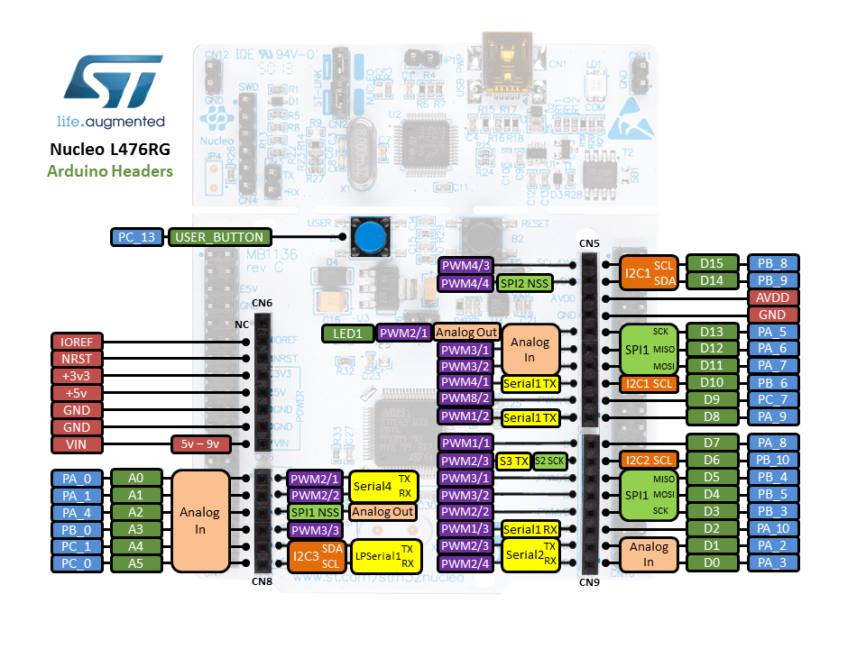
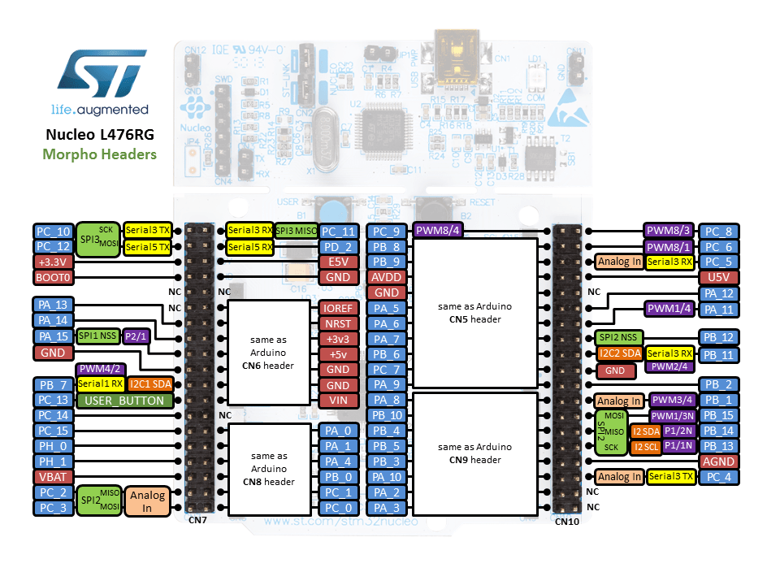

.. _nucleo_l552ze_q_board:

ST Nucleo L552ZE Q
##################

Overview
********

The Nucleo L552ZE Q board, featuring an ARM Cortex-M33 based STM32L552ZE MCU,
provides an affordable and flexible way for users to try out new concepts and
build prototypes by choosing from the various combinations of performance and
power consumption features. Here are some highlights of the Nucleo L552ZE Q
board:

- STM32L552ZE microcontroller in LQFP144 package
- Two types of extension resources:

  - Arduino Uno V3 connectivity
  - ST morpho extension pin headers for full access to all STM32 I/Os

- On-board ST-LINK/V2-1 debugger/programmer with SWD connector
- Flexible board power supply:

   - USB VBUS or external source(3.3V, 5V, 7 - 12V)
   - ST-Link

- Three LEDs: USB communication (LD1), user LED (LD2), power LED (LD3)
- Two push-buttons: USER and RESET
- External or internal SMPS to generate Vcore logic supply
- USB OTG full speed or device only

More information about the board can be found at the `Nucleo L552ZE Q website`_.

Hardware
********

The STM32L552xx devices are an ultra-low-power microcontrollers family (STM32L5
Series) based on the high-performance Arm|reg| Cortex|reg|-M33 32-bit RISC core.
They operate at a frequency of up to 110 MHz.

- Ultra-low-power with FlexPowerControl (down to 108 nA Standby mode and 62 uA/MHz run mode)
- Core: ARM |reg| 32-bit Cortex |reg| -M33 CPU with TrustZone |reg| and FPU.
- Performance benchmark:

  - 1.5 DMPIS/MHz (Drystone 2.1)
  - 442 CoreMark |reg| (4.02 CoreMark |reg| /MHZ)

- Security

  - Arm |reg|  TrustZone |reg| and securable I/Os memories and peripherals
  - Flexible life cycle scheme with RDP (readout protection)
  - Root of trust thanks to unique boot entry and hide protection area (HDP)
  - Secure Firmware Installation thanks to embedded Root Secure Services
  - Secure Firmware Update support with TF-M
  - HASH hardware accelerator
  - Active tamper and protection temperature, voltage and frequency attacks
  - True Random Number Generator NIST SP800-90B compliant
  - 96-bit unique ID
  - 512-byte One-Time Programmable for user data

- Clock management:

  - 4 to 48 MHz crystal oscillator
  - 32 kHz crystal oscillator for RTC (LSE)
  - Internal 16 MHz factory-trimmed RC ( |plusminus| 1%)
  - Internal low-power 32 kHz RC ( |plusminus| 5%)
  - Internal multispeed 100 kHz to 48 MHz oscillator, auto-trimmed by
    LSE (better than  |plusminus| 0.25 % accuracy)
  - 3 PLLs for system clock, USB, audio, ADC

- Power management

  - Embedded regulator (LDO) with three configurable range output to supply the digital circuitry
  - Embedded SMPS step-down converter
  - External SMPS support

- RTC with HW calendar, alarms and calibration
- Up to 114 fast I/Os, most 5 V-tolerant, up to 14 I/Os with independent supply down to 1.08 V
- Up to 22 capacitive sensing channels: support touchkey, linear and rotary touch sensors
- Up to 16 timers and 2 watchdogs

  - 2x 16-bit advanced motor-control
  - 2x 32-bit and 5x 16-bit general purpose
  - 2x 16-bit basic
  - 3x low-power 16-bit timers (available in Stop mode)
  - 2x watchdogs
  - 2x SysTick timer

- Memories

  - Up to 512 MB Flash, 2 banks read-while-write
  - 512 KB of SRAM including 64 KB with hardware parity check
  - External memory interface for static memories supporting SRAM, PSRAM, NOR, NAND and FRAM memories
  - OCTOSPI memory interface

- Rich analog peripherals (independent supply)

  - 3x 12-bit ADC 5 MSPS, up to 16-bit with hardware oversampling, 200 uA/MSPS
  - 2x 12-bit DAC, low-power sample and hold
  - 2x operational amplifiers with built-in PGA
  - 2x ultra-low-power comparators
  - 4x digital filters for sigma delta modulator

- 19x communication interfaces

  - USB Type-C / USB power delivery controller
  - 2.0 full-speed crystal less solution, LPM and BCD
  - 2x SAIs (serial audio interface)
  - 4x I2C FM+(1 Mbit/s), SMBus/PMBus
  - 6x USARTs (ISO 7816, LIN, IrDA, modem)
  - 3x SPIs (7x SPIs with USART and OCTOSPI in SPI mode)
  - 1xFDCAN
  - 1xSDMMC interface
  - 2x 14 channel DMA controllers

- CRC calculation unit
- Development support: serial wire debug (SWD), JTAG, Embedded Trace Macrocell |trade|

More information about STM32L552ZE can be found here:

- `STM32L552ZE on www.st.com`_
- `STM32L552 reference manual`_

Supported Features
==================

The Zephyr nucleo_l552ze_q board configuration supports the following hardware features:

+-----------+------------+-------------------------------------+
| Interface | Controller | Driver/Component                    |
+===========+============+=====================================+
| NVIC      | on-chip    | nested vector interrupt controller  |
+-----------+------------+-------------------------------------+
| UART      | on-chip    | serial port-polling;                |
|           |            | serial port-interrupt               |
+-----------+------------+-------------------------------------+
| PINMUX    | on-chip    | pinmux                              |
+-----------+------------+-------------------------------------+
| GPIO      | on-chip    | gpio                                |
+-----------+------------+-------------------------------------+
| I2C       | on-chip    | i2c                                 |
+-----------+------------+-------------------------------------+
| PWM       | on-chip    | pwm                                 |
+-----------+------------+-------------------------------------+
| SPI       | on-chip    | spi                                 |
+-----------+------------+-------------------------------------+
| TrustZone | on-chip    | Trusted Firmware-M                  |
+-----------+------------+-------------------------------------+

Other hardware features are not yet supported on this Zephyr port.

The default configuration can be found in the defconfig file:
``boards/arm/nucleo_l552ze_q/nucleo_l552ze_q_defconfig``

Connections and IOs
===================

Nucleo L552ZE Q Board has 8 GPIO controllers. These controllers are responsible for pin muxing,
input/output, pull-up, etc.

Available pins:
---------------

For mode details please refer to `STM32 Nucleo-144 board User Manual`_.

Default Zephyr Peripheral Mapping:
----------------------------------

- UART_1_TX : PA9
- UART_1_RX : PA10
- UART_2_TX : PA2
- UART_2_RX : PA3
- UART_3_TX : PB10
- UART_3_RX : PB11
- I2C_1_SCL : PB6
- I2C_1_SDA : PB7
- SPI_1_NSS : PA4
- SPI_1_SCK : PB3
- SPI_1_MISO : PA6
- SPI_1_MOSI : PA7
- SPI_2_NSS : PB12
- SPI_2_SCK : PB13
- SPI_2_MISO : PB14
- SPI_2_MOSI : PB15
- SPI_3_NSS : PB12
- SPI_3_SCK : PC10
- SPI_3_MISO : PC11
- SPI_3_MOSI : PC12
- PWM_2_CH1 : PA0
- USER_PB : PC13
- LD2 : PA5

System Clock
------------

Nucleo L552ZE Q System Clock could be driven by internal or external oscillator,
as well as main PLL clock. By default System clock is driven by PLL clock at
110MHz, driven by 4MHz medium speed internal oscillator.

Serial Port
-----------

Nucleo L552ZE Q board has 6 U(S)ARTs. The Zephyr console output is assigned to
UART2. Default settings are 115200 8N1.

Programming and Debugging
*************************

Applications for the ``nucleo_l552ze_q`` board configuration can be built and
flashed in the usual way (see :ref:`build_an_application` and
:ref:`application_run` for more details).

Flashing
========

Nucleo L552ZE Q board includes an ST-LINK/V3E embedded debug tool
interface. This interface is not yet supported by the openocd version.
Instead, support can be enabled on pyocd by adding "pack" support with
the following pyocd command:

.. code-block:: console

   $ pyocd pack --update
   $ pyocd pack --install stm32l552ze

Nucleo L552ZE Q board includes an ST-LINK/V2-1 embedded debug tool
interface.  This interface is supported by the openocd version
included in the Zephyr SDK since v0.9.2.

Flashing an application to Nucleo L552ZE Q
------------------------------------------

Connect the Nucleo L552ZE Q to your host computer using the USB port.
Then build and flash an application. Here is an example for the
:ref:`hello_world` application.

Run a serial host program to connect with your Nucleo board:

.. code-block:: console

   $ minicom -D /dev/ttyACM0

Then build and flash the application.

.. zephyr-app-commands::
   :zephyr-app: samples/hello_world
   :board: nucleo_l552ze_q
   :goals: build flash

You should see the following message on the console:

.. code-block:: console

   Hello World! arm

Building a secure/non-secure with Arm |reg| TrustZone |reg|
-----------------------------------------------------------

The TF-M integration sample :ref:`tfm_ipc` can be run by a Nucleo L552ZE Q, using the ``nucleo_l552ze_q_ns`` target. When building a ``*_ns`` image with TF-M, a ``build/tfm/install/postbuild.sh`` bash script will be run as a post-build step to make some required flash layout changes. The ``build/tfm/install/postbuild.sh`` script will also be used to flash the board. Check the ``build/tfm/install`` directory to ensure that the commands required by these scripts (``readlink``, etc.) are available on your system.

Debugging
=========

You can debug an application in the usual way.  Here is an example for the
:ref:`hello_world` application.

.. zephyr-app-commands::
   :zephyr-app: samples/hello_world
   :board: nucleo_l552ze_q
   :maybe-skip-config:
   :goals: debug

.. _Nucleo L552ZE Q website:
   http://www.st.com/en/evaluation-tools/nucleo-l552ze-q.html

.. _STM32 Nucleo-144 board User Manual:
   http://www.st.com/resource/en/user_manual/dm00615305.pdf

.. _STM32L552ZE on www.st.com:
   http://www.st.com/en/microcontrollers/stm32l552ze.html

.. _STM32L552 reference manual:
   http://www.st.com/resource/en/reference_manual/DM00346336.pdf
