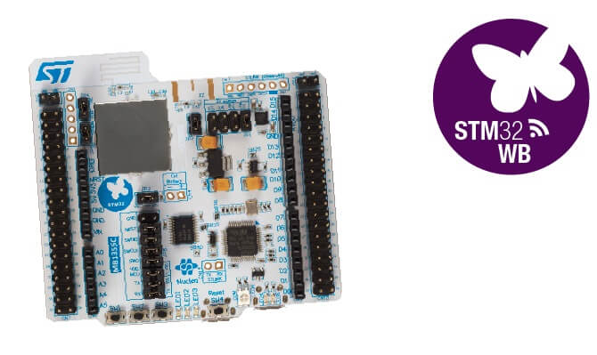

.. _nucleo_wb55rg_board:

ST Nucleo WB55RG
################

Overview
********

The Nucleo WB55RG board is a multi-protocol wireless and ultra-low-power device
embedding a powerful and ultra-low-power radio compliant with the Bluetooth®
Low Energy (BLE) SIG specification v5.0 and with IEEE 802.15.4-2011.

- STM32 microcontroller in VFQFPN68 package
- 2.4 GHz RF transceiver supporting Bluetooth® specification v5.0 and
  IEEE 802.15.4-2011 PHY and MAC
- Dedicated Arm® 32-bit Cortex® M0+ CPU for real-time Radio layer
- Three user LEDs
- Board connector: USB user with Micro-B
- Two types of extension resources:

  - Arduino Uno V3 connectivity
  - ST morpho extension pin headers for full access to all STM32 I/Os

- Integrated PCB antenna or footprint for SMA connector
- On-board ST-LINK/V2-1 debugger/programmer with SWD connector
- Flexible power-supply options: ST-LINK USB VBUS or external sources
- On-board socket for CR2032 battery
- On-board ST-LINK/V2-1 debugger/programmer with USB re- enumeration capability:
  mass storage, virtual COM port and debug port

More information about the board can be found at the `Nucleo WB55RG website`_.

Hardware
********

STM32WB55RG is an ultra-low-power dual core Arm Cortex-M4 MCU 64 MHz,Cortex-M0 32MHz
with 1 Mbyte of Flash memory, Bluetooth 5, 802.15.4, USB, LCD, AES-256 SoC and
provides the following hardware capabilities:

- Ultra-low-power with FlexPowerControl (down to 600 nA Standby mode with RTC and 32KB RAM)
- Core: ARM |reg| 32-bit Cortex |reg|-M4 CPU with FPU, frequency up to 64 MHz
- Radio:

  - 2.4GHz
  - RF transceiver supporting Bluetooth® 5 specification, IEEE 802.15.4-2011 PHY and MAC,
    supporting Thread and ZigBee|reg| 3.0
  - RX Sensitivity: -96 dBm (Bluetooth|reg| Low Energy at 1 Mbps), -100 dBm (802.15.4)
  - Programmable output power up to +6 dBm with 1 dB steps
  - Integrated balun to reduce BOM
  - Support for 2 Mbps
  - Dedicated Arm|reg| 32-bit Cortex|reg| M0 + CPU for real-time Radio layer
  - Accurate RSSI to enable power control
  - Suitable for systems requiring compliance with radio frequency regulations
    ETSI EN 300 328, EN 300 440, FCC CFR47 Part 15 and ARIB STD-T66
  - Support for external PA

- Clock Sources:

  - 32 MHz crystal oscillator with integrated trimming capacitors (Radio and CPU clock)
  - 32 kHz crystal oscillator for RTC (LSE)
  - 2x Internal low-power 32 kHz RC (|plusminus| 5% and |plusminus| 500ppm)
  - Internal multispeed 100 kHz to 48 MHz oscillator, auto-trimmed by
    LSE (better than  |plusminus| 0.25 % accuracy)
  - 2 PLLs for system clock, USB, SAI and ADC

- RTC with HW calendar, alarms and calibration
- LCD 8 x 40 or 4 x 44 with step-up converter
- Up to 24 capacitive sensing channels: support touchkey, linear and rotary touch sensors
- 16x timers:

  - 2x 16-bit advanced motor-control
  - 2x 32-bit and 5x 16-bit general purpose
  - 2x 16-bit basic
  - 2x low-power 16-bit timers (available in Stop mode)
  - 2x watchdogs
  - SysTick timer

- Up to 114 fast I/Os, most 5 V-tolerant, up to 14 I/Os with independent supply down to 1.08 V
- Memories

  - Up to 1 MB Flash, 2 banks read-while-write, proprietary code readout protection
  - Up to 320 KB of SRAM including 64 KB with hardware parity check
  - External memory interface for static memories supporting SRAM, PSRAM, NOR and NAND memories
  - Quad SPI memory interface

- 4x digital filters for sigma delta modulator
- Rich analog peripherals (down to 1.62 V)

  - 12-bit ADC 4.26Msps, up to 16-bit with hardware oversampling, 200 uA/Msps
  - 2x ultra-low-power comparator
  - Accurate 2.5 V or 2.048 V reference voltage buffered output

- System peripherals

  - Inter processor communication controller (IPCC) for communication with
    Bluetooth|reg| Low Energy and 802.15.4
  - HW semaphores for resources sharing between CPUs
  - 2x DMA controllers (7x channels each) supporting ADC, SPI, I2C, USART,
    QSPI, SAI, AES, Timers
  - 1x USART (ISO 7816, IrDA, SPI Master, Modbus and Smartcard mode)
  - 1x LPUART (low power)
  - 2x SPI 32 Mbit/s
  - 2x I2C (SMBus/PMBus)
  - 1x SAI (dual channel high quality audio)
  - 1x USB 2.0 FS device, crystal-less, BCD and LPM
  - Touch sensing controller, up to 18 sensors
  - LCD 8x40 with step-up converter
  - 1x 16-bit, four channels advanced timer
  - 2x 16-bits, two channels timer
  - 1x 32-bits, four channels timer
  - 2x 16-bits ultra-low-power timer
  - 1x independent Systick
  - 1x independent watchdog
  - 1x window watchdog

- Security and ID

 - 3x hardware encryption AES maximum 256-bit for the application,
   the Bluetooth|reg| Low Energy and IEEE802.15.4
 - Customer key storage / key manager services
 - HW public key authority (PKA)
 - Cryptographic algorithms: RSA, Diffie-Helman, ECC over GF(p)
 - True random number generator (RNG)
 - Sector protection against R/W operation (PCROP)
 - CRC calculation unit
 - 96-bit unique ID
 - 64-bit unique ID. Possibility to derive 802.15.5 64-bit and
   Bluetooth|reg| Low Energy 48-bit EUI

- Up to 72 fast I/Os, 70 of them 5 V-tolerant
- Development support: serial wire debug (SWD), JTAG, Embedded Trace Macrocell |trade|

More information about STM32WB55RG can be found here:

- `STM32WB55RG on www.st.com`_
- `STM32WB5RG datasheet`_
- `STM32WB5RG reference manual`_

Supported Features
==================

The Zephyr nucleo_wb55rg board configuration supports the following hardware features:

+-----------+------------+-------------------------------------+
| Interface | Controller | Driver/Component                    |
+===========+============+=====================================+
| NVIC      | on-chip    | nested vector interrupt controller  |
+-----------+------------+-------------------------------------+
| UART      | on-chip    | serial port-polling;                |
|           |            | serial port-interrupt               |
+-----------+------------+-------------------------------------+
| PINMUX    | on-chip    | pinmux                              |
+-----------+------------+-------------------------------------+
| GPIO      | on-chip    | gpio                                |
+-----------+------------+-------------------------------------+
| I2C       | on-chip    | i2c                                 |
+-----------+------------+-------------------------------------+
| SPI       | on-chip    | spi                                 |
+-----------+------------+-------------------------------------+
| PWM       | on-chip    | pwm                                 |
+-----------+------------+-------------------------------------+
| ADC       | on-chip    | adc                                 |
+-----------+------------+-------------------------------------+
| WATCHDOG  | on-chip    | independent watchdog                |
+-----------+------------+-------------------------------------+

Other hardware features are not yet supported on this Zephyr port.

The default configuration can be found in the defconfig file:
``boards/arm/nucleo_wb55rg/nucleo_wb55rg_defconfig``

Connections and IOs
===================

Nucleo WB55RG Board has 6 GPIO controllers. These controllers are responsible for pin muxing,
input/output, pull-up, etc.

Default Zephyr Peripheral Mapping:
----------------------------------

.. rst-class:: rst-columns

- UART_1 TX/RX : PB7/PB6
- LPUART_1 TX/RX : PA3/PA2 (arduino_serial)
- I2C_1_SCL : PB8
- I2C_1_SDA : PB9
- I2C_3_SCL : PC0
- I2C_3_SDA : PC1
- USER_PB : PC4
- USER_PB1 : PD0
- USER_PB2 : PD1
- LD1 : PB5
- LD2 : PB0
- LD3 : PB1
- SPI_1_NSS : PA4 (arduino_spi)
- SPI_1_SCK : PA5 (arduino_spi)
- SPI_1_MISO : PA6 (arduino_spi)
- SPI_1_MOSI : PA7 (arduino_spi)
- PWM_2 CH 1 : PA0
- ADC_1_CH3 : PC2

System Clock
------------

Nucleo WB55RG System Clock could be driven by internal or external oscillator,
as well as main PLL clock. By default System clock is driven by HSE clock at 32MHz.

Serial Port
-----------

Nucleo WB55RG board has 2 (LP)U(S)ARTs. The Zephyr console output is assigned to USART1.
Default settings are 115200 8N1.

Programming and Debugging
*************************

Applications for the ``nucleo_wb55rg`` board configuration can be built the
usual way (see :ref:`build_an_application`).

Flashing
========

Nucleo WB55RG board includes an ST-LINK/V2-1 embedded debug tool
interface.  This interface is not yet supported by the openocd version.
Instead, support can be enabled on pyocd by adding "pack" support with
the following pyocd command:

.. code-block:: console

   $ pyocd pack --install stm32wb55rg

Flashing an application to Nucleo WB55RG
----------------------------------------

Connect the Nucleo WB55RG to your host computer using the USB port.
Then build and flash an application. Here is an example for the
:ref:`hello_world` application.

Run a serial host program to connect with your Nucleo board:

.. code-block:: console

   $ minicom -D /dev/ttyUSB0

Then build and flash the application.

.. zephyr-app-commands::
   :zephyr-app: samples/hello_world
   :board: nucleo_wb55rg
   :goals: build flash

You should see the following message on the console:

.. code-block:: console

   Hello World! arm

Debugging
=========

You can debug an application in the usual way.  Here is an example for the
:ref:`blinky-sample` application.

.. zephyr-app-commands::
   :zephyr-app: samples/basic/blinky
   :board: nucleo_wb55rg
   :maybe-skip-config:
   :goals: debug

.. _Nucleo WB55RG website:
   https://www.st.com/en/evaluation-tools/p-nucleo-wb55.html

.. _STM32WB55RG on www.st.com:
   https://www.st.com/en/microcontrollers-microprocessors/stm32wb55rg.html

.. _STM32WB5RG datasheet:
   https://www.st.com/resource/en/datasheet/stm32wb55rg.pdf

.. _STM32WB5RG reference manual:
   https://www.st.com/resource/en/reference_manual/dm00318631.pdf
