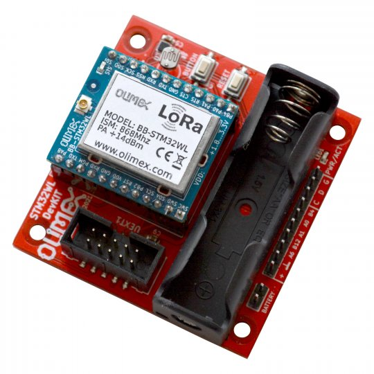

.. _olimex_lora_stm32wl_devkit:

Olimex LoRa STM32WL DevKit
##########################

Overview
********

LoRaWAN development kit based on Olimex BB-STM32WL module using the
STM32WLE5CCU6 MCU.

     Olimex LoRa STM32WL DevKit (credit: OLIMEX)

Hardware
********

The board has below hardware features:

- BB-STM32WL, 256KB Flash, 64KB RAM with external antenna
- Lithium battery connector 3V (does not include battery)
- UEXT connector for external sensors
- BMA280 temperature, humidity, pressure sensor
- LDR resistor for lighting measurement
- IIS2MDCTR 3-axis magnetometer for smart parking
- GPIO connector for prototyping
- Low power design
- 1 User LED
- 1 user, 1 boot, and 1 reset push-button
- 32.768 kHz LSE crystal oscillator

More information about the board and the module can be found here:

- `LoRa-STM32WL-DevKit Repository`_
- `LoRa-STM32WL-DevKit page on OLIMEX website`_
- `BB-STM32WL Module website`_
- `STM32WLE5CC reference manual`_
- `STM32WLE5CC on www.st.com`_

Supported Features
==================

The Zephyr Olimex LoRa STM32WL Dev Kit configuration supports the following
hardware features:

+-----------+------------+-------------------------------------+
| Interface | Controller | Driver/Component                    |
+===========+============+=====================================+
| ADC       | on-chip    | adc                                 |
+-----------+------------+-------------------------------------+
| AES       | on-chip    | crypto                              |
+-----------+------------+-------------------------------------+
| COUNTER   | on-chip    | rtc                                 |
+-----------+------------+-------------------------------------+
| CLOCK     | on-chip    | reset and clock control             |
+-----------+------------+-------------------------------------+
| FLASH     | on-chip    | flash                               |
+-----------+------------+-------------------------------------+
| GPIO      | on-chip    | gpio                                |
+-----------+------------+-------------------------------------+
| I2C       | on-chip    | i2c                                 |
+-----------+------------+-------------------------------------+
| MPU       | on-chip    | arch/arm                            |
+-----------+------------+-------------------------------------+
| NVIC      | on-chip    | arch/arm                            |
+-----------+------------+-------------------------------------+
| PINMUX    | on-chip    | pinmux                              |
+-----------+------------+-------------------------------------+
| RADIO     | on-chip    | LoRa                                |
+-----------+------------+-------------------------------------+
| SPI       | on-chip    | spi                                 |
+-----------+------------+-------------------------------------+
| UART      | on-chip    | serial port-polling;                |
|           |            | serial port-interrupt               |
+-----------+------------+-------------------------------------+
| WATCHDOG  | on-chip    | independent watchdog                |
+-----------+------------+-------------------------------------+

Other hardware features are not yet supported on this Zephyr port.

The default configuration can be found in the defconfig and dts files:

- :zephyr_file:`boards/arm/olimex_lora_stm32wl_devkit/olimex_lora_stm32wl_devkit_defconfig`
- :zephyr_file:`boards/arm/olimex_lora_stm32wl_devkit/olimex_lora_stm32wl_devkit.dts`

Programming and Debugging
*************************

Applications for the ``olimex_lora_stm32wl_devkit`` board configuration can be built the
usual way (see :ref:`build_an_application`).

The board contains an on-board debug probe which implements the CMSIS-DAP
interface.

It can also be debugged and flashed with an external debug probe connected
to the SWD pins.

The built-in debug probe works with pyOCD, but requires installing an additional
pack to support the STM32WL:

.. code-block:: console

   $ pyocd pack --update
   $ pyocd pack --install stm32wl

Flashing an application
=======================

Connect the board to your host computer and build and flash an application.

.. zephyr-app-commands::
   :zephyr-app: samples/hello_world
   :board: olimex_lora_stm32wl_devkit
   :goals: build flash

Run a serial terminal to connect with your board. By default, ``usart1`` is
accessible via the the built-in USB to UART converter.

.. code-block:: console

   $ picocom --baud 115200 /dev/ttyACM0

Debugging
=========

You can debug an application in the usual way.  Here is an example for the
:ref:`blinky-sample` application.

.. zephyr-app-commands::
   :zephyr-app: samples/basic/blinky
   :board: olimex_lora_stm32wl_devkit
   :maybe-skip-config:
   :goals: debug

.. _LoRa-STM32WL-DevKit Repository:
   https://github.com/OLIMEX/LoRa-STM32WL-DevKIT

.. _LoRa-STM32WL-DevKit page on OLIMEX website:
   https://www.olimex.com/Products/IoT/LoRa/LoRa-STM32WL-DevKit/open-source-hardware

.. _BB-STM32WL Module website:
   https://www.olimex.com/Products/IoT/LoRa/BB-STM32WL/

.. _STM32WLE5CC on www.st.com:
   https://www.st.com/en/microcontrollers-microprocessors/stm32wle5cc.html

.. _STM32WLE5CC datasheet:
   https://www.st.com/resource/en/datasheet/stm32wle5cc.pdf

.. _STM32WLE5CC reference manual:
   https://www.st.com/resource/en/reference_manual/dm00530369-stm32wlex-advanced-armbased-32bit-mcus-with-subghz-radio-solution-stmicroelectronics.pdf
