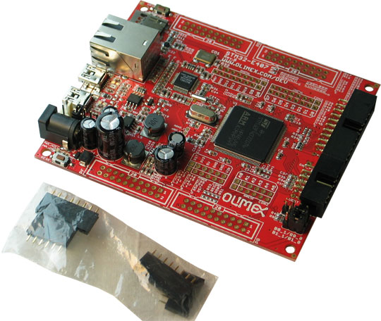
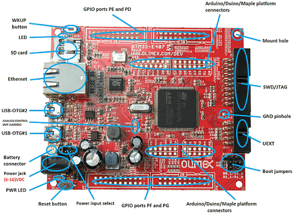

.. _olimex_stm32_e407:

OLIMEX-STM32-E407
#################

Overview
********

Zephyr applications use the olimex_stm32_e407 board configuration
to run on the OLIMEX-STM32-E407 open source hardware. It is based on
the STMicroelectronics STM32F407ZG ARM Cortex-M4 CPU.

     OLIMEX-STM32-E407

Hardware
********

Information about the board can be found at the
`OLIMEX-STM32-E407 website`_ and `OLIMEX-STM32-E407 user manual`_.
The `ST STM32F407ZG Datasheet`_ contains the processor's
information and the datasheet.

Supported Features
==================

The olimex_stm32_e407 board configuration supports the following
hardware features:

+-----------+------------+----------------------+
| Interface | Controller | Driver/Component     |
+===========+============+======================+
| NVIC      | on-chip    | nested vectored      |
|           |            | interrupt controller |
+-----------+------------+----------------------+
| SYSTICK   | on-chip    | system clock         |
+-----------+------------+----------------------+
| UART      | on-chip    | serial port          |
+-----------+------------+----------------------+
| GPIO      | on-chip    | gpio                 |
+-----------+------------+----------------------+

Other hardware features are not supported by the Zephyr kernel.

Pin Mapping
===========

     OLIMEX-STM32-E407 connectors

LED
---

* LED (green) = PC13
* PWR_LED (red) = power

Push buttons
------------

* BUT = PA0
* RST = NRST

External Connectors
-------------------

JTAG/SWD debug

+-------+--------------+-------+--------------+
| PIN # | Signal Name  | Pin # | Signal Name  |
+=======+==============+=======+==============+
| 1     | +3.3V        | 11    | -            |
+-------+--------------+-------+--------------+
| 2     | +3.3V        | 12    | GND          |
+-------+--------------+-------+--------------+
| 3     | PB4 / TRST   | 13    | PB3 / TDO    |
+-------+--------------+-------+--------------+
| 4     | GND          | 14    | GND          |
+-------+--------------+-------+--------------+
| 5     | PA15 / TDI   | 15    | PB4 / TRST   |
+-------+--------------+-------+--------------+
| 6     | GND          | 16    | GND          |
+-------+--------------+-------+--------------+
| 7     | PA13 / TMS   | 17    | -            |
+-------+--------------+-------+--------------+
| 8     | GND          | 18    | GND          |
+-------+--------------+-------+--------------+
| 9     | PA14 / TCK   | 19    | +5V_JTAG     |
+-------+--------------+-------+--------------+
| 10    | GND          | 20    | GND          |
+-------+--------------+-------+--------------+

UEXT

+-------+-----------------------+----------------+
| PIN # | Wire   Name           | STM32F407 port |
+=======+=======================+================+
| 1     | +3.3V                 | -              |
+-------+-----------------------+----------------+
| 2     | GND                   | -              |
+-------+-----------------------+----------------+
| 3     | PC6/USART6_TX         | PC6            |
+-------+-----------------------+----------------+
| 4     | PC7/USART6_RX         | PC7            |
+-------+-----------------------+----------------+
| 5     | PB8/I2C1_SCL          | PB8            |
+-------+-----------------------+----------------+
| 6     | PB9/I2C1_SDA          | PB9            |
+-------+-----------------------+----------------+
| 7     | PC2/SPI2_MISO         | PC2            |
+-------+-----------------------+----------------+
| 8     | PC3/SPI2_MOSI         | PC3            |
+-------+-----------------------+----------------+
| 9     | PB10/SPI_SCK/UART3_TX | PB10           |
+-------+-----------------------+----------------+
| 10    | RB7/UEXT_CS           | PB7            |
+-------+-----------------------+----------------+

Arduino Headers
---------------

CON1 power

+-------+--------------+-------------------------+
| Pin   | Signal Name  | STM32F407 Pin#          |
+=======+==============+=========================+
| RST   | RESET        | 23                      |
+-------+--------------+-------------------------+
| 3V3   | VCC (3V3)    | N/A                     |
+-------+--------------+-------------------------+
| 5V    | VDD (5V)     | N/A                     |
+-------+--------------+-------------------------+
| GND   | GND          | N/A                     |
+-------+--------------+-------------------------+
| GND   | GND          | N/A                     |
+-------+--------------+-------------------------+
| VIN   | VIN          | N/A                     |
+-------+--------------+-------------------------+

CON2 analog

+-------+--------------+-------------------------+
| Pin   | Signal Name  | STM32F407 Pin#          |
+=======+==============+=========================+
| A0    | PC0          | 26                      |
+-------+--------------+-------------------------+
| A1    | PF6          | 18                      |
+-------+--------------+-------------------------+
| A2    | PF7          | 19                      |
+-------+--------------+-------------------------+
| A3    | PF8          | 20                      |
+-------+--------------+-------------------------+
| A4    | PF9          | 21                      |
+-------+--------------+-------------------------+
| A5    | PF10         | 22                      |
+-------+--------------+-------------------------+

CON3 digital

+-------+---------------+-------------------------+
| Pin   | Signal Name   | STM32F407 Pin#          |
+=======+===============+=========================+
| D0    | PB7/USART1_RX | 137                     |
+-------+---------------+-------------------------+
| D1    | PB6/USART1_TX | 136                     |
+-------+---------------+-------------------------+
| D2    | PE2           | 1                       |
+-------+---------------+-------------------------+
| D3    | PE4           | 3                       |
+-------+---------------+-------------------------+
| D4    | PE5           | 4                       |
+-------+---------------+-------------------------+
| D5    | PR6           | 5                       |
+-------+---------------+-------------------------+
| D6    | PG7           | 92                      |
+-------+---------------+-------------------------+
| D7    | PG8           | 93                      |
+-------+---------------+-------------------------+

CON4 digital

+-------+--------------+-------------------------+
| Pin   | Signal Name  | STM32F407 Pin#          |
+=======+==============+=========================+
| D8    | PG12         | 35                      |
+-------+--------------+-------------------------+
| D9    | PG15         | 70                      |
+-------+--------------+-------------------------+
| D10   | PA4          | 40                      |
+-------+--------------+-------------------------+
| D11   | PB5          | 43                      |
+-------+--------------+-------------------------+
| D12   | PA6          | 42                      |
+-------+--------------+-------------------------+
| D13   | PA5          | 41                      |
+-------+--------------+-------------------------+
| GND   | AGND         | 31                      |
+-------+--------------+-------------------------+
| AREF  | AREF         | 32                      |
+-------+--------------+-------------------------+

PD

+-------+--------------+-------+--------------+
| PIN # | Signal Name  | Pin # | Signal Name  |
+=======+==============+=======+==============+
| 1     | +3.3V        | 11    | PD8          |
+-------+--------------+-------+--------------+
| 2     | GND          | 12    | PD9          |
+-------+--------------+-------+--------------+
| 3     | PD0          | 13    | PD10         |
+-------+--------------+-------+--------------+
| 4     | PD1          | 14    | PD11         |
+-------+--------------+-------+--------------+
| 5     | PD2/SD_MMC   | 15    | PD12         |
+-------+--------------+-------+--------------+
| 6     | PD3          | 16    | PD13         |
+-------+--------------+-------+--------------+
| 7     | PD4          | 17    | PD14         |
+-------+--------------+-------+--------------+
| 8     | PD5          | 18    | PD15         |
+-------+--------------+-------+--------------+
| 9     | PD6          | 19    | +5V          |
+-------+--------------+-------+--------------+
| 10    | PD7          | 20    | GND          |
+-------+--------------+-------+--------------+

PE

+-------+--------------+-------+--------------+
| PIN # | Signal Name  | Pin # | Signal Name  |
+=======+==============+=======+==============+
| 1     | +3.3V        | 11    | PE8          |
+-------+--------------+-------+--------------+
| 2     | GND          | 12    | PE9          |
+-------+--------------+-------+--------------+
| 3     | PE0          | 13    | PE10         |
+-------+--------------+-------+--------------+
| 4     | PE1          | 14    | PE11         |
+-------+--------------+-------+--------------+
| 5     | PE2/D2       | 15    | PE12         |
+-------+--------------+-------+--------------+
| 6     | PE3          | 16    | PE13         |
+-------+--------------+-------+--------------+
| 7     | PE4/D3       | 17    | PE14         |
+-------+--------------+-------+--------------+
| 8     | PE5/D4       | 18    | PE15         |
+-------+--------------+-------+--------------+
| 9     | PE6/D5       | 19    | +5V          |
+-------+--------------+-------+--------------+
| 10    | PE7          | 20    | GND          |
+-------+--------------+-------+--------------+

PF

+-------+--------------+-------+--------------+
| PIN # | Signal Name  | Pin # | Signal Name  |
+=======+==============+=======+==============+
| 1     | +3.3V        | 11    | PF8/A3       |
+-------+--------------+-------+--------------+
| 2     | GND          | 12    | PF9/A4       |
+-------+--------------+-------+--------------+
| 3     | PF0          | 13    | PF10/A5      |
+-------+--------------+-------+--------------+
| 4     | PF1          | 14    | PF11/A6      |
+-------+--------------+-------+--------------+
| 5     | PF2          | 15    | PF12         |
+-------+--------------+-------+--------------+
| 6     | PF3          | 16    | PF13         |
+-------+--------------+-------+--------------+
| 7     | PF4          | 17    | PF14         |
+-------+--------------+-------+--------------+
| 8     | PF5          | 18    | PF15         |
+-------+--------------+-------+--------------+
| 9     | PF6/A1       | 19    | +5V          |
+-------+--------------+-------+--------------+
| 10    | PF7/A2       | 20    | GND          |
+-------+--------------+-------+--------------+

PG

+-------+--------------+-------+--------------+
| PIN # | Signal Name  | Pin # | Signal Name  |
+=======+==============+=======+==============+
| 1     | +3.3V        | 11    | PG8/D7       |
+-------+--------------+-------+--------------+
| 2     | GND          | 12    | PG9          |
+-------+--------------+-------+--------------+
| 3     | PG0          | 13    | PG10/UEXT_CS |
+-------+--------------+-------+--------------+
| 4     | PG1          | 14    | PG11/TX_EN   |
+-------+--------------+-------+--------------+
| 5     | PG2          | 15    | PG12/D8      |
+-------+--------------+-------+--------------+
| 6     | PG3          | 16    | PG13/TXD0    |
+-------+--------------+-------+--------------+
| 7     | PG4          | 17    | PG14/TXD1    |
+-------+--------------+-------+--------------+
| 8     | PG5          | 18    | PG15/D9      |
+-------+--------------+-------+--------------+
| 9     | PG6          | 19    | +5V          |
+-------+--------------+-------+--------------+
| 10    | PG7/D6       | 20    | GND          |
+-------+--------------+-------+--------------+

System Clock
============

OLIMEX-STM32-E407 has two external oscillators. The frequency of
the slow clock is 32.768 kHz. The frequency of the main clock
is 12 MHz. The processor can setup HSE to drive the master clock,
which can be set as high as 168 MHz.

Programming and Debugging
*************************
The OLIMEX-STM32-E407 board does not include an embedded debug tool
interface. You will need to use ST tools or an external JTAG probe.
In the following examples a ST-Link V2 USB dongle is used.

If you have an external JTAG probe compliant with the default Zephyr OpenOCD
configuration, however, then applications for the ``olimex_stm32_e407`` board
configuration can be built and flashed in the usual way (see
:ref:`build_an_application` and :ref:`application_run` for more details).

Flashing an application to the Olimex-STM32-E407
================================================

Connect the ST-Link USB dongle to your host computer and to the JTAG port of
the OLIMEX-STM32-E407 board. Then build and flash an application.

Here is an example for the :ref:`hello_world` application.

.. zephyr-app-commands::
   :zephyr-app: samples/hello_world
   :board: olimex_stm32_e407
   :goals: build flash

Run a serial host program to connect with your board:

.. code-block:: console

   $ minicom -D /dev/ttyACM0

After resetting the board, you should see the following message:

.. code-block:: console

   ***** BOOTING ZEPHYR OS v1.8.99 - BUILD: May 29 2017 22:31:53 *****
   Hello World! arm

Debugging
=========

Provided that you have a JTAG probe, you can debug an application in the usual
way.  Here is an example for the :ref:`hello_world` application.

.. zephyr-app-commands::
   :zephyr-app: samples/hello_world
   :board: olimex_stm32_e407
   :maybe-skip-config:
   :goals: debug

.. _OLIMEX-STM32-E407 website:
   https://www.olimex.com/Products/ARM/ST/STM32-E407/open-source-hardware

.. _OLIMEX-STM32-E407 user manual:
   https://www.olimex.com/Products/ARM/ST/STM32-E407/resources/STM32-E407.pdf

.. _ST STM32F407ZG Datasheet:
   http://www.st.com/resource/en/reference_manual/dm00031020.pdf

