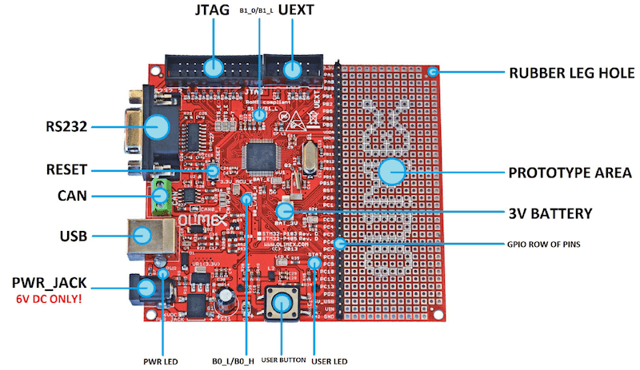
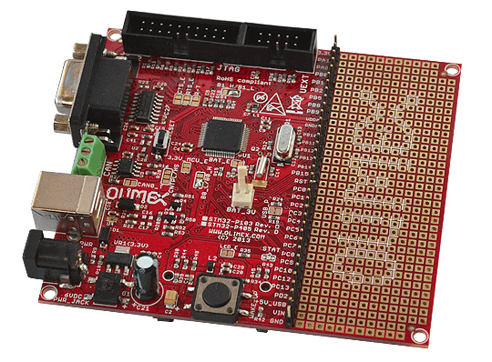

.. _olimex_stm32_p405:

OLIMEX-STM32-P405
#################

Overview
********

The OLIMEX-STM32-P405 board is based on the STMicroelectronics STM32F405RG ARM
Cortex-M4 CPU.

     OLIMEX-STM32-P405

Hardware
********

Information about the board can be found at the
`OLIMEX-STM32-P405 website`_ and `OLIMEX-STM32-P405 user manual`_.
The `ST STM32F405RG Datasheet`_ contains the processor's
information and the datasheet.

Supported Features
==================

The olimex_stm32_p405 board configuration supports the following
hardware features:

+-----------+------------+----------------------+
| Interface | Controller | Driver/Component     |
+===========+============+======================+
| NVIC      | on-chip    | nested vectored      |
|           |            | interrupt controller |
+-----------+------------+----------------------+
| SYSTICK   | on-chip    | system clock         |
+-----------+------------+----------------------+
| UART      | on-chip    | serial port          |
+-----------+------------+----------------------+
| GPIO      | on-chip    | gpio                 |
+-----------+------------+----------------------+

Other hardware features are not supported by the Zephyr kernel.

Pin Mapping
===========

     OLIMEX-STM32-P405 connectors

LED
---

* USER_LED (red) = PC12
* PWR_LED (red) = power

Push buttons
------------

* USER_BUTTON = PA0
* RST = NRST

External Connectors
-------------------

JTAG debug

+-------+--------------+-------+--------------+
| PIN # | Signal Name  | Pin # | Signal Name  |
+=======+==============+=======+==============+
| 1     | +3.3V        | 11    | -            |
+-------+--------------+-------+--------------+
| 2     | +3.3V        | 12    | GND          |
+-------+--------------+-------+--------------+
| 3     | PB4 / TRST   | 13    | PB3 / TDO    |
+-------+--------------+-------+--------------+
| 4     | GND          | 14    | GND          |
+-------+--------------+-------+--------------+
| 5     | PA15 / TDI   | 15    | PB4 / TRST   |
+-------+--------------+-------+--------------+
| 6     | GND          | 16    | GND          |
+-------+--------------+-------+--------------+
| 7     | PA13 / TMS   | 17    | -            |
+-------+--------------+-------+--------------+
| 8     | GND          | 18    | GND          |
+-------+--------------+-------+--------------+
| 9     | PA14 / TCK   | 19    | +5V_JTAG     |
+-------+--------------+-------+--------------+
| 10    | GND          | 20    | GND          |
+-------+--------------+-------+--------------+

UEXT

+-------+-----------------------+----------------+
| PIN # | Wire   Name           | STM32F405 port |
+=======+=======================+================+
| 1     | +3.3V                 | -              |
+-------+-----------------------+----------------+
| 2     | GND                   | -              |
+-------+-----------------------+----------------+
| 3     | PA9/USART1_TX         | PA9            |
+-------+-----------------------+----------------+
| 4     | PA10/USART1_RX        | PA10           |
+-------+-----------------------+----------------+
| 5     | PB6/I2C1_SCL          | PB6            |
+-------+-----------------------+----------------+
| 6     | PB7/I2C1_SDA          | PB7            |
+-------+-----------------------+----------------+
| 7     | PA6/SPI1_MISO         | PA6            |
+-------+-----------------------+----------------+
| 8     | PA7/SPI1_MOSI         | PA7            |
+-------+-----------------------+----------------+
| 9     | PA5/SPI1_SCK          | PA5            |
+-------+-----------------------+----------------+
| 10    | PA4/SPI1_NSS          | PA4            |
+-------+-----------------------+----------------+

GPIO row of pins

+---------+----------------------------------------------+
| Pin     | STM32F405 Pin Functions                      |
+=========+==============================================+
| 3V3     | N/A                                          |
+---------+----------------------------------------------+
| PA1     | PA1/USART2_RTS/ADC1/TIM2_CH2                 |
+---------+----------------------------------------------+
| PA8     | PA8/USART1_CK/TIM1_CH1/MCO                   |
+---------+----------------------------------------------+
| PB0     | PB0/ADC8/TIM3_CH3/TIM1_CH2N                  |
+---------+----------------------------------------------+
| PB1     | PB1/ADC9/TIM3_CH4/TIM1_CH3N                  |
+---------+----------------------------------------------+
| PB2     | PB2/BOOT1                                    |
+---------+----------------------------------------------+
| PB5     | PB5/I2C1_SMBAI/TIM3_CH2/SPI1_MOSI            |
+---------+----------------------------------------------+
| PB8     | PB8/TIM4_CH3/I2C1_SCL/CANRX                  |
+---------+----------------------------------------------+
| PB9     | PB9/TIM4_CH4/I2C1_SDA/CANTX                  |
+---------+----------------------------------------------+
| VDDA    | N/A                                          |
+---------+----------------------------------------------+
| GNDA    | N/A                                          |
+---------+----------------------------------------------+
| PB10    | PB10/I2C2_SCL/USART3_TX/TIM2_CH3             |
+---------+----------------------------------------------+
| PB11    | PB11/I2C2_SDA/USART3_RX/TIM2_CH4             |
+---------+----------------------------------------------+
| PB12    | PB12/SPI2_NSS/I2C2_SMBAL/USART3_CK/TIM1_BKIN |
+---------+----------------------------------------------+
| PB13    | PB13/SPI2_SCK/USART3_CTS/TIM1_CH1N           |
+---------+----------------------------------------------+
| PB14    | PB14/SPI2_MISO/USART3_RTS/TIM1_CH2N          |
+---------+----------------------------------------------+
| PB15    | PB15/SPI2_MOSI/TIM1_CH3N                     |
+---------+----------------------------------------------+
| RST     | NRST                                         |
+---------+----------------------------------------------+
| PC0     | PC0/ADC10                                    |
+---------+----------------------------------------------+
| PC1     | PC1/ADC11                                    |
+---------+----------------------------------------------+
| PC2     | PC2/ADC12                                    |
+---------+----------------------------------------------+
| PC3     | PC3/ADC13                                    |
+---------+----------------------------------------------+
| PC4     | PC4/ADC14                                    |
+---------+----------------------------------------------+
| PC5     | PC5/ADC15                                    |
+---------+----------------------------------------------+
| PC6     | PC6/TIM3_CH1                                 |
+---------+----------------------------------------------+
| PC7     | PC7/TIM3_CH2                                 |
+---------+----------------------------------------------+
| PC8     | PC8/TIM3_CH3                                 |
+---------+----------------------------------------------+
| PC9     | PC9/TIM3_CH4                                 |
+---------+----------------------------------------------+
| PC10    | PC10/USART3_TX                               |
+---------+----------------------------------------------+
| PC12    | PC12/USART3_CK                               |
+---------+----------------------------------------------+
| PC13    | PC13/ANTI_TAMP                               |
+---------+----------------------------------------------+
| PD2     | PD2/TIM3_ETR                                 |
+---------+----------------------------------------------+
| +5V_USB | N/A                                          |
+---------+----------------------------------------------+
| VIN     | N/A                                          |
+---------+----------------------------------------------+
| GND     | N/A                                          |
+---------+----------------------------------------------+

System Clock
============

OLIMEX-STM32-P405 has two external oscillators. The frequency of
the slow clock is 32.768 kHz. The frequency of the main clock
is 8 MHz. The processor can setup HSE to drive the master clock,
which can be set as high as 168 MHz.

Programming and Debugging
*************************
The OLIMEX-STM32-P405 board does not include an embedded debug tool
interface. You will need to use ST tools or an external JTAG probe.
In the following examples a ST-Link V2 USB dongle is used.

Flashing an application to the Olimex-STM32-P405
================================================

The sample application :ref:`hello_world` is being used in this tutorial.

Connect the ST-Link USB dongle to your host computer and to the JTAG port of
the OLIMEX-STM32-P405 board.

Now build and flash the application.

.. zephyr-app-commands::
   :zephyr-app: samples/hello_world
   :board: olimex_stm32_p405
   :goals: build flash

Run a serial host program to connect with your board:

.. code-block:: console

   $ minicom -D /dev/ttyACM0

After resetting the board, you should see the following message:

.. code-block:: console

   ***** BOOTING ZEPHYR OS v1.8.99 - BUILD: Aug  4 2017 14:54:40 *****
   Hello World! arm

Debugging
=========

You can debug an application in the usual way.  Here is an example for the
:ref:`hello_world` application.

.. zephyr-app-commands::
   :zephyr-app: samples/hello_world
   :board: olimex_stm32_p405
   :maybe-skip-config:
   :goals: debug

.. _OLIMEX-STM32-P405 website:
   https://www.olimex.com/Products/ARM/ST/STM32-P405/

.. _OLIMEX-STM32-P405 user manual:
   https://www.olimex.com/Products/ARM/ST/STM32-P405/resources/STM32-P405_UM.pdf

.. _ST STM32F405RG Datasheet:
   http://www.st.com/resource/en/reference_manual/dm00031020.pdf

