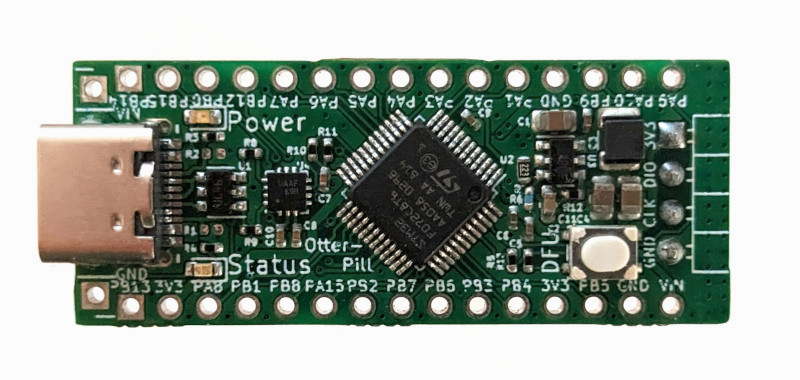

.. _otterpill:

OtterPill
#########

Overview
********
STM32F072 devboard with USB 2.0 and USB-PD capability in Arduino Nano form factor.
More information about the board can be found in the `OtterPill GitHub Repo`_.

Hardware
********

The OtterPill features an STM32F072, a FUSB302B USB Type-C controller and a 3.3V regulator with up to 27V input range.
Pinout and size are Arduino Nano compatible.

Supported Features
==================

The OtterPill board supports the following hardware features:

+-----------+------------+-------------------------------------+
| Interface | Controller | Driver/Component                    |
+===========+============+=====================================+
| NVIC      | on-chip    | nested vector interrupt controller  |
+-----------+------------+-------------------------------------+
| UART      | on-chip    | serial port-polling;                |
|           |            | serial port-interrupt               |
+-----------+------------+-------------------------------------+
| PINMUX    | on-chip    | pinmux                              |
+-----------+------------+-------------------------------------+
| GPIO      | on-chip    | gpio                                |
+-----------+------------+-------------------------------------+
| CLOCK     | on-chip    | reset and clock control             |
+-----------+------------+-------------------------------------+
| FLASH     | on-chip    | flash memory                        |
+-----------+------------+-------------------------------------+
| I2C       | on-chip    | i2c controller                      |
+-----------+------------+-------------------------------------+
| USB       | on-chip    | USB device                          |
+-----------+------------+-------------------------------------+

Pin Mapping
===========

For a diagram, refer to the `Pinout section in the OtterPill README`_.

Default Zephyr Peripheral Mapping:
----------------------------------
- UART_1_TX : PA9
- UART_1_RX : PA10
- I2C1_SCL : PB6
- I2C1_SDA : PB7
- SPI2_SCK : PB13
- SPI2_MISO : PB14
- SPI2_MOSI : PB15

This corresponds to where UART, I2C and SPI are on the Arduino Nano pinout,
but those can be remapped to other pins on this board.

I2C2 is used internall to connect the FUSB302B USB-PD controller to the STM32.

One user-programmable LED is available as ``led0`` and the DFU button is available for general use as ``sw0``.

Programming and Debugging
*************************

Flashing
========

The board can be flashed via USB with dfu-util by holding the DFU button while plugging in power.
Alternatively, it can be flashed via the SWD pins with openocd,
which is configured by default to use an STLink programmer.

Debugging
=========

Using the SWD interface and an STLink programmer, you can debug the board as described in :ref:`west-debugging`.

References
**********

.. target-notes::

.. _`OtterPill GitHub Repo`: https://github.com/Jana-Marie/OtterPill
.. _`Pinout section in the OtterPill README`: https://github.com/Jana-Marie/OtterPill#pinout
