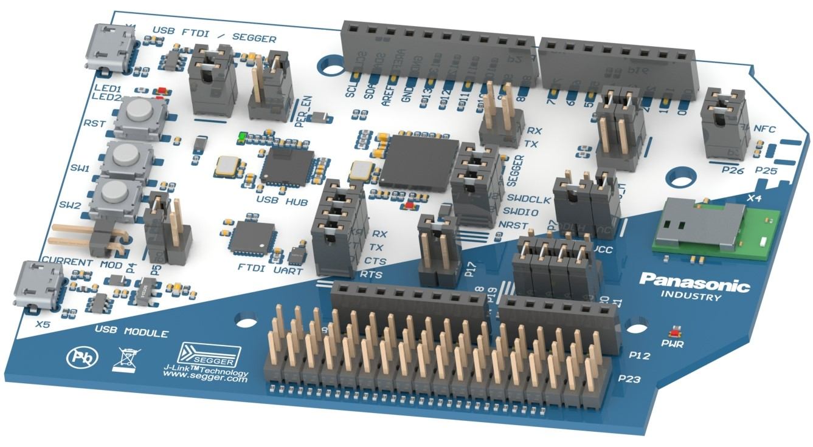

.. _pan1781_evb:

PAN1781 Evaluation Board
########################

Overview
********

The PAN1781 Evaluation Board is a development tool for the PAN1781 module
which is based on the nRF52820 chipset from Nordic Semiconductor.

You can find more information about the PAN1781 module and the PAN1781
evaluation board on the `product website`_.

Please also refer to :ref:`nrf52833dk_nrf52820` for general information about
development kits for the nRF52820 from Nordic Semiconductor.

The PAN1781 evaluation board is closely linked to these other evaluation
boards:

* :ref:`pan1780_evb`
* :ref:`pan1782_evb`

Usage
*****

You can find the `user guide`_ for the PAN1781 Evaluation Board in the
`Panasonic Wireless Connectivity Development Hub`_.

The user guide contains (amongst other things) detailed information about

* pin mapping
* powering options
* breakout pin header interface
* current consumption measurement
* software development

and other things.

The schematics for the PAN1781 Evaluation Board are available in the
`download section`_ of the `Panasonic Wireless Connectivity Development Hub`_.

Programming and Debugging
*************************

Please use the ``pan1781_evb`` board configuration when
:ref:`build_an_application` and :ref:`application_run`.

.. target-notes::
.. _product website: https://industry.panasonic.eu/products/devices/wireless-connectivity/bluetooth-low-energy-modules/pan1781-nrf52820
.. _Panasonic Wireless Connectivity Development Hub: https://pideu.panasonic.de/development-hub/
.. _user guide: https://pideu.panasonic.de/development-hub/pan1781/evaluation_board/user_guide/
.. _download section: https://pideu.panasonic.de/development-hub/pan1781/downloads/
