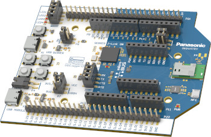

.. _pan1783_evb:

PAN1783 Evaluation Board
########################

Overview
********

The PAN1783 Evaluation Board (pan1783_evb) is a development tool for the
PAN1783 Module which is based on the nRF5340 chipset from Nordic Semiconductor.

You can find more information about the PAN1783 Module and Evaluation Board
on the `product website`_.

     PAN1783 EVB (Credit: Panasonic)

The PAN1783 Evaluation Board is closely linked to these other evaluation
boards:

* pan1783a_evb
* pan1783a_pa_evb

Usage
*****

For detailed information, you can find the `user guide`_ for the PAN1783
Evaluation Board in the `Panasonic Wireless Connectivity Development Hub`_.

The User Guide contains (amongst other things) detailed information about

* pin mapping
* powering options
* breakout pin header interface
* current consumption measurement
* software development

The schematics for the PAN1783 Evaluation Board are available in the
`download section`_ of the `Panasonic Wireless Connectivity Development Hub`_.

Programming and Debugging
*************************

Please use the ``pan1783_evb_cpuapp`` for application core or
``pan1783_evb_cpunet`` board configuration for network core
when :ref:`build_an_application` and :ref:`application_run`.

.. target-notes::
.. _product website: https://industry.panasonic.eu/products/devices/wireless-connectivity/bluetooth-low-energy-modules/pan1783-nrf5340
.. _Panasonic Wireless Connectivity Development Hub: https://pideu.panasonic.de/development-hub/
.. _user guide: https://pideu.panasonic.de/development-hub/pan1783/evaluation_board/user_guide/
.. _download section: https://pideu.panasonic.de/development-hub/pan1783/downloads/
