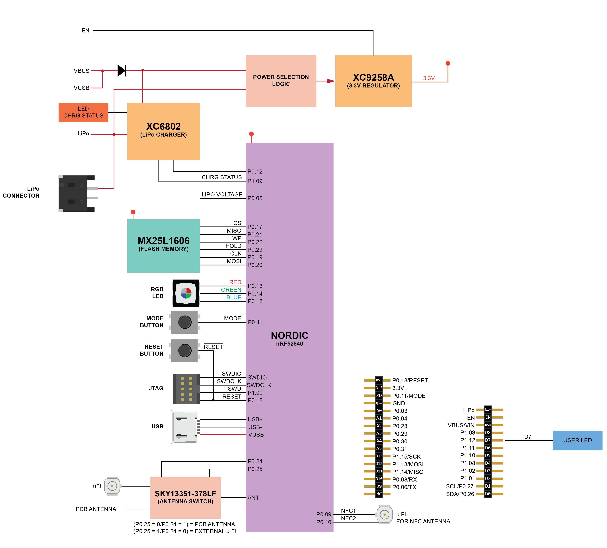
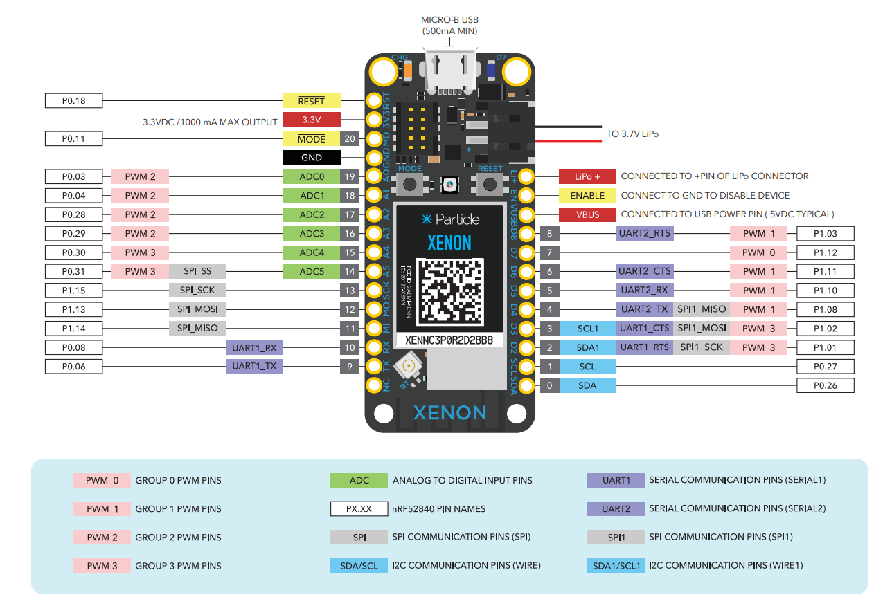
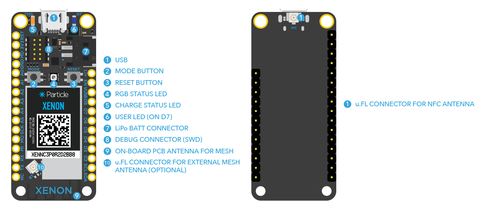

.. _particle_xenon:

particle xenon
##############

Overview
********

`particle xenon`_ is a evaluation board based on the Nordic Semiconductor
nRF52840 SoC. The board was developed by Particle Industries.
The board has a JTAG connector on it to be programmable.

It is equipped with a onboard LIPO circuit and conforms with the
Adafruit Feather formfactor.

Zephyr applications use the particle xenon board configuration
to run on the particle xenon board hardware. It provides
support for the Nordic Semiconductor nRF52840 ARM |reg| Cortex |reg|-M4F SoC
with an integrated 2.4 GHz transceiver supporting Bluetooth |reg| Low Energy
and IEEE |reg| 802.15.4.

The schematic can be found on the `particle xenon website`_.

Hardware
********

On the front of the board are RGB-LED, LED and LIPO circuitru.
The RGB-LED is controlled by the nRF52840 via GPIO pins.

     particle xenon block (Credit: PHYTEC)

     particle xenon pinout (Credit: Particle Industries)

     particle xenon pin markings (Credit: Particle Industries)

Power supply
============

The board is optimized for low power applications and supports two
power source configurations, battery and micro USB connector.

It contains circuitry for LIPO usage and can be charged via the USB port.

Supported Features
==================

The particle_xenon board configuration supports the following
hardware features:

+-----------+------------+----------------------+
| Interface | Controller | Driver/Component     |
+===========+============+======================+
| NVIC      | on-chip    | nested vectored      |
|           |            | interrupt controller |
+-----------+------------+----------------------+
| RTC       | on-chip    | system clock         |
+-----------+------------+----------------------+
| UART      | on-chip    | serial port          |
+-----------+------------+----------------------+
| I2C       | on-chip    | i2c                  |
+-----------+------------+----------------------+
| SPI       | on-chip    | spi                  |
+-----------+------------+----------------------+
| GPIO      | on-chip    | gpio                 |
+-----------+------------+----------------------+
| FLASH     | on-chip    | flash                |
+-----------+------------+----------------------+
| RADIO     | on-chip    | Bluetooth            |
+-----------+------------+----------------------+

Other hardware features are not supported by the Zephyr kernel.

Connections and IOs
===================

Please see the `particle xenon Website` for the board on github / schematic.

Adapter LEDs
------------

+-------+-----------------------+--------------------------------+
| Name  | Type                  | Usage                          |
+=======+=======================+================================+
| P1,14 | green                 | -                              |
+-------+-----------------------+--------------------------------+
| P1,15 | blue                  | -                              |
+-------+-----------------------+--------------------------------+
| P1,13 | red                   | -                              |
+-------+-----------------------+--------------------------------+

Programming and Debugging
*************************

Applications for the ``particle_xenon`` board configuration can be
built and flashed in the usual way (see :ref:`build_an_application`
and :ref:`application_run` for more details).

Flashing
========

Build and flash an application in the usual way, for example:

.. zephyr-app-commands::
   :zephyr-app: samples/basic/blinky
   :board: particle_xenon
   :goals: build flash

Debugging
=========

You can debug an application in the usual way.  Here is an example for the
:ref:`hello_world` application.

.. zephyr-app-commands::
   :zephyr-app: samples/hello_world
   :board: particle_xenon
   :maybe-skip-config:
   :goals: debug

Testing the LEDs and buttons
****************************

There are 2 samples that allow you to test that the buttons (switches) and
LEDs on the board are working properly with Zephyr:

* :ref:`blinky-sample`
* :ref:`button-sample`

You can build and flash the examples to make sure Zephyr is running correctly on
your board.

.. _particle xenon Website:
   https://github.com/particle-iot/xenon
