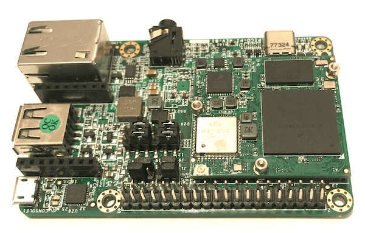

.. _pico_pi_m4:

Pico-Pi i.MX7D - Android Things IoT Development Platform
#############################################################

Overview
********

The i.MX7D SoC is a Hybrid multi-core processor composed of Single Cortex A7
core and Single Cortex M4 core.
Zephyr was ported to run on the M4 core. In a later release, it will also
communicate with the A7 core (running Linux) via RPmsg.

Hardware
********

The Pico-Pi Platform is composed of a CPU and IO board.

Pico-Pi IO Board
================
- S1 - On/Off (MX7_ONOFF signal)
- Board to board connector : Edison compatible connector (70 configurable pins)
- mikroBUS expansion connector ADC, GPIO, I²C, PWM, SPI, UART)
- 10-pin needle JTAG Connector
- Debug USB exposing One UART
- MIPI DSI 1 lane Connector
- LCD Touch Connector
- Audio Jack: Mic and Stereo Headphone

Pico-Pi CPU Board
=================

- CPU i.MX7 Dual with a Single Cortex A7 (1 GHz) core and
  Single Cortex M4 (200MHz) core
- Memory

  - RAM -> A7: 4GB
  - RAM -> M4: 3x32KB (TCML, TCMU, OCRAM_S), 1x128KB (OCRAM) and 1x256MB (DDR)
  - Flash -> A7: 8GB eMMC

For more information about the i.MX7 SoC and Pico-Pi i.MX7D, see these references:

- `i.MX 7 Series Website`_
- `i.MX 7 Dual Datasheet`_
- `i.MX 7 Dual Reference Manual`_

Supported Features
==================

The Pico-Pi i.MX7D configuration supports the following hardware features on the
Cortex M4 Core:

+-----------+------------+-------------------------------------+
| Interface | Controller | Driver/Component                    |
+===========+============+=====================================+
| NVIC      | on-chip    | nested vector interrupt controller  |
+-----------+------------+-------------------------------------+
| SYSTICK   | on-chip    | systick                             |
+-----------+------------+-------------------------------------+
| GPIO      | on-chip    | gpio                                |
+-----------+------------+-------------------------------------+
| I2C       | on-chip    | i2c                                 |
+-----------+------------+-------------------------------------+
| UART      | on-chip    | serial port-polling;                |
|           |            | serial port-interrupt               |
+-----------+------------+-------------------------------------+

The default configuration can be found in the defconfig file:
``boards/arm/pico_pi_m4/pico_pi_m4_defconfig``

Other hardware features are not currently supported by the port.

Connections and IOs
===================

The Pico-Pi board Board was tested with the following pinmux controller
configuration.

+---------------+---------------------+--------------------------------+
| Board Name    | SoC Name            | Usage                          |
+===============+=====================+================================+
| UART_TX232    | UART1_TX            | UART Console                   |
+---------------+---------------------+--------------------------------+
| UART_RX232    | UART1_RX            | UART Console                   |
+---------------+---------------------+--------------------------------+
| RX_E          | UART6_TX            | UART (mikroBUS and Edison)     |
+---------------+---------------------+--------------------------------+
| TX_E          | UART6_RX            | UART (mikroBUS and Edison)     |
+---------------+---------------------+--------------------------------+
| I2CX_SDA_3V   | I2C1_SDA            | I2C (mikroBUS and Edison)      |
+---------------+---------------------+--------------------------------+
| I2CX_SCL_3V   | I2C1_SCL            | I2C (mikroBUS and Edison)      |
+---------------+---------------------+--------------------------------+

System Clock
============

The M4 Core is configured to run at a 200 MHz clock speed.

Serial Port
===========

The iMX7D SoC has seven UARTs. The number 6 is configured for the console and
the number 2 is used in the mikroBUS connector.

Programming and Debugging
*************************

The Pico-Pi i.MX7D doesn't have QSPI flash for the M4 and it needs to be started by
the A7 core. The A7 core is responsible to load the M4 binary application into
the RAM, put the M4 in reset, set the M4 Program Counter and Stack Pointer, and
get the M4 out of reset.
The A7 can perform these steps at bootloader level or after the Linux system
has booted.

The M4 can use up to 5 different RAMs. These are the memory mapping for A7 and
M4:

+------------+-----------------------+------------------------+-----------------------+----------------------+
| Region     | Cortex-A7             | Cortex-M4 (System Bus) | Cortex-M4 (Code Bus)  | Size                 |
+============+=======================+========================+=======================+======================+
| DDR        | 0x80000000-0xFFFFFFFF | 0x80000000-0xDFFFFFFF  | 0x10000000-0x1FFEFFFF | 2048MB (less for M4) |
+------------+-----------------------+------------------------+-----------------------+----------------------+
| OCRAM      | 0x00900000-0x0091FFFF | 0x20200000-0x2021FFFF  | 0x00900000-0x0091FFFF | 128KB                |
+------------+-----------------------+------------------------+-----------------------+----------------------+
| TCMU       | 0x00800000-0x00807FFF | 0x20000000-0x20007FFF  |                       | 32KB                 |
+------------+-----------------------+------------------------+-----------------------+----------------------+
| TCML       | 0x007F8000-0x007FFFFF |                        | 0x1FFF8000-0x1FFFFFFF | 32KB                 |
+------------+-----------------------+------------------------+-----------------------+----------------------+
| OCRAM_S    | 0x00180000-0x00187FFF | 0x20180000-0x20187FFF  | 0x00000000-0x00007FFF | 32KB                 |
+------------+-----------------------+------------------------+-----------------------+----------------------+

References
==========

- `i.MX 7 Dual Reference Manual`_ from page 182 (section 2.1.2 and 2.1.3)
- `Toradex Wiki`_

At compilation time you have to choose which RAM will be used. This
configuration is done in the file ``boards/arm/pico_pi_m4/pico_pi_m4.dts`` with
"zephyr,flash" (when CONFIG_XIP=y) and "zephyr,sram" properties. The available
configurations are:

.. code-block:: none

   "zephyr,flash"
   - &ddr_code
   - &tcml_code
   - &ocram_code
   - &ocram_s_code
   - &ocram_pxp_code
   - &ocram_epdc_code

   "zephyr,sram"
   - &ddr_sys
   - &tcmu_sys
   - &ocram_sys
   - &ocram_s_sys
   - &ocram_pxp_sys
   - &ocram_epdc_sys

Below you will find the instructions to load and run Zephyr on M4 from A7 using
u-boot.

Connect both micro USB interfaces into the PC. This is the A7 console and the
UART6 in the Edison connector is M4 console for Zephyr with both configured to work at 115200 8N1.
The USB interface is used to power the CPU and IO boards and is connected
to the USB OTG interface of the i.MX7D.

After powering up the platform stop the u-boot execution on the A7 core and
expose the eMMC as mass storage with the following command in the u-boot
prompt: ``ums 0 mmc 0``. Copy the compiled zephyr.bin to the first FAT
partition and remove the mounted device on the PC by issuing a "Ctrl+C" in the
u-boot prompt.
Set the u-boot environment variables and run the zephyr.bin from the
appropriated memory configured in the Zephyr compilation:

.. code-block:: console

   setenv bootm4 'fatload mmc 0:1 $m4addr $m4fw && dcache flush && bootaux $m4addr'
   # TCML
   setenv m4tcml 'setenv m4fw zephyr.bin; setenv m4addr 0x007F8000'
   setenv bootm4tcml 'run m4tcml && run bootm4'
   run bootm4tcml
   # TCMU
   setenv m4tcmu 'setenv m4fw zephyr.bin; setenv m4addr 0x00800000'
   setenv bootm4tcmu 'run m4tcmu && run bootm4'
   run bootm4tcmu
   # OCRAM
   setenv m4ocram 'setenv m4fw zephyr.bin; setenv m4addr 0x00900000'
   setenv bootm4ocram 'run m4ocram && run bootm4'
   run bootm4ocram
   # OCRAM_S
   setenv m4ocrams 'setenv m4fw zephyr.bin; setenv m4addr 0x00180000'
   setenv bootm4ocrams 'run m4ocrams && run bootm4'
   run bootm4ocrams
   # DDR
   setenv m4ddr 'setenv m4fw zephyr.bin; setenv m4addr 0x80000000'
   setenv bootm4ddr 'run m4ddr && run bootm4'
   run bootm4ddr

:ref:`build_an_application` and :ref:`application_run` for more details).

References
==========

- `Loading Code on Cortex-M4 from Linux for the i.MX 6SoloX and i.MX 7Dual/7Solo Application Processors`_
- `J-Link iMX7D Instructions`_

.. _i.MX 7 Series Website:
   https://www.nxp.com/products/processors-and-microcontrollers/applications-processors/i.mx-applications-processors/i.mx-7-processors:IMX7-SERIES?fsrch=1&sr=1&pageNum=1

.. _i.MX 7 Dual Datasheet:
   https://www.nxp.com/docs/en/data-sheet/IMX7DCEC.pdf

.. _i.MX 7 Dual Reference Manual:
   https://www.nxp.com/webapp/Download?colCode=IMX7DRM

.. _J-Link Tools:
   https://www.segger.com/downloads/jlink/#J-LinkSoftwareAndDocumentationPack

.. _NXP iMX7D Connect CortexM4.JLinkScript:
   https://wiki.segger.com/images/8/86/NXP_iMX7D_Connect_CortexM4.JLinkScript

.. _Loading Code on Cortex-M4 from Linux for the i.MX 6SoloX and i.MX 7Dual/7Solo Application Processors:
   https://www.nxp.com/docs/en/application-note/AN5317.pdf

.. _J-Link iMX7D Instructions:
   https://wiki.segger.com/IMX7D

.. _Toradex Wiki:
   https://developer.toradex.com/knowledge-base/freertos-on-the-cortex-m4-of-a-colibri-imx7#Memory_areas
