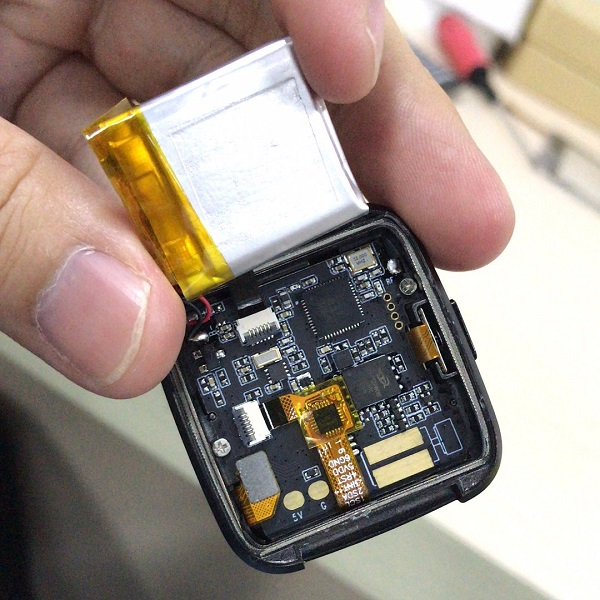
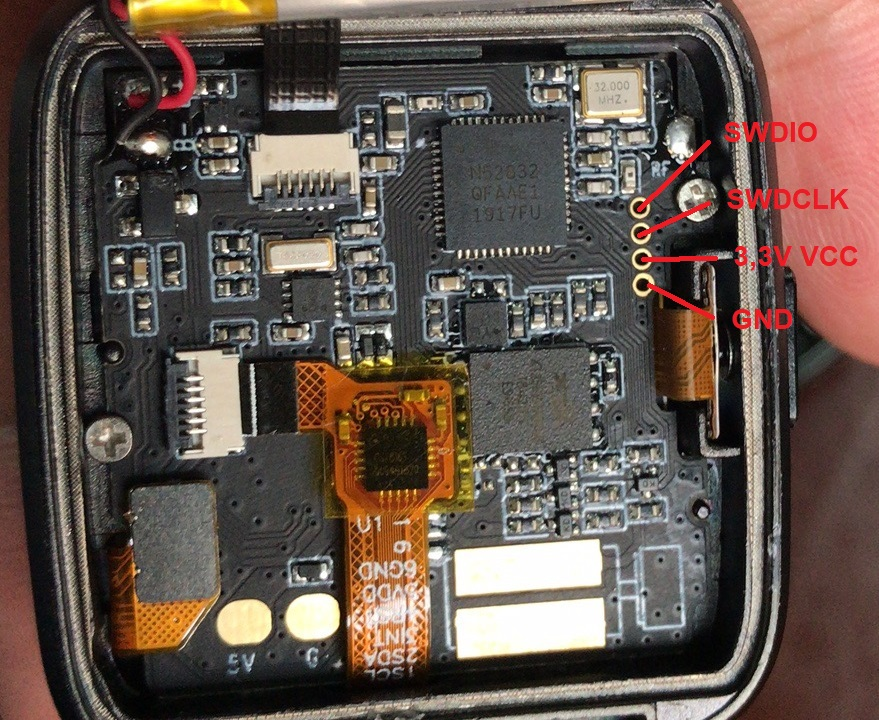

.. _pinetime_devkit0:

Pine64 PineTime DevKit0
#######################

Overview
********

   PineTime leaflet (Credit: Pine64)

The Pine64 smartwatch, dubbed "PineTime", is a product of a community effort
for an open source smartwatch in collaboration with wearable RTOS and Linux
app developers/communities.

   PineTime Dev Kit (Credit: Pine64)

Hardware
********

The PineTime is based on a Nordic NRF52832 chip and features:

- 64 MHz Cortex-M4 with FPU
- 64KB SRAM
- 512KB on board Flash
- 1.3 inches (33mm), 240x240 pixels display with ST7789 driver
- 170-180mAh LiPo battery
- XT25F32B 32Mb (4MB) SPI NOR Flash
- CST816S Capacitive Touch
- BMA421 Triaxial Acceleration Sensor
- HRS3300 PPG Heart Rate Sensor

PineTime Port Assignment
========================

See `PineTime schematics`_
+----------------------+---------------------------------+-----------+
| NRF52 pins           | Function                        | Direction |
+======================+=================================+===========+
| P0.00/XL1            | 32.768 kHz –XL1                 |           |
+----------------------+---------------------------------+-----------+
| P0.01/XL2            | 32.768 kHz –XL2                 |           |
+----------------------+---------------------------------+-----------+
| P0.02/AIN0           | SPI-SCK, LCD_SCK                | OUT       |
+----------------------+---------------------------------+-----------+
| P0.03/AIN1           | SPI-MOSI, LCD_SDI               | OUT       |
+----------------------+---------------------------------+-----------+
| P0.04/AIN2           | SPI-MISO                        | IN        |
+----------------------+---------------------------------+-----------+
| P0.05/AIN3           | SPI-CE# (SPI-NOR)               | OUT       |
+----------------------+---------------------------------+-----------+
| P0.06                | BMA421-SDA, HRS3300-SDA, TP-SDA | I/O       |
+----------------------+---------------------------------+-----------+
| P0.07                | BMA421-SCL, HRS3300-SCL, TP-SCL | OUT       |
+----------------------+---------------------------------+-----------+
| P0.08                | BMA421-INT                      | IN        |
+----------------------+---------------------------------+-----------+
| P0.09/NFC1           | LCD_DET                         | OUT       |
+----------------------+---------------------------------+-----------+
| P0.10/NFC2           | TP_RESET                        | OUT       |
+----------------------+---------------------------------+-----------+
| P0.11                |                                 |           |
+----------------------+---------------------------------+-----------+
| P0.12                | CHARGE INDICATION               | IN        |
+----------------------+---------------------------------+-----------+
| P0.13                | PUSH BUTTON_IN                  | IN        |
+----------------------+---------------------------------+-----------+
| P0.14/TRACEDATA3     | LCD_BACKLIGHT_LOW               | OUT       |
+----------------------+---------------------------------+-----------+
| P0.15/TRACEDATA2     | PUSH BUTTON_OUT                 | OUT       |
+----------------------+---------------------------------+-----------+
| P0.16/TRACEDATA1     | VIBRATOR OUT                    | OUT       |
+----------------------+---------------------------------+-----------+
| P0.17                |                                 |           |
+----------------------+---------------------------------+-----------+
| P0.18/TRACEDATA0/SWO | LCD_RS OUT                      |           |
+----------------------+---------------------------------+-----------+
| P0.19                | POWER PRESENCE INDICATION       | IN        |
+----------------------+---------------------------------+-----------+
| P0.20/TRACECLK       |                                 |           |
+----------------------+---------------------------------+-----------+
| P0.21/nRESET         |                                 |           |
+----------------------+---------------------------------+-----------+
| P0.22                | LCD_BACKLIGHT_MID               | OUT       |
+----------------------+---------------------------------+-----------+
| P0.23                | LCD_BACKLIGHT_HIGH              | OUT       |
+----------------------+---------------------------------+-----------+
| P0.24                | 3V3 POWER CONTROL               | OUT       |
+----------------------+---------------------------------+-----------+
| P0.25                | LCD_CS                          | OUT       |
+----------------------+---------------------------------+-----------+
| P0.26                | LCD_RESET                       | OUT       |
+----------------------+---------------------------------+-----------+
| P0.27                | STATUS LED (NOT STAFF)          | OUT       |
+----------------------+---------------------------------+-----------+
| P0.28/AIN4           | TP_INT                          | IN        |
+----------------------+---------------------------------+-----------+
| P0.29/AIN5           |                                 |           |
+----------------------+---------------------------------+-----------+
| P0.30/AIN6           | HRS3300-TEST                    | IN        |
+----------------------+---------------------------------+-----------+
| P0.31/AIN7           | BATTERY VOLTAGE (Analog)        | IN        |
+----------------------+---------------------------------+-----------+

Building
********

In order to get started with Zephyr on the PineTime, you can use the
board-specific sample:

.. zephyr-app-commands::
   :zephyr-app: samples/boards/pine64_pinetime
   :board: pinetime_devkit0
   :goals: build

Programming and Debugging
*************************

The PineTime Dev Kit comes with the back not glued down to allow it to be
easily reprogrammed.

The kit does not include a hardware programmer, but existing debuggers
supporting SWD can be used.

These are the necessary steps for debugging:

- Unlock the device
- Upload new software
- Run a debugger

More infos to be found in the `Wiki Reprogramming the PineTime`_ page.

Debugger connection
===================

The dev kits have exposed SWD pins for flashing and debugging.

Only a few devs have soldered to these pins, most just use friction to make
contact with the programming cable.

The pinout is:

Unlocking the Flash memory
==========================

Unlocking the device is a one-time action that is needed to enable to debug
port and provide full access to the device. This will erase all existing
software from the internal flash.

.. code-block:: console

   $ nrfjprog -f NRF52 --recover

Flashing
========

Using nrfjprog, flashing the PineTime is done with the command:

.. code-block:: console

   $ nrfjprog -f NRF52 --program firmware.hex --sectorerase

Debugging
=========

Using Segger Ozone debugger, debugging and flashing is made easy.

Simply load the .elf file containing the final firmware and
setup the debbuger to use SWD over USB for the chip nRF52832_xxAA.
This setup can be done using the menu Tools/J-Link Settings. or by directly
typing the following in the debugger console:

.. code-block:: console

   $ Project.SetDevice ("nRF52832_xxAA");
   $ Project.SetHostIF ("USB", "");
   $ Project.SetTargetIF ("SWD");
   $ Project.SetTIFSpeed ("4 MHz");
   $ File.Open ("path/to/your/build/zephyr/zephyr.elf");

References
**********

.. target-notes::

.. _Pine64 PineTime presentation:
   https://www.pine64.org/pinetime

.. _Pine64 PineTime wiki page:
   https://wiki.pine64.org/index.php/PineTime

.. _Pine64 forum:
   https://forum.pine64.org

.. _PineTime schematics:
   http://files.pine64.org/doc/PineTime/PineTime%20Schematic-V1.0a-20191103.pdf

.. _Wiki Reprogramming the PineTime:
   https://wiki.pine64.org/index.php/Reprogramming_the_PineTime
