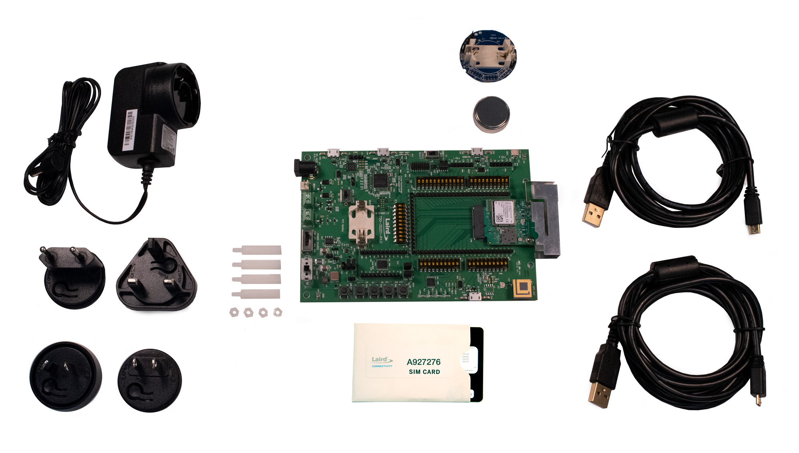

.. _pinnacle_100_dvk:

Laird Connectivity Pinnacle 100 DVK
###################################

Overview
********
The Pinnacle™ 100 cellular modem seamlessly incorporates a powerful Cortex M4F
controller, full Bluetooth 5 and LTE-M/NB-IoT capabilities – all with full
regulatory certifications and LTE carrier approvals. The Pinnacle 100 also
delivers complete antenna flexibility, with pre-integrated internal or external
antenna options such as the Revie Flex family of LTE and NB-IoT
internal antennas.

Develop your application directly on the M4F controller using Zephyr RTOS to
cut BOM costs and power consumption. Take advantage of the Zephyr community,
Laird Connectivity’s sample code (cellular, Bluetooth) and hardware interfaces,
or use our hosted mode AT commands set firmware.

Extremely power conscious, the Pinnacle 100 is ideal for battery-powered
devices operating at the edge of your IoT networks, seamlessly bridging the
cellular WAN to BLE. It’s never been easier to bridge wireless
Bluetooth 5 sensor data to cloud services like AWS IoT over a
low-power LTE connection.

More information about the board can be found at the `Pinnacle 100 website`_.

The Pinnacle 100 Development Kit (453-00010-K1 or 453-00011-K1) hardware
provides support for the
Nordic Semiconductor nRF52840 ARM Cortex-M4F CPU, `Sierra Wireless HL7800`_ (Altair ALT1250)
and the following devices:

* :abbr:`ADC (Analog to Digital Converter)`
* CLOCK
* FLASH
* :abbr:`GPIO (General Purpose Input Output)`
* :abbr:`I2C (Inter-Integrated Circuit)`
* :abbr:`MPU (Memory Protection Unit)`
* :abbr:`NVIC (Nested Vectored Interrupt Controller)`
* :abbr:`PWM (Pulse Width Modulation)`
* RADIO (Bluetooth Low Energy and 802.15.4)
* :abbr:`RTC (nRF RTC System Clock)`
* Segger RTT (RTT Console)
* :abbr:`SPI (Serial Peripheral Interface)`
* :abbr:`UART (Universal asynchronous receiver-transmitter)`
* :abbr:`USB (Universal Serial Bus)`
* :abbr:`WDT (Watchdog Timer)`
* :abbr:`QSPI (Quad Serial Peripheral Interface)`
* :abbr:`BME680 (Bosch Sensortec BME680 environmental sensor)`
* :abbr:`HL7800 (Sierra Wireless HL7800 LTE-M1/NB-IoT modem)`

     Pinnacle 100 DVK (453-00010-K1)

Hardware
********

Supported Features
==================

The Pinnacle 100 development board configuration supports the following
hardware features:

+-----------+------------+----------------------+
| Interface | Controller | Driver/Component     |
+===========+============+======================+
| ADC       | on-chip    | adc                  |
+-----------+------------+----------------------+
| CLOCK     | on-chip    | clock_control        |
+-----------+------------+----------------------+
| FLASH     | on-chip    | flash                |
+-----------+------------+----------------------+
| GPIO      | on-chip    | gpio                 |
+-----------+------------+----------------------+
| I2C(M)    | on-chip    | i2c                  |
+-----------+------------+----------------------+
| MPU       | on-chip    | arch/arm             |
+-----------+------------+----------------------+
| NVIC      | on-chip    | arch/arm             |
+-----------+------------+----------------------+
| PWM       | on-chip    | pwm                  |
+-----------+------------+----------------------+
| RADIO     | on-chip    | Bluetooth,           |
|           |            | ieee802154           |
+-----------+------------+----------------------+
| RTC       | on-chip    | system clock         |
+-----------+------------+----------------------+
| RTT       | Segger     | console              |
+-----------+------------+----------------------+
| SPI(M/S)  | on-chip    | spi                  |
+-----------+------------+----------------------+
| UART      | on-chip    | serial               |
+-----------+------------+----------------------+
| USB       | on-chip    | usb                  |
+-----------+------------+----------------------+
| WDT       | on-chip    | watchdog             |
+-----------+------------+----------------------+
| QSPI      | on-chip    | qspi/MX25R64(8MB)    |
+-----------+------------+----------------------+
| BME680    | I2C(M)     | sensor/bme680        |
+-----------+------------+----------------------+
| HL7800    | UART       | HL7800 modem driver  |
+-----------+------------+----------------------+

See `Pinnacle 100 website`_ for a complete list
of Pinnacle 100 Development Kit hardware features.

Connections and IOs
===================

LED
---

* LED1 (blue)  = P1.4
* LED2 (green) = P1.5
* LED3 (red)   = P1.6
* LED4 (green) = P1.7

Push buttons
------------

* BUTTON1 = SW1 = P0.31
* BUTTON2 = SW2 = P0.3
* BUTTON3 = SW3 = P0.4
* BUTTON4 = SW4 = P0.2
* NRF RESET = SW5 = reset

Programming and Debugging
*************************

Applications for the ``pinnacle_100_dvk`` board configuration can be
built and flashed in the usual way. (see :ref:`build_an_application`
and :ref:`application_run` for more details)

Flashing
========

Follow the instructions in the :ref:`nordic_segger` page to install
and configure all the necessary software. Further information can be
found in :ref:`nordic_segger_flashing`. Then build and flash
applications as usual (see :ref:`build_an_application` and
:ref:`application_run` for more details).

Here is an example for the :ref:`hello_world` application.

First, run your favorite terminal program to listen for output.

.. note:: On the Pinnacle 100 development board,
   the FTDI USB should be used to access the UART console.

.. code-block:: console

   $ minicom -D <tty_device> -b 115200

Replace :code:`<tty_device>` with the port where the board Pinnacle 100 DVK
can be found. For example, under Linux, :code:`/dev/ttyUSB0`.

Then build and flash the application in the usual way.

.. zephyr-app-commands::
   :zephyr-app: samples/hello_world
   :board: pinnacle_100_dvk
   :goals: build flash

Debugging
=========

Refer to the :ref:`nordic_segger` page to learn about debugging Nordic boards with a
Segger IC.

Software
********

Pinnacle 100 Out-of-Box Demo Software
=====================================
The Pinnacle 100 development kit ships with an out of the box software demo.
Check out the `Pinnacle 100 OOB Demo`_ source code and documentation.

Sample Applications
===================
`Pinnacle 100 Sample Applications`_ are available.

Testing Bluetooth on the Pinnacle 100 DVK
=========================================
Many of the Bluetooth examples will work on the Pinnacle 100 DVK.
Try them out:

* :ref:`ble_peripheral`
* :ref:`bluetooth-eddystone-sample`
* :ref:`bluetooth-ibeacon-sample`

Testing the LEDs and buttons in the Pinnacle 100 DVK
====================================================

There are 2 samples that allow you to test that the buttons (switches) and LEDs on
the board are working properly with Zephyr:

.. code-block:: console

   samples/basic/blinky
   samples/basic/button

You can build and flash the examples to make sure Zephyr is running correctly on
your board. The button and LED definitions can be found in
:zephyr_file:`boards/arm/pinnacle_100_dvk/pinnacle_100_dvk.dts`.

Selecting the pins
==================
To select the pin numbers for tx-pin and rx-pin:

.. code-block:: console

   tx-pin = <pin_no>

Open the `nRF52840 Product Specification`_, chapter 7 'Hardware and Layout'.
In the table 7.1.1 'aQFN73 ball assignments' select the pins marked
'General purpose I/O'.  Note that pins marked as 'low frequency I/O only' can only be used
in under-10KHz applications. They are not suitable for 115200 speed of UART.

Translate the 'Pin' into number for devicetree by using the following formula::

   pin_no = b\*32 + a

where ``a`` and ``b`` are from the Pin value in the table (Pb.a).
For example, for P0.1, ``pin_no = 1`` and for P1.0, ``pin_no = 32``.

References
**********

.. target-notes::

.. _Pinnacle 100 website: https://www.lairdconnect.com/wireless-modules/cellular-solutions/pinnacle-100-cellular-modem
.. _nRF52840 Product Specification: https://infocenter.nordicsemi.com/pdf/nRF52840_PS_v1.1.pdf
.. _Sierra Wireless HL7800: https://source.sierrawireless.com/devices/hl-series/hl7800/#sthash.641qTTwA.dpbs
.. _J-Link Software and documentation pack: https://www.segger.com/jlink-software.html
.. _Pinnacle 100 OOB Demo: https://github.com/LairdCP/Pinnacle_100_oob_demo
.. _Pinnacle 100 Sample Applications: https://github.com/LairdCP/Pinnacle_100_Sample_Applications
