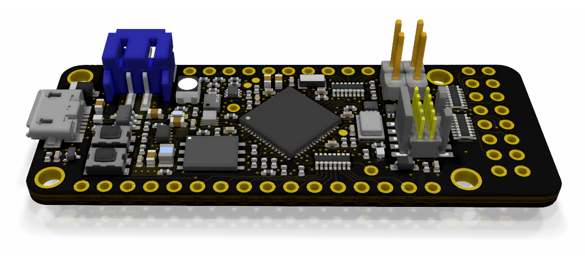

.. _quickfeather:

QuickFeather
############

Overview
********

The QuickFeather development board is a platform with an on-board QuickLogic
EOS S3 Sensor Processing Platform.

   QuickFeather (Credit: QuickLogic)

Hardware
********

- QuickLogic EOS S3 MCU Platform
- mCube MC3635 accelerometer
- Infineon DPS310 pressure sensor
- Infineon IM69D130 MEMS microphone
- 16 Mbit of on-board flash memory
- User button
- RGB LED
- Integrated battery charger

Detailed information about the board can be found in a `QuickFeather repository`_.

Supported Features
==================

The QuickFeather configuration supports the following hardware
features:

+-----------+------------+-------------------------------------+
| Interface | Controller | Driver/Component                    |
+===========+============+=====================================+
| UART      | on-chip    | serial port                         |
+-----------+------------+-------------------------------------+
| GPIO      | on-chip    | gpio                                |
+-----------+------------+-------------------------------------+

The default configuration can be found in the Kconfig file
:zephyr_file:`boards/arm/quick_feather/quick_feather_defconfig`.

Connections and IOs
===================

Detailed information about pinouts is available in the `schematics document`_.

Programming and Debugging
*************************

Flashing
========

The QuickFeather platform by default boots from flash. Currently
the Zephyr port only enables loading the program directly to SRAM using either
OpenOCD and a SWD programmer or SEGGER JLink.

OpenOCD
-------

In order to connect to the target a SWD programmer supported in
OpenOCD is needed. To connect to the board run:

.. code-block:: console

   openocd -f /path/to/swd-programmer.cfg -f tcl/board/quicklogic_quickfeather.cfg -c "init" -c "reset halt"

`The QuickFeather OpenOCD config`_ can be found in the OpenOCD mainline repository.

JLink
-----

To connect to the QuickFeather board with JLink please follow instructions
in the `QuickFeather User Guide`_.

Debugging
=========

To debug the QuickFeather board please connect to the target with either
OpenOCD or JLink and use GDB distributed in Zephyr's SDK in *arm-zephyr-eabi/bin*
directory.

To load basic sample via GDB:

- Build the sample in an usual way:

.. zephyr-app-commands::
   :zephyr-app: samples/hello_world
   :board: quick_feather
   :goals: build

- Connect to the target using either OpenOCD or JLink
- Connect via GDB and load an ELF file:

.. code-block:: console

   /path/to/zephyr-sdk/arm-zephyr-eabi/bin/arm-zephyr-eabi-gdb
   target remote <port_number>
   file </path/to/zephyr.elf>
   load
   continue

References
**********

.. target-notes::

.. _QuickFeather repository:
    https://github.com/QuickLogic-Corp/quick-feather-dev-board

.. _schematics document:
    https://github.com/QuickLogic-Corp/quick-feather-dev-board/blob/master/doc/quickfeather-board.pdf

.. _The QuickFeather OpenOCD config:
    https://sourceforge.net/p/openocd/code/ci/master/tree/tcl/board/quicklogic_quickfeather.cfg

.. _QuickFeather User Guide:
    https://github.com/QuickLogic-Corp/quick-feather-dev-board/blob/master/doc/QuickFeather_UserGuide.pdf
