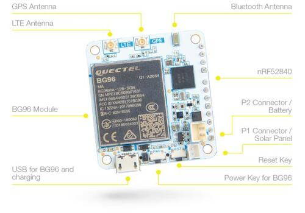

.. _rak5010_nrf52840:

RAK5010
#######

Overview
********

WisTrio NB-IoT Tracker Pro (RAK5010) is a tracker
with integrated LTE CAT M1 & NB1, GPS, BLE, and sensors.
It is built on the Quectel BG96 LTE CAT M1 & NB1 module,
which has an integrated GPS receiver. The MCU running
the board is a Nordic nRF52840 controller.

As it has both GPS and BLE it can be used for outdoor
and indoor scenarios, where location-based services need be present.

The built-in sensors for RAK5010 are temperature and
humidity sensor, motion sensor, pressure sensor, and light sensor.
The extension IOs allow adding more sensors in addition to the on-board ones.

This board is particularly suitable to be used as a
quick testing and prototyping tool for applications
requiring NB-IoT connectivity. Application development
supports the GCC environment.

Hardware
********

- nRF52840 ARM Cortex-M4F Processor
- 32.768 kHz crystal oscillator
- 1 Micro-AB USB OTG host/device
- Quectel BG96, with LTE CAT M1, LTE NB1, and GNSS
- iPEX connectors for the LTE and GPS antenna and an on-board ceramic antenna for the BLE.
- nano-SIM and ESIM options.
- Multiple interfaces, I2C, UART, GPIO, ADC
- 1 user LED
- 1 SHTC3 Humidity and Temperature Sensor
- 1 OPT3001DNPR Ambient Light Sensor
- 1 LPS22HB Pressure Sensor
- 1 LIS3DH Motion Sensor
- Powered by either Micro USB, 3.7V rechargeable battery or a 5V Solar Panel Port

Supported Features
==================

The rak5010_nrf52840 board configuration supports the following hardware features:

+-----------+------------+----------------------+
| Interface | Controller | Driver/Component     |
+===========+============+======================+
| ADC       | on-chip    | adc                  |
+-----------+------------+----------------------+
| CLOCK     | on-chip    | clock_control        |
+-----------+------------+----------------------+
| FLASH     | on-chip    | flash                |
+-----------+------------+----------------------+
| GPIO      | on-chip    | gpio                 |
+-----------+------------+----------------------+
| I2C(M)    | on-chip    | i2c                  |
+-----------+------------+----------------------+
| MPU       | on-chip    | arch/arm             |
+-----------+------------+----------------------+
| NVIC      | on-chip    | arch/arm             |
+-----------+------------+----------------------+
| PWM       | on-chip    | pwm                  |
+-----------+------------+----------------------+
| RADIO     | on-chip    | Bluetooth,           |
|           |            | ieee802154           |
+-----------+------------+----------------------+
| RTC       | on-chip    | system clock         |
+-----------+------------+----------------------+
| SPI(M/S)  | on-chip    | spi                  |
+-----------+------------+----------------------+
| UART      | on-chip    | serial               |
+-----------+------------+----------------------+
| USB       | on-chip    | usb                  |
+-----------+------------+----------------------+
| WDT       | on-chip    | watchdog             |
+-----------+------------+----------------------+

Other hardware features have not been enabled yet for this board.

Connections and IOs
===================

LED
---

* LED0 (green) = P0.12

Programming and Debugging
*************************

The RAK5010 board shall be connected to a Segger Embedded Debugger Unit
`J-Link OB <https://www.segger.com/jlink-ob.html>`_.  This provides a debug
interface to the NRF52840 chip. You can use JLink to communicate with
the NRF52840.

Flashing
========

#. Download JLink from the Segger `JLink Downloads Page`_.  Go to the section
   "J-Link Software and Documentation Pack" and install the "J-Link Software
   and Documentation pack for Linux".  The application JLinkExe needs to be
   accessible from your path.

#. Run your favorite terminal program to listen for output.  Under Linux the
   terminal should be :code:`/dev/ttyACM0`. For example:

   .. code-block:: console

      $ minicom -D /dev/ttyACM0 -o

   The -o option tells minicom not to send the modem initialization string.
   Connection should be configured as follows:

   - Speed: 115200
   - Data: 8 bits
   - Parity: None
   - Stop bits: 1

#. Connect the RAK5010 board to your host computer using the USB debug port.
   Then build and flash the :ref:`hello_world` application.

   .. zephyr-app-commands::
      :zephyr-app: samples/hello_world
      :board: rak5010_nrf52840
      :goals: build flash

   You should see "Hello World! rak5010_nrf52840" in your terminal.

Debugging
=========

You can debug an application in the usual way.  Here is an example for the
:ref:`hello_world` application.

.. zephyr-app-commands::
   :zephyr-app: samples/hello_world
   :board: rak5010_nrf52840
   :maybe-skip-config:
   :goals: debug

References
**********

.. target-notes::

.. _RAK5010 Product Description:
    https://doc.rakwireless.com/datasheet/rakproducts/rak5010-wistrio-nb-iot-tracker-datasheet

.. _JLink Downloads Page:
    https://www.segger.com/downloads/jlink
