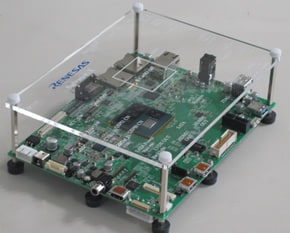
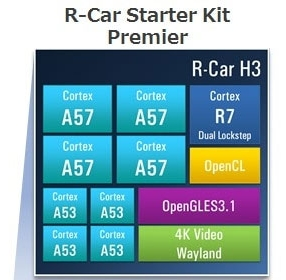
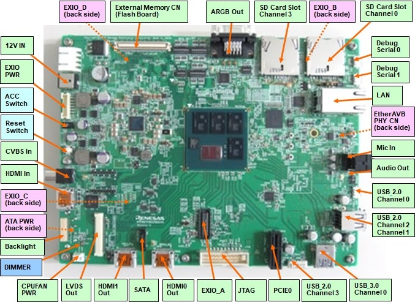

.. _rcar_h3_salvatorx_boards:

Renesas R-Car H3 Salvator-X
###########################

Overview
********
- The H3 Salvator-X board is designed for evaluating the features and performance
  of the R-CAR H3 device from Renesas Electronics and it is also used for developing
  and evaluating application software for these R-CAR H3.

- The H3 Salvator-X, based on the R-CAR H3 SIP, comes with LPDDR4 @4GB in 2-channel,
  each 64-bit wide+Hyperflash @64MB, CSI2 interfaces and several communication interfaces
  like USB, Ethernet, HDMI and can work standalone or can be adapted to other boards,
  via 440pin connector on bottom side.

More information about the board can be found at `Renesas R-Car Development Support website`_.

Hardware
********

Hardware capabilities for the H3 Salvator-X for can be found on the `eLinux H3 Salvator-X page`_
of the board.

.. note:: Zephyr will be booted on the CR7 processor provided for RTOS purpose.

More information about the SoC that equips the board can be found here:

- `Renesas R-Car H3 chip`_

Supported Features
==================

Here is the current supported features when running Zephyr Project on the R-Car Salvator-X CR7:

+-----------+------------------------------+--------------------------------+
| Interface | Driver/components            | Support level                  |
+===========+==============================+================================+
| PINCTRL   | pinctrl                      |                                |
+-----------+------------------------------+--------------------------------+
| CLOCK     | clock_control                |                                |
+-----------+------------------------------+--------------------------------+
| GPIO      | gpio                         |                                |
+-----------+------------------------------+--------------------------------+
| UART      | uart                         | serial port-polling            |
+           +                              +                                +
|           | FT232RQ / CP2102             | serial port-interrupt          |
+-----------+------------------------------+--------------------------------+
| CAN       | can                          | normal mode                    |
+           +                              +                                +
|           | TCAN332GDCNT                 | loopback mode                  |
+-----------+------------------------------+--------------------------------+
| I2C       | i2c                          | interrupt driven               |
+-----------+------------------------------+--------------------------------+

It's also currently possible to write on the ram console.

Connections and IOs
===================

GPIO
----

By running Zephyr on H3 Salvator-X, the software readable push buttons 'SW20',
'SW21', 'SW22' can be used as input, and the software contollable LEDs 'LED4',
'LED5', 'LED6' can be used as output.

UART
----

Salvator-X board is providing two serial ports:

- one is for A53/A57 processors
- the other one is for CR7

Both ports are converted to USB through CP2102 converters and they are exposed
as follows:

+-----------+-----------+
| Connector | Processor |
+===========+===========+
| CN25      | A53/A57   |
+-----------+-----------+
| CN26      | CR7       |
+-----------+-----------+

Programming and Debugging
*************************

Build and flash applications as usual (see :ref:`build_an_application` and
:ref:`application_run` for more details).

Supported Debug Probe
=====================

The "Olimex ARM-USB-OCD-H" probe is the only officially supported probe. This
probe is supported by OpenOCD that is shipped with the Zephyr SDK.

The "Olimex ARM-USB-OCD-H" probe needs to be connected to CN1 on Salvator-X.

Configuring a Console
=====================

Connect a USB cable from your PC to CN25 and/or CN26 then use the following
settings with your serial terminal of choice (minicom, putty,
etc.):

- Speed: 115200
- Data: 8 bits
- Parity: None
- Stop bits: 1

Flashing
========

First of all, open your serial terminal.

Applications for the ``rcar_h3_salvatorx_cr7`` board configuration can be built
in the usual way (see :ref:`build_an_application` for more details).

.. zephyr-app-commands::
   :zephyr-app: samples/hello_world
   :board: rcar_h3_salvatorx_cr7
   :goals: flash

You should see the following message in the terminal:

.. code-block:: console

	*** Booting Zephyr OS build v2.6.0-rc1 ***
	Hello World! rcar_h3_salvatorx_cr7

Debugging
=========

First of all, open your serial terminal.

Here is an example for the :ref:`hello_world` application.

.. zephyr-app-commands::
   :zephyr-app: samples/hello_world
   :board: rcar_h3_salvatorx_cr7
   :goals: debug

You will then get access to a GDB session for debug.

By continuing the app, you should see the following message in the terminal:

.. code-block:: console

	*** Booting Zephyr OS build v2.6.0-rc1 ***
	Hello World! rcar_h3_salvatorx_cr7

References
**********

- `Renesas R-Car H3 chip`_
- `Renesas R-Car Development Support website`_
- `eLinux H3 Salvator-X page`_

.. _Renesas R-Car H3 chip:
	https://www.renesas.com/eu/en/products/automotive-products/automotive-system-chips-socs/r-car-h3-high-end-automotive-system-chip-soc-vehicle-infotainment-and-driving-safety-support

.. _Renesas R-Car Development Support website:
   https://www.renesas.com/us/en/support/partners/r-car-consortium/r-car-development-support

.. _eLinux H3 Salvator-X page:
	https://elinux.org/R-Car/Boards/Salvator-X

.. _Install a toolchain:
	https://docs.zephyrproject.org/latest/getting_started/index.html#install-a-toolchain
