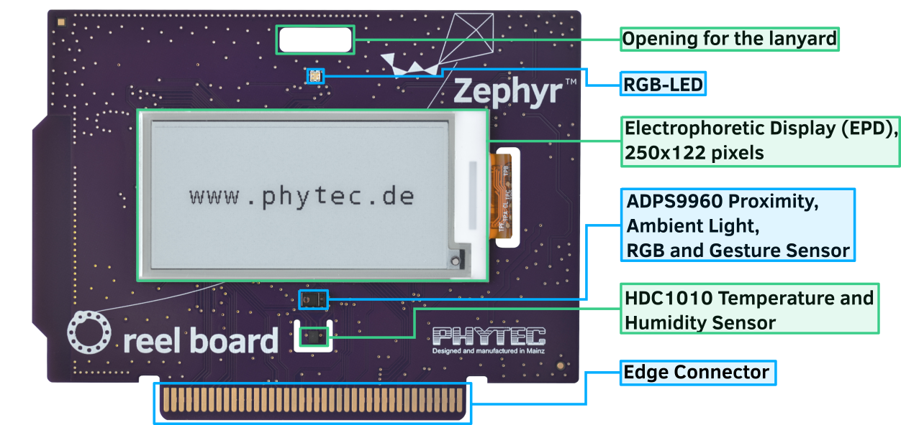
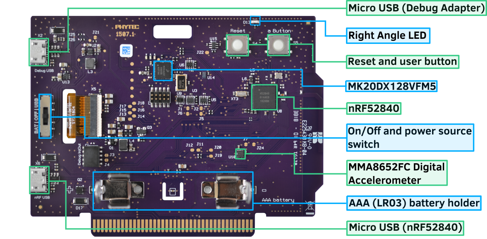
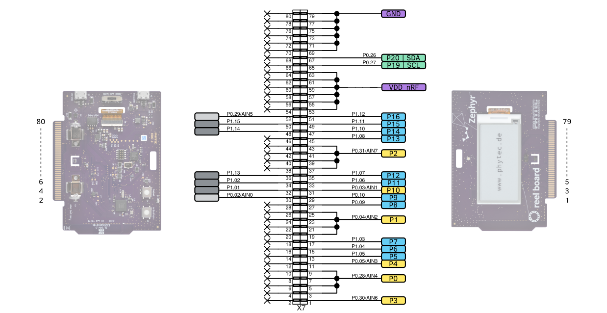
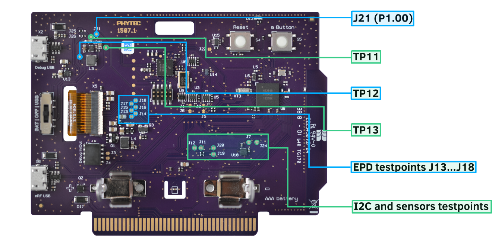
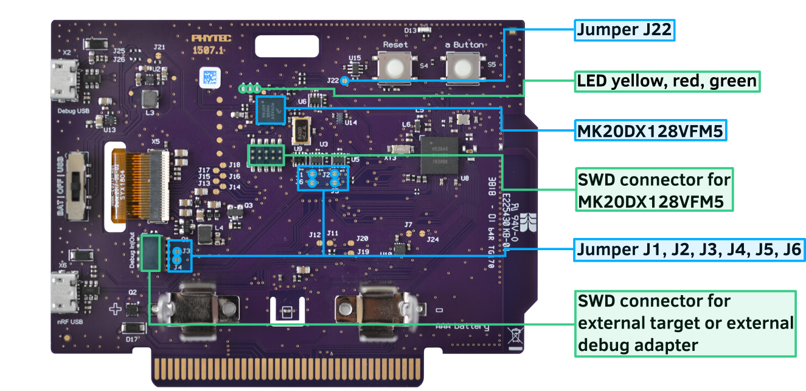

.. _reel_board:

reel board
##########

Overview
********

reel board is a evaluation board based on the Nordic Semiconductor
nRF52840 SoC. The board was developed by PHYTEC Messtechnik GmbH in
cooperation with Zephyr Project for the Hackathon - "Get Connected".
The board has a built-in debug adapter based on the DAPLink interface
firmware and NXP MK20DX128VFM5 SoC.

It is equipped with the Electrophoretic (electronic ink) Display (EPD),
environmental (temperature, humidity, light, accelerometer) sensors, and
Bluetooth connectivity making it easy to experiment and evaluate the
Zephyr OS in these kinds of use cases:

* battery powered sensor node
* low-power, low-cost human-machine interface (HMI) for remote
  control and environmental sensor monitoring
* temperature and humidity monitor on your table
* product, name or price tag
* interactive badge for meetings and conferences

Zephyr applications use the reel_board board configuration
to run on the reel board hardware. It provides
support for the Nordic Semiconductor nRF52840 ARM |reg| Cortex |reg|-M4F SoC
with an integrated 2.4 GHz transceiver supporting Bluetooth |reg| Low Energy
and IEEE |reg| 802.15.4.

Hardware
********

On the front of the board are RGB-LED, ADPS9960 and HDC1010 sensors,
and Electrophoretic Display.
The RGB-LED is controlled by the nRF52840 via GPIO pins.
Display is controlled by the nRF52840 via SPI and 3 GPIOs.

On the back side of the board are all other components such as nRF52840,
circuit for the Debug Adapter, On/Off and power source switch, battery holder,
buttons and MMA8652 (accelerometer) sensor.

ADPS9960 is Digital Proximity, Ambient Light, RGB and Gesture sensor.
HDC1010 is a digital humidity and temperature sensor.
MMA8652 is a 12-bit Digital Accelerometer.
All sensors are connected to the I2C bus and one GPIO pin each,
which can be used as an interrupt source.

     reel board front (Credit: PHYTEC)

     reel board back (Credit: PHYTEC)

Power supply
============

The board is optimized for low power applications and supports two
power source configurations, battery and micro USB connector.

The On/Off switch can choose which power source is used.

reel board uses TPS610981 boost converter to generate supply voltage
for nRF52840 and peripherals (sensors and EPD).
The boost converter has two modes:

* Active mode - supply voltages for nRF52840 and peripherals are on
* Low Power mode - only supply voltage for nRF52840 is on

The mode is controlled by MODE pin (P1.00).

.. note::
   Actually there is no possibility to reduce energy consumption by the
   Low Power mode. Both voltages are always on, see:
   :file:`boards/arm/reel_board/board.c`

Supported Features
==================

The reel_board board configuration supports the following
hardware features:

+-----------+------------+----------------------+
| Interface | Controller | Driver/Component     |
+===========+============+======================+
| NVIC      | on-chip    | nested vectored      |
|           |            | interrupt controller |
+-----------+------------+----------------------+
| RTC       | on-chip    | system clock         |
+-----------+------------+----------------------+
| UART      | on-chip    | serial port          |
+-----------+------------+----------------------+
| I2C       | on-chip    | i2c                  |
+-----------+------------+----------------------+
| SPI       | on-chip    | spi                  |
+-----------+------------+----------------------+
| GPIO      | on-chip    | gpio                 |
+-----------+------------+----------------------+
| FLASH     | on-chip    | flash                |
+-----------+------------+----------------------+
| RADIO     | on-chip    | Bluetooth            |
+-----------+------------+----------------------+
| SENSOR    | off-chip   | MMA8652 polling:     |
|           |            | ADPS9960 polling:    |
|           |            | HDC1010 polling      |
+-----------+------------+----------------------+

Other hardware features are not supported by the Zephyr kernel.

Connections and IOs
===================

Port P0
-------

+-------+-----------------------+---------------------------+
| Name  | Function              | Usage                     |
+=======+=======================+===========================+
| P0.0  | XL1                   | 32.768 kHz oscillator     |
+-------+-----------------------+---------------------------+
| P0.1  | XL2                   | 32.768 kHz oscillator     |
+-------+-----------------------+---------------------------+
| P0.2  | edge connector pin 25 | None                      |
+-------+-----------------------+---------------------------+
| P0.3  | edge connector pin 27 | None                      |
+-------+-----------------------+---------------------------+
| P0.4  | edge connector pin 29 | None                      |
+-------+-----------------------+---------------------------+
| P0.5  | edge connector pin 31 | None                      |
+-------+-----------------------+---------------------------+
| P0.6  | UART0_TX              | UART Console over USB     |
+-------+-----------------------+---------------------------+
| P0.7  | Button                | user button (S5)          |
+-------+-----------------------+---------------------------+
| P0.8  | UART0_RX              | UART Console over USB     |
+-------+-----------------------+---------------------------+
| P0.9  | edge connector pin 42 | None                      |
+-------+-----------------------+---------------------------+
| P0.10 | edge connector pin 40 | None                      |
+-------+-----------------------+---------------------------+
| P0.11 | RGB LED (red)         | GPIO                      |
+-------+-----------------------+---------------------------+
| P0.12 | RGB LED (green)       | GPIO                      |
+-------+-----------------------+---------------------------+
| P0.13 | LED1 (yellow)         | GPIO                      |
+-------+-----------------------+---------------------------+
| P0.14 | EPD Busy output       | GPIO                      |
+-------+-----------------------+---------------------------+
| P0.15 | EPD Reset input       | GPIO                      |
+-------+-----------------------+---------------------------+
| P0.16 | EPD DC input          | GPIO                      |
+-------+-----------------------+---------------------------+
| P0.17 | EPD SPI3_CS           | SPI                       |
+-------+-----------------------+---------------------------+
| P0.18 | CPU Reset             | Reset (S4)                |
+-------+-----------------------+---------------------------+
| P0.19 | EPD SPI3_CLK          | SPI                       |
+-------+-----------------------+---------------------------+
| P0.20 | EPD SPI3_MOSI         | SPI                       |
+-------+-----------------------+---------------------------+
| P0.21 | SPI3_MISO             | SPI (not connected)       |
+-------+-----------------------+---------------------------+
| P0.22 | HDC1010 DRDYn         | GPIO                      |
+-------+-----------------------+---------------------------+
| P0.23 | APDS9960 INT          | GPIO                      |
+-------+-----------------------+---------------------------+
| P0.24 | MMA8652 INT1          | GPIO                      |
+-------+-----------------------+---------------------------+
| P0.25 | reserved              | None                      |
+-------+-----------------------+---------------------------+
| P0.26 | I2C_0                 | I2C                       |
+-------+-----------------------+---------------------------+
| P0.27 | I2C_0                 | I2C                       |
+-------+-----------------------+---------------------------+
| P0.28 | edge connector pin 35 | None                      |
+-------+-----------------------+---------------------------+
| P0.29 | edge connector pin 37 | None                      |
+-------+-----------------------+---------------------------+
| P0.30 | edge connector pin 39 | None                      |
+-------+-----------------------+---------------------------+
| P0.31 | edge connector pin 41 | None                      |
+-------+-----------------------+---------------------------+

Port P1
-------

+-------+-----------------------+---------------------------+
| Name  | Function              | Usage                     |
+=======+=======================+===========================+
| P1.0  | peripheral power on   | GPIO                      |
+-------+-----------------------+---------------------------+
| P1.1  | edge connector pin 38 | None                      |
+-------+-----------------------+---------------------------+
| P1.2  | edge connector pin 36 | None                      |
+-------+-----------------------+---------------------------+
| P1.3  | edge connector pin 32 | None                      |
+-------+-----------------------+---------------------------+
| P1.4  | edge connector pin 30 | None                      |
+-------+-----------------------+---------------------------+
| P1.5  | edge connector pin 28 | None                      |
+-------+-----------------------+---------------------------+
| P1.6  | edge connector pin 26 | None                      |
+-------+-----------------------+---------------------------+
| P1.7  | edge connector pin 20 | None                      |
+-------+-----------------------+---------------------------+
| P1.8  | edge connector pin 18 | None                      |
+-------+-----------------------+---------------------------+
| P1.9  | RGB LED (blue)        | GPIO                      |
+-------+-----------------------+---------------------------+
| P1.10 | edge connector pin 16 | None                      |
+-------+-----------------------+---------------------------+
| P1.11 | edge connector pin 14 | None                      |
+-------+-----------------------+---------------------------+
| P1.12 | edge connector pin 10 | None                      |
+-------+-----------------------+---------------------------+
| P1.13 | edge connector pin 8  | None                      |
+-------+-----------------------+---------------------------+
| P1.14 | edge connector pin 6  | None                      |
+-------+-----------------------+---------------------------+
| P1.15 | edge connector pin 4  | None                      |
+-------+-----------------------+---------------------------+

Edge Connector
--------------

     reel board edge connector (Credit: PHYTEC)

Solder Jumper and Testpoints
============================

There are several labeled solder jumpers on the board.
These can be used to connect a logic analyzer to check the behavior of a
driver or to measure the voltage of a signal.

     reel board testpoints (Credit: PHYTEC)

I2C bus and sensors testpoints
------------------------------

+-------+-----------------------+---------------------------+
| Name  | Type                  | Usage                     |
+=======+=======================+===========================+
| J19   | closed solder jumper  | testpoint I2C SDA         |
+-------+-----------------------+---------------------------+
| J20   | closed solder jumper  | testpoint I2C SCL         |
+-------+-----------------------+---------------------------+
| J7    | closed solder jumper  | testpoint INT1 MMA8652    |
+-------+-----------------------+---------------------------+
| J11   | closed solder jumper  | testpoint INT APDS9960    |
+-------+-----------------------+---------------------------+
| J12   | closed solder jumper  | testpoint DRDYn HDC1010   |
+-------+-----------------------+---------------------------+

EPD testpoints
--------------

+-------+-----------------------+---------------------------+
| Name  | Type                  | Usage                     |
+=======+=======================+===========================+
| J13   | closed solder jumper  | testpoint EPD Busy        |
+-------+-----------------------+---------------------------+
| J14   | closed solder jumper  | testpoint EPD Reset       |
+-------+-----------------------+---------------------------+
| J15   | closed solder jumper  | testpoint EPD DC          |
+-------+-----------------------+---------------------------+
| J16   | closed solder jumper  | testpoint EPD SPI_CS      |
+-------+-----------------------+---------------------------+
| J17   | closed solder jumper  | testpoint EPD SPI_CLK     |
+-------+-----------------------+---------------------------+
| J18   | closed solder jumper  | testpoint EPD SPI_MOSI    |
+-------+-----------------------+---------------------------+

Power supply testpoint
----------------------

+-------+-----------------------+-------------------------------------------+
| Name  | Type                  | Usage                                     |
+=======+=======================+===========================================+
| J21   | closed solder jumper  | testpoint peripheral voltage on/off       |
+-------+-----------------------+-------------------------------------------+
| TP11  | testpoint             | testpoint peripheral voltage              |
+-------+-----------------------+-------------------------------------------+
| TP12  | testpoint             | testpoint nRF52840 supply voltage VDD_nRF |
+-------+-----------------------+-------------------------------------------+
| TP13  | testpoint             | testpoint boost converter input voltage   |
+-------+-----------------------+-------------------------------------------+

Build-in Debug Adapter
======================

Debug Adapter is based on the DAPLink interface firmware and
NXP MK20DX128VFM5 SoC. The adapter is powered via micro USB connector and
is always on when the board is connected to the USB host.
reel board can be flashed and debugged, powered either from battery or USB.
If the Adapter is powered via USB, the Adapter circuit heats the board
slightly and the temperature sensor can output values up to 1.5 degrees higher.

     reel board Debug Adapter overview (Credit: PHYTEC)

Debug Adapter Firmware
----------------------

DAPLink firmware for the adapter can be found at `DAPLink reel board Firmware`_.
To update the firmware (if necessary), the adapter must be started in bootloader
mode. For this, the board should be disconnected from the USB host,
the J22 should be closed (use tweezers for this) and the board reconnected to
the USB host.

Debug Adapter Jumper
--------------------

+-------+-----------------------+----------------------------------------------+
| Name  | Type                  | Usage                                        |
+=======+=======================+==============================================+
| J1    | closed solder jumper  | open to use adapter for external target      |
+-------+-----------------------+----------------------------------------------+
| J2    | closed solder jumper  | open to use adapter for external target      |
+-------+-----------------------+----------------------------------------------+
| J3    | open solder jumper    | close to pass UART TX to external adapter    |
+-------+-----------------------+----------------------------------------------+
| J4    | open solder jumper    | close to pass UART RX to external adapter    |
+-------+-----------------------+----------------------------------------------+
| J5    | closed solder jumper  | open to connect external adapter to nRF52840 |
+-------+-----------------------+----------------------------------------------+
| J6    | closed solder jumper  | open to connect external adapter to nRF52840 |
+-------+-----------------------+----------------------------------------------+
| J22   | open solder jumper    | close to start adapter in bootloader mode    |
+-------+-----------------------+----------------------------------------------+

Adapter LEDs
------------

+-------+-----------------------+--------------------------------+
| Name  | Type                  | Usage                          |
+=======+=======================+================================+
| D11   | green                 | flashes when adapter is active |
+-------+-----------------------+--------------------------------+
| D14   | red                   | reserved                       |
+-------+-----------------------+--------------------------------+
| D15   | yellow                | reserved                       |
+-------+-----------------------+--------------------------------+

Programming and Debugging
*************************

Applications for the ``reel_board`` board configuration can be
built and flashed in the usual way (see :ref:`build_an_application`
and :ref:`application_run` for more details).

Flashing
========

Build and flash
applications as usual (see :ref:`build_an_application` and
:ref:`application_run` for more details).

Here is an example for the :ref:`hello_world` application.

First, run your favorite terminal program to listen for output.

.. code-block:: console

   $ minicom -D <tty_device> -b 115200

Replace :code:`<tty_device>` with the port where the reel board
can be found. For example, under Linux, :code:`/dev/ttyACM0`.

Then build and flash the application in the usual way.

.. zephyr-app-commands::
   :zephyr-app: samples/hello_world
   :board: reel_board
   :goals: build flash

Debugging
=========

You can debug an application in the usual way.  Here is an example for the
:ref:`hello_world` application.

.. zephyr-app-commands::
   :zephyr-app: samples/hello_world
   :board: reel_board
   :maybe-skip-config:
   :goals: debug

Testing the LEDs and buttons
****************************

There are 2 samples that allow you to test that the buttons (switches) and
LEDs on the board are working properly with Zephyr:

* :ref:`blinky-sample`
* :ref:`button-sample`

You can build and flash the examples to make sure Zephyr is running correctly on
your board.

References
**********

.. target-notes::

.. _DAPLink reel board Firmware:
   https://github.com/jfischer-phytec-iot/DAPLink/tree/reel-board
