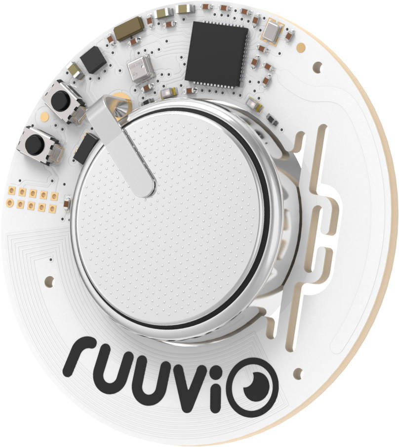
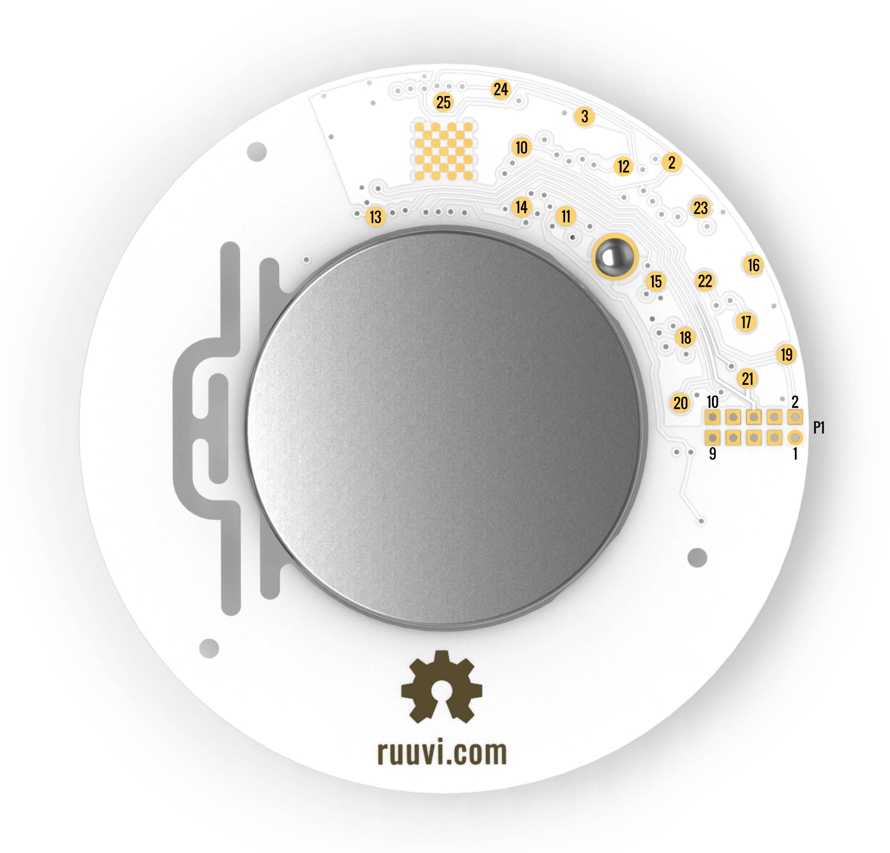

.. _nrf52_ruuvi:

nRF52-ruuvi
##############

Overview
********

RuuviTag is an advanced battery-operated open-source Bluetooth
enabled sensor beacon platform capable of sending temperature, humidity,
pressure, and motion information.

     RUUVI Tag

More information about the board can be found at the
`ruuvitag website`_.

Hardware
********

RuuviTag is built from the ground up using the latest technology available.

* Nordic Semiconductor nRF52832 System-on-Chip
* STMicroelectronics LIS2DH12 accelerometer
* Bosch BME 280 temperature + relative air humidity + air pressure sensor
* NFC™-A tag antenna
* 1000mAh CR2477 battery
* Recommended -20ºC to +65ºC (max -40ºC to +85ºC)
* 2 buttons
* 2 LEDs
* 45 mm diameter (PCB)
* 52 mm diameter (enclosure)
* Long range RF antenna

`ruuvitag datasheet`_

Supported Features
==================

+-----------+------------+----------------------+
| Interface | Controller | Driver/Component     |
+===========+============+======================+
| NVIC      | on-chip    | nested vectored      |
|           |            | interrupt controller |
+-----------+------------+----------------------+
| RTC       | on-chip    | system clock         |
+-----------+------------+----------------------+
| UART      | on-chip    | serial port          |
+-----------+------------+----------------------+
| GPIO      | on-chip    | gpio                 |
+-----------+------------+----------------------+
| FLASH     | on-chip    | flash                |
+-----------+------------+----------------------+
| RADIO     | on-chip    | Bluetooth            |
+-----------+------------+----------------------+
| RTT       | on-chip    | console              |
+-----------+------------+----------------------+

Other hardware features are not supported by the Zephyr kernel.
See `nRF52 DK website`_ and `Nordic Semiconductor Infocenter`_
for a complete list of nRF52 Development Kit board hardware features.

Connections and IOs
===================

LED
---

* LED0 (red) = P0.17
* LED1 (green) = P0.19

Push buttons
------------

* BUTTON0 = SW1 = P0.13

Pin descriptions
----------------

* 2 = P0.29 = SPI_SCK
* 3 = P0.28 = SPI_MISO
* 10 = P0.04 = GPIO (can be used as a GPIO / ADC pin)
* 11 = P0.05 = GPIO (can be used as a GPIO / ADC pin)
* 12 = P0.25 = SPI_MOSI
* 13 = P0.19 = LED2 (green) / GPIO (can be used as a GPIO pin but the LED will blink)
* 14 = P0.17 = LED1 (red) / GPIO (can be used as a GPIO pin but the LED will blink)
* 15 = P0.13 = Button / GPIO (can be used as a GPIO pin)
* 16 = GND (Battery's negative contact)
* 17 = Battery's positive contact
* 18 = Battery's positive contact
* 19 = SWDIO
* 20 = SWDCLK
* 21 = P0.18 = SWO / GPIO (can be used as a GPIO pin)
* 22 = P0.21 = Reset / GPIO (can be used as a GPIO pin if no need to reset the device)
* 23 = GND (Battery's negative contact)
* 24 = P0.31 = GPIO (can be used as a GPIO / ADC pin)
* 25 = P0.30 = GPIO (can be used as a GPIO / ADC pin)

GPIO = General Purpose Input Output pin

P1 = Standard 10-pin ARM Cortex debug connector (on RuuviTag Rev.B1-B5)

* 1 = VDD
* 2 = SWDIO
* 3 = GND (Battery's negative contact)
* 4 = SWDCLK
* 5 = GND (Battery's negative contact)
* 6 = SWO
* 7 = No Connect
* 8 = No Connect
* 9 = GND (Battery's negative contact)
* 10 = Reset

P1 = TC2030 TagConnect (on RuuviTag Rev.B6)

* 1 = Battery's positive contact
* 2 = SWDIO
* 3 = Reset
* 4 = SWDCLK
* 5 = GND (Battery's negative contact)
* 6 = SWO

Programming and Debugging
*************************

Flashing
========

.. code-block:: console

  nrfjprog --family nrf52 --eraseall
  nrfjprog --family nrf52 --program zephyr.hex
  nrfjprog --family nrf52 --reset

Debugging
=========

Testing the LEDs and buttons in the nRF52 DK
********************************************

There are 2 samples that allow you to test that the buttons (switches) and LEDs on
the board are working properly with Zephyr:

* :ref:`blinky-sample`
* :ref:`button-sample`

You can build and flash the examples to make sure Zephyr is running correctly on
your board. The button and LED definitions can be found in :file:`boards/arm/nrf52_pca10040/board.h`.

References
**********

.. target-notes::

.. _ruuvitag website: https://ruuvi.com
.. _ruuvitag datasheet: https://blog.ruuvi.com/datasheet-52fb00265c60
.. _nRF52 DK website: http://www.nordicsemi.com/eng/Products/Bluetooth-low-energy/nRF52-DK
.. _Nordic Semiconductor Infocenter: http://infocenter.nordicsemi.com/