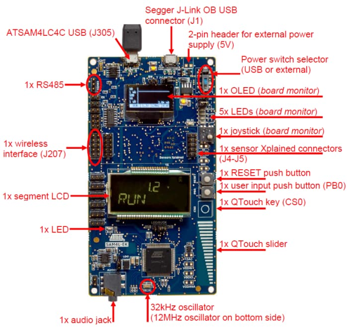

.. _sam4l_ek:

SAM4L-EK
########

Overview
********

The SAM4L series embeds picoPower technology for ultra-low power consumption.
Combined power control techniques are used to bring active current consumption
down to 90μA/MHz.  The device allows a wide range of configurations giving the
user the ability to balance between the lowest possible power consumption and
the feature set selected for the application.  The WAIT and RETENTION modes
provide full logic and RAM retention, associated with fast wake-up capability
(<1.5μs) and a very low consumption of, respectively, 3 μA and 1.5 μA.  In
addition, WAIT mode supports SleepWalking features.  In BACKUP mode, CPU,
peripherals and RAM are powered off consuming less than 0.9μA with external
interrupt wake-up support.

The SAM4L-EK is a full featured design to develop for Atmel SAM4L SoC series.
The kit is equipped with a rich set of peripherals that make the ATSAM4L-EK a
perfect evaluation platform.  Download the `SAM4L-EK Online User Guide`_ for
more details.

Hardware
********

- ATSAM4LC4C ARM Cortex-M4 Processor
- 12 MHz crystal oscillator
- 32.768 kHz crystal oscillator
- 1 Micro-AB USB OTG host/device
- 1 AT86RF2xx IEEE 802.15.4 transceiver connector
- 1 RS-485 full duplex interface
- 1 Sensor Xplained board connector
- 1 Audio Jack connector 3.5mm
- 1 Dedicated Board Monitor MCU

  - Power measurement (VDDIN, VDDIO, VDDANA)
  - 1 OLED Display (128x64)
  - 5 LEDs
  - 1 Joystick
  - 1 USART
  - 1 TWI
- 1 40x4 LCD Segment Display
- 1 user touch button and One user pushbutton
- 1 user LED
- 1 QTouch Slider
- 1 QTouch Button
- 1 TEMT6000 Light Sensor
- 1 AT25DF641A Serial NOR Flash

Supported Features
==================

The sam4l_ek board configuration supports the following hardware features:

+-----------+------------+-------------------------------------+
| Interface | Controller | Driver/Component                    |
+===========+============+=====================================+
| HWINFO    | on-chip    | Unique 120 bit serial number        |
+-----------+------------+-------------------------------------+
| MPU       | on-chip    | arch/arm                            |
+-----------+------------+-------------------------------------+
| NVIC      | on-chip    | arch/arm                            |
+-----------+------------+-------------------------------------+
| SPI       | on-chip    | spi                                 |
+-----------+------------+-------------------------------------+
| SYSTICK   | on-chip    | systick                             |
+-----------+------------+-------------------------------------+
| TRNG      | on-chip    | 32-bit True Random Number Generator |
+-----------+------------+-------------------------------------+
| USART     | on-chip    | serial port                         |
+-----------+------------+-------------------------------------+

Other hardware features are not currently supported by Zephyr.

The default configuration can be found in the Kconfig
:zephyr_file:`boards/arm/sam4l_ek/sam4l_ek_defconfig`.

Connections and IOs
===================

The `SAM4L-EK Design Documentation`_ has detailed information about board
connections.  Download the `SAM4L-EK Design Documentation`_ for more details.

System Clock
============

The SAM4L MCU is configured to use the 12 MHz internal oscillator on the board
with the on-chip PLL to generate an 48 MHz system clock.

Serial Port
===========

The ATSAM4LC4C MCU has 4 USARTs.  One of the USARTs (USART2) is connected on
the embedded debug unit and can works as a console.  The USART0 is shared
between all others headers and RS-485 port.

Programming and Debugging
*************************

The SAM4L-EK board have a Segger Embedded Debugger Unit
`J-Link OB <https://www.segger.com/jlink-ob.html>`_.  This provides a debug
interface to the SAM4LC4C chip. You can use Ozone or JLink to communicate with
the SAM4LC4C.

Flashing
========

#. Download JLink from the Segger `JLink Downloads Page`_.  Go to the section
   "J-Link Software and Documentation Pack" and install the "J-Link Software
   and Documentation pack for Linux".  The application JLinkExe needs to be
   accessible from your path.

#. Run your favorite terminal program to listen for output.  Under Linux the
   terminal should be :code:`/dev/ttyACM0`. For example:

   .. code-block:: console

      $ minicom -D /dev/ttyACM0 -o

   The -o option tells minicom not to send the modem initialization string.
   Connection should be configured as follows:

   - Speed: 115200
   - Data: 8 bits
   - Parity: None
   - Stop bits: 1

#. Connect the SAM4L-EK board to your host computer using the USB debug port.
Then build and flash the :ref:`hello_world` application.

   .. zephyr-app-commands::
      :zephyr-app: samples/hello_world
      :board: sam4l_ek
      :goals: build flash

   You should see "Hello World! sam4l_ek" in your terminal.

Debugging
=========

You can debug an application in the usual way.  Here is an example for the
:ref:`hello_world` application.

.. zephyr-app-commands::
   :zephyr-app: samples/hello_world
   :board: sam4l_ek
   :maybe-skip-config:
   :goals: debug

References
**********

.. target-notes::

.. _SAM4L-EK Online User Guide:
    http://ww1.microchip.com/downloads/en/DeviceDoc/Atmel-42026-ATSAM4L-EK-User-Guide_ApplicationNote_AVR32850.pdf

.. _SAM4L-EK Design Documentation:
    http://ww1.microchip.com/downloads/en/DeviceDoc/doc42027_SAM4L-EK_Design_Documentation.PDF

.. _JLink Downloads Page:
    https://www.segger.com/downloads/jlink
