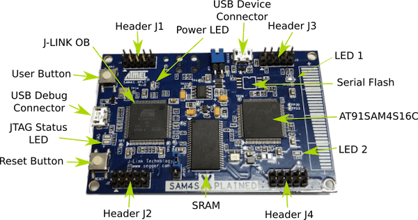

.. _sam4s_xplained:

SAM4S Xplained
################

Overview
********

The SAM4S Xplained evaluation kit is a development platform to evaluate the
Atmel SAM4S series microcontrollers.

Hardware
********

- ATSAM4S16C ARM Cortex-M4 Processor
- 12 MHz crystal oscillator
- internal 32.768 kHz crystal oscillator
- IS66WV51216DALL 8 Mb SRAM
- Micro-AB USB device
- Micro-AB USB debug interface supporting SEGGER OB and Virtual COM Port and
  Data
- One reset and one user pushbutton
- 2 yellow user LEDs
- IC pads for external flash chip

Supported Features
==================

The sam4s_xplained board configuration supports the following hardware
features:

+-----------+------------+-------------------------------------+
| Interface | Controller | Driver/Component                    |
+===========+============+=====================================+
| NVIC      | on-chip    | nested vector interrupt controller  |
+-----------+------------+-------------------------------------+
| SYSTICK   | on-chip    | systick                             |
+-----------+------------+-------------------------------------+
| UART      | on-chip    | serial port                         |
+-----------+------------+-------------------------------------+
| USART     | on-chip    | serial port                         |
+-----------+------------+-------------------------------------+
| I2C       | on-chip    | i2c                                 |
+-----------+------------+-------------------------------------+
| SPI       | on-chip    | spi                                 |
+-----------+------------+-------------------------------------+
| WATCHDOG  | on-chip    | watchdog                            |
+-----------+------------+-------------------------------------+
| GPIO      | on-chip    | gpio                                |
+-----------+------------+-------------------------------------+
| HWINFO    | on-chip    | Unique device serial number         |
+-----------+------------+-------------------------------------+

Other hardware features are not currently supported by Zephyr.

The default configuration can be found in the Kconfig
:zephyr_file:`boards/arm/sam4s_xplained/sam4s_xplained_defconfig`.

Connections and IOs
===================

Download the `SAM4S Xplained Design Files`_ for more information. It has
full schematic and gerbers files.

System Clock
============

The SAM4S MCU is configured to use the 12 MHz internal oscillator on the board
with the on-chip PLL to generate an 84 MHz system clock.

Serial Port
===========

The ATSAM4S16C MCU has 2 UARTs and 2 USARTs. One of the UARTs (UART0) is
connected to the Segger J-Link OB chip (the AT91SAM3U4 is programmed to be
Segger J-Link OB). Segger J-Link OB brings the UART out as a virtual COM port.
The section flashing uses the UART from the Segger USB debug connection.

Programming and Debugging
*************************

The SAM4S Xplained board comes with Segger `J-Link OB <https://www.segger.com/jlink-ob.html>`_. This provides a debug
interface to the SAM4S16C chip. You can use Ozone or JLink to communicate with
the SAM4S16C.

Flashing
========

For flash the board Zephyr provides two paths.  One uses the default JLink
tool and the second one uses :ref:`atmel_sam_ba_bootloader`.

Using JLink
-------------

#. Download JLink from the Segger `JLink Downloads Page`_. Go to the section
   "J-Link Software and Documentation Pack" and install the "J-Link Software
   and Documentation pack for Linux". The application JLinkExe needs to be
   accessible from your path.

#. Connect the SAM4S Xplained board to your host computer using the USB debug
   port. Then build and flash the :ref:`hello_world` application.

   .. zephyr-app-commands::
      :zephyr-app: samples/hello_world
      :board: sam4s_xplained
      :goals: build flash

Using SAM-BA bootloader
-----------------------

#. Close the ``J25`` jumper on the SAM4S Xplained board.  Power on the board
   for 10s.

#. Open the ``J25`` jumper.

#. Connect the SAM4S Xplained board to your host computer using the SoC USB
   port. Then build and flash the :ref:`hello_world` application.

   .. zephyr-app-commands::
      :zephyr-app: samples/hello_world
      :board: sam4s_xplained
      :goals: build

   .. code-block:: console

      $ west flash -r bossac

Visualizing the message
-----------------------

#. Run your favorite terminal program to listen for output. Under Linux the
   terminal should be :code:`/dev/ttyACM0`. For example:

   .. code-block:: console

      $ minicom -D /dev/ttyACM0 -o

   The -o option tells minicom not to send the modem initialization string.
   Connection should be configured as follows:

   - Speed: 115200
   - Data: 8 bits
   - Parity: None
   - Stop bits: 1

#. Press reset button

   You should see "Hello World! arm" in your terminal.

Debugging
=========

You can debug an application in the usual way.  Here is an example for the
:ref:`hello_world` application.

.. zephyr-app-commands::
   :zephyr-app: samples/hello_world
   :board: sam4s_xplained
   :maybe-skip-config:
   :goals: debug

References
**********

.. target-notes::

.. _SAM4S Xplained Online User Guide:
    http://ww1.microchip.com/downloads/en/devicedoc/atmel-42075-sam4s-xplained-pro_user-guide.pdf

.. _JLink Downloads Page:
    https://www.segger.com/downloads/jlink

.. _SAM4S Xplained Design Files:
    http://ww1.microchip.com/downloads/en/DeviceDoc/SAM4S-XPLD__KitsFiles.zip
