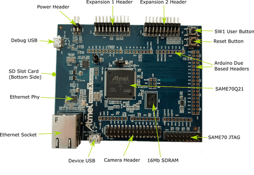

.. _sam_e70_xplained:

SAM E70 Xplained
################

Overview
********

The SAM E70 Xplained evaluation kit is a development platform to evaluate the
Atmel SAM E70 series microcontrollers.

Hardware
********

- ATSAME70Q21 ARM Cortex-M7 Processor
- 12 MHz crystal oscillator
- 32.768 kHz crystal oscillator (not populated)
- AT24MAC402 EEPROM
- IS42S16100E 16 Mb SDRAM
- SD card connector
- Ethernet port
- Micro-AB USB device
- Micro-AB USB debug interface supporting CMSIS-DAP, Virtual COM Port and Data
  Gateway Interface (DGI)
- JTAG interface connector
- One reset and one user pushbutton
- One green user LED

Supported Features
==================

The sam_e70_xplained board configuration supports the following hardware
features:

+-----------+------------+-------------------------------------+
| Interface | Controller | Driver/Component                    |
+===========+============+=====================================+
| NVIC      | on-chip    | nested vector interrupt controller  |
+-----------+------------+-------------------------------------+
| SYSTICK   | on-chip    | systick                             |
+-----------+------------+-------------------------------------+
| UART      | on-chip    | serial port                         |
+-----------+------------+-------------------------------------+
| USART     | on-chip    | serial port                         |
+-----------+------------+-------------------------------------+
| I2C       | on-chip    | i2c                                 |
+-----------+------------+-------------------------------------+
| ETHERNET  | on-chip    | ethernet                            |
+-----------+------------+-------------------------------------+
| WATCHDOG  | on-chip    | watchdog                            |
+-----------+------------+-------------------------------------+

Other hardware features are not currently supported by Zephyr.

The default configuration can be found in the Kconfig
:file:`boards/arm/sam_e70_xplained/sam_e70_xplained_defconfig`.

Connections and IOs
===================

The `SAME70-XPLD User Guide`_ has detailed information about board connections.

System Clock
============

The SAM E70 MCU is configured to use the 12 MHz external oscillator on the board
with the on-chip PLL to generate a 300 MHz system clock.

Serial Port
===========

The ATSAME70Q21 MCU has five UARTs and three USARTs. One of the USARTs is
configured for the console and is available as a Virtual COM Port via EDBG USB
chip.

Programming and Debugging
*************************

Flashing the Zephyr project onto SAM E70 MCU requires the `OpenOCD tool`_.
Support for Atmel SAM E microcontroller series was added in OpenOCD release
0.10.0. The current OpenOCD version available in the Zephyr SDK is 0.9 and
unfortunately it does not support Atmel SAM E microcontrollers. Since few, if
any major Linux distributions currently offer OpenOCD version 0.10.0 as a
package you will have to compile and install it yourself. Make sure to enable
CMSIS-DAP support as this is the debug interface used by the on board EDBG chip.

By default a factory new SAM E70 chip will boot SAM-BA boot loader located in
the ROM, not the flashed image. This is determined by the value of GPNVM1
(General-Purpose NVM bit 1). The flash procedure will ensure that GPNVM1 is
set to 1 changing the default behavior to boot from Flash.

If your chip has a security bit GPNVM0 set you will be unable to program flash
memory or connect to it via a debug interface. The only way to clear GPNVM0
is to perform a chip erase procedure that will erase all GPNVM bits and the full
contents of the SAM E70 flash memory:

- With the board power off, set a jumper on the J200 header.
- Turn the board power on. The jumper can be removed soon after the power is on
  (flash erasing procedure is started when the erase line is asserted for at
  least 230ms)

Flashing
========

#. Build the Zephyr kernel and the application:

   .. code-block:: console

      $ cd $ZEPHYR_BASE/samples/hello_world/
      $ make BOARD=sam_e70_xplained

#. Connect the SAM E70 Xplained board to your host computer using the USB debug
   port.

#. Run your favorite terminal program to listen for output. Under Linux the
   terminal should be :code:`/dev/ttyACM0`. For example:

   .. code-block:: console

      $ minicom -D /dev/ttyACM0 -o

   The -o option tells minicom not to send the modem initialization
   string. Connection should be configured as follows:

   - Speed: 115200
   - Data: 8 bits
   - Parity: None
   - Stop bits: 1

#. To flash the image, assuming the OpenOCD tool is already installed, enter:

   .. code-block:: console

      $ make BOARD=sam_e70_xplained flash

   The command will also verify that the image was programmed correctly, reset
   the board and run the Zephyr application.

   You should see "Hello World!" in your terminal.

Debugging
=========

#. Connect the SAM E70 Xplained board to your host computer using the USB debug
   port.

#. Start GDB server on your host computer

   .. code-block:: console

      $ openocd -f board/atmel_same70_xplained.cfg&

#. You can now use GDB remote debugging to connect to the target board. By
   default GDB server will listen on port 3333.

References
**********

SAM E70 Product Page:
    http://www.atmel.com/products/microcontrollers/arm/sam-e.aspx

.. _SAME70-XPLD User Guide:
    http://www.atmel.com/Images/Atmel-44050-Cortex-M7-Microcontroller-SAM-E70-XPLD-Xplained_User-guide.pdf

.. _OpenOCD tool:
    http://openocd.org/

.. _SAM-BA:
    http://www.atmel.com/tools/ATMELSAM-BAIN-SYSTEMPROGRAMMER.aspx
