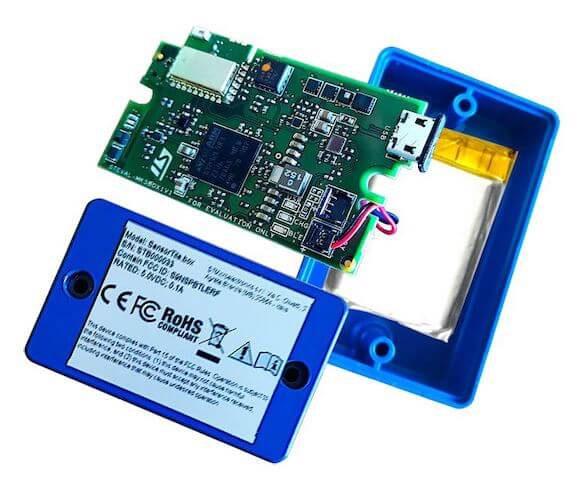

.. _sensortile_box:

ST SensorTile.box
#################

Overview
********

The STEVAL-MKSBOX1V1 (SensorTile.box) is a ready-to-use box kit for wireless
IoT and wearable sensor platforms to help you use and develop apps based on
remote motion and environmental sensor data.
The SensorTile.box board fits into a small plastic box with a long-life rechargeable
battery, and communicates with a standard smartphone through its Bluetooth interface,
providing data coming from the sensors.

More information about the board can be found at the `SensorTile.box website`_.

Hardware
********

SensorTile.box provides the following hardware components:

- Ultra low-power STM32L4R9ZI System on Chip

  - LQFP144 package
  - Core: ARM |reg| 32-bit Cortex |reg|-M4 CPU with FPU, adaptive
    real-time accelerator (ART Accelerator) allowing 0-wait-state
    execution from Flash memory, frequency up to 120 MHz, MPU, 150
    DMIPS/1.25 DMIPS/MHz (Dhrystone 2.1), and DSP instructions
  - Clock Sources:

    - 16 MHz crystal oscillator
    - 32 kHz crystal oscillator for RTC (LSE)

- Communication

  - Bluetooth Smart connectivity v4.2 (SPBTLE-1S)
  - 1 x USB OTG FS (SoC) with micro-B connector
    (USB device role only)

- Internal Buses

  - 3 x SPI bus
  - 3 x I2C bus

- micro-SD connector

- On board sensors:

  - Digital temperature sensor (STTS751)
  - 6-axis inertial measurement unit (LSM6DSOX)
  - 3-axis accelerometers (LIS2DW12 and LIS3DHH)
  - 3-axis magnetometer (LIS2MDL)
  - Altimeter / pressure sensor (LPS22HH)
  - Microphone / audio sensor (MP23ABS1)
  - Humidity sensor (HTS221)

- HCP602535ZC LI-ion rechargeable battery (3.7V 500mAh)
- FTSH107 connector for SWD debugging and UART Tx/Rx

Supported Features
==================

The SensorTile.box provides motion, environmental, and audio
sensor data through either the BLE or USB protocols to a host application running
on a smartphone/PC to implement applications such as:

- Pedometer optimized for belt positioning
- Baby crying detection with Cloud AI learning
- Barometer / environmental monitoring
- Vehicle / goods tracking
- Vibration monitoring
- Compass and inclinometer
- Sensor data logger

Connections and IOs
===================

LED
---

- Blue LED  = PB15
- Green LED = PF2

Push buttons
------------

- BUTTON = BOOT
  (used to let the SensorTile.box enter DFU mode. See `Programming and Debugging`_
  section)
- BUTTON = PWR
  (used to Power on/off the board when battery is connected)

System Clock
============

SensorTile.box System Clock could be driven by internal or external
oscillator, as well as main PLL clock. By default, the System clock is
driven by the PLL clock at 80MHz, driven by the 16MHz external oscillator.
The system clock can be boosted to 120MHz.
The internal AHB/APB1/APB2 AMBA buses are all clocked at 80MHz.

Serial Port
===========

There are two possible options for Zephyr console output:

- using USART1 which is available on FTSH107 connector. In this case a JTAG adapter
  can be used to connect SensorTile.box to STLINK-V2 and have both SWD and console lines
  available on PC.
- using the USB connector, which may be used to make the console available on PC as
  USB CDC class.

Console default settings are 115200 8N1.

USB interface
=============

SensorTile.box can be connected as a USB device to a PC host through its micro-B connector.
The final application may use it to declare SensorTile.box device as belonging to a
certain standard or vendor class, e.g. a CDC, a mass storage or a composite device with both
functions.

Programming and Debugging
*************************

There are 2 main entry points for flashing STM32FL4Rx SoCs, one using the ROM
bootloader, and another by using the SWD debug port (which requires additional
hardware) on FTSH107 connector.
Flash using the ROM bootloader by powering on the board
while keeping the BOOT0 button pressed.
The ROM bootloader supports flashing via USB (DFU), UART, I2C and SPI.
You can read more about how to enable and use the ROM bootloader by checking
the application note `AN2606`_ (STM32L4Rx section).

Flashing
========

Installing dfu-util
-------------------

It is recommended to use at least v0.8 of dfu-util. The package available in
Debian and Ubuntu can be quite old, so you might have to build dfu-util from source.
Information about how to get the source code and how to build it can be found
at the `DFU-UTIL website`_

Flashing an Application to SensorTile.box
-----------------------------------------

While pressing the BOOT0 button, connect the
micro-USB cable to the USB OTG SensorTile.box
port and to your computer. The board should be
forced to enter DFU mode.

Confirm that the board is in DFU mode:

.. code-block:: console

   $ sudo dfu-util -l
   dfu-util 0.9

   Copyright 2005-2009 Weston Schmidt, Harald Welte and OpenMoko Inc.
   Copyright 2010-2019 Tormod Volden and Stefan Schmidt
   This program is Free Software and has ABSOLUTELY NO WARRANTY
   Please report bugs to http://sourceforge.net/p/dfu-util/tickets/

   Found DFU: [0483:df11] ver=2200, devnum=74, cfg=1, intf=0, path="2-2", alt=2, name="@OTP Memory /0x1FFF7000/01*0001Ke", serial="204A325D574D"
   Found DFU: [0483:df11] ver=2200, devnum=74, cfg=1, intf=0, path="2-2", alt=1, name="@Option Bytes  /0x1FF00000/01*040 e/0x1FF01000/01*040 e", serial="204A325D574D"
   Found DFU: [0483:df11] ver=2200, devnum=74, cfg=1, intf=0, path="2-2", alt=0, name="@Internal Flash  /0x08000000/512*0004Kg", serial="204A325D574D"

You should see following confirmation on your Linux host:

.. code-block:: console

   $ dmesg
   usb 2-2: new full-speed USB device number 74 using xhci_hcd
   usb 2-2: New USB device found, idVendor=0483, idProduct=df11
   usb 2-2: New USB device strings: Mfr=1, Product=2, SerialNumber=3
   usb 2-2: Product: STM32  BOOTLOADER
   usb 2-2: Manufacturer: STMicroelectronics
   usb 2-2: SerialNumber: 204A325D574D

You can build and flash the provided sample application
(:ref:`sensortile_box sensors`) that reads sensors data and outputs
values on the console.

References
**********

.. target-notes::

.. _SensorTile.box website:
   https://www.st.com/en/evaluation-tools/steval-mksbox1v1.html

.. _AN2606:
   https://www.st.com/content/ccc/resource/technical/document/application_note/b9/9b/16/3a/12/1e/40/0c/CD00167594.pdf/files/CD00167594.pdf/jcr:content/translations/en.CD00167594.pdf

.. _DFU-UTIL website:
   http://dfu-util.sourceforge.net/
