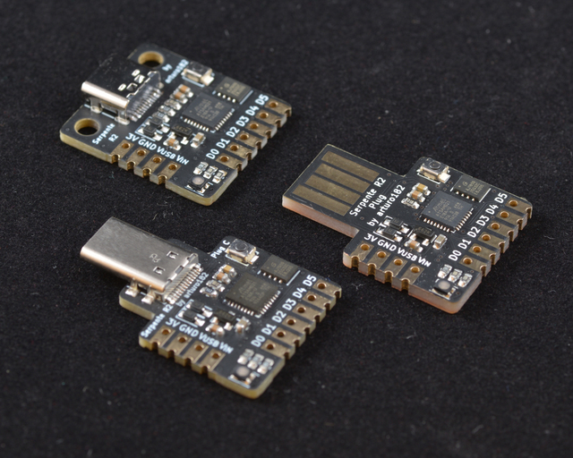

.. _serpente:

Arturo182 Serpente
##################

Overview
********

The Serpente is a very small low-cost development and prototyping
board equipped with 4MiB flash storage, a PWM enabled RGB led and 6 I/O pins.
The board comes with 3 different USB connector options: USB Type-C plug,
USB Type-C socket and USB Type-A plug.

Hardware
********

- ATSAMD21E18A ARM Cortex-M0+ processor at 48 MHz
- 256 KiB flash memory and 32 KiB of RAM
- Extra 4MiB SPI flash memory
- RGB User LED
- Reset button
- Native USB port

Supported Features
==================

The Serpente board configuration supports the
following hardware features:

+-----------+------------+------------------------------------------+
| Interface | Controller | Driver/Component                         |
+===========+============+==========================================+
| NVIC      | on-chip    | nested vector interrupt controller       |
+-----------+------------+------------------------------------------+
| Flash     | on-chip    | Can be used with LittleFS to store files |
+-----------+------------+------------------------------------------+
| SYSTICK   | on-chip    | systick                                  |
+-----------+------------+------------------------------------------+
| WDT       | on-chip    | Watchdog                                 |
+-----------+------------+------------------------------------------+
| GPIO      | on-chip    | I/O ports                                |
+-----------+------------+------------------------------------------+
| PWM       | on-chip    | Pulse Width Modulation                   |
+-----------+------------+------------------------------------------+
| USART     | on-chip    | Serial ports                             |
+-----------+------------+------------------------------------------+
| SPI       | on-chip    | Serial Peripheral Interface ports        |
+-----------+------------+------------------------------------------+
| USB       | on-chip    | USB device                               |
+-----------+------------+------------------------------------------+

Other hardware features are not currently supported by Zephyr.

The default configuration can be found in the Kconfig file
:zephyr_file:`boards/arm/serpente/serpente_defconfig`.

Connections and IOs
===================

The `Serpente documentation`_ has detailed information about the board
including `pinouts`_ and the `schematic`_.

System Clock
============

The SAMD21 MCU is configured to use the 8MHz internal oscillator
with the on-chip PLL generating the 48 MHz system clock.

USB Device Port
===============

The SAMD21 MCU has a USB device port that can be used to communicate
with a host PC.  See the :ref:`usb-samples` sample applications for
more, such as the :zephyr:code-sample:`usb-cdc-acm` sample which prints "Hello World!"
to the host PC.

Programming and Debugging
=========================

The Serpente ships the BOSSA compatible UF2 bootloader. The bootloader
can be entered by quickly tapping the reset button twice.

Flashing
========

#. Build the Zephyr kernel and the :zephyr:code-sample:`blinky` sample application:

   .. zephyr-app-commands::
      :zephyr-app: samples/basic/blinky
      :board: serpente
      :goals: build
      :compact:

#. Connect the Serpente to your host computer using USB

#. Tap the reset button twice quickly to enter bootloader mode

#. Flash the image:

   .. zephyr-app-commands::
      :zephyr-app: samples/basic/blinky
      :board: serpente
      :goals: flash
      :compact:

   You should see the User LED blink.

References
**********

.. target-notes::

.. _Serpente documentation:
    https://www.solder.party/docs/serpente/r2/

.. _pinouts:
    https://www.solder.party/docs/serpente/r2/pinout/

.. _schematic:
    https://www.solder.party/docs/serpente/r2/downloads/
