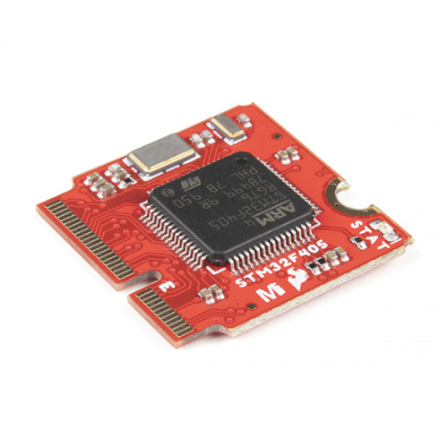

.. _sparkfun_micromod_stm32:

Sparkfun MicroMod STM32 Processor
##################################

Overview
********

The SparkFun MicroMod STM32 Processor Board is ready to rock your MicroMod world with its ARM® Cortex®-M4 32-bit RISC core! This little Processor Board provides you with an economical and easy to use development platform if you're needing more power with minimal working space. With the M.2 MicroMod connector, connecting your STM32 Processor is a breeze. Simply match up the key on your processor's beveled edge connector to the key on the M.2 connector and secure it with a screw (included with all Carrier Boards). The STM32 is one of the most powerful and economical microcontrollers available so to be able to add it to your MicroMod Carrier Board is a huge advantage for your project!

As we previously stated; the STM32F405 Processor is based on the high-performance ARM® Cortex®-M4 32-bit RISC core and can operate at a frequency of up to 168 MHz. This core features a floating point unit (FPU) single precision which supports all ARM single precision data-processing instructions and data types. It also implements a full set of DSP instructions and a memory protection unit (MPU) which enhances application security. This Processor Board utilizes the DFU bootloader for uploading code, and incorporates an extensive range of enhanced I/Os and peripherals. To complement the STM32F405 processor, we've also added an additional 128Mb (16MB) serial flash memory chip to the underside of the board.

Hardware
********

- STM32F405 Cortex M4 with FPU and 1MB Flash, 168MHz speed
- 192KB RAM total - 128 KB RAM + 64 KB program-only/cache RAM
- 16 MB SPI Flash chip
- I2C, UART, GPIO, ADCs, DACs

Supported Features
==================

The Sparkfun MicroMod STM32 Processor module supports the
following hardware features:

+-----------+------------+----------------------+
| Interface | Controller | Driver/Component     |
+===========+============+======================+
| NVIC      | on-chip    | nested vectored      |
|           |            | interrupt controller |
+-----------+------------+----------------------+
| SYSTICK   | on-chip    | system clock         |
+-----------+------------+----------------------+
| UART      | on-chip    | serial port          |
+-----------+------------+----------------------+
| GPIO      | on-chip    | gpio                 |
+-----------+------------+----------------------+
| I2C       | on-chip    | i2c                  |
+-----------+------------+----------------------+
| SPI       | on-chip    | spi                  |
+-----------+------------+----------------------+
| USB       | on-chip    | USB device           |
+-----------+------------+----------------------+

Other hardware features are not supported by the Zephyr kernel.

Connections and IOs
===================

The `MicroMod STM32 Processor Hookup Guide`_ has detailed
information about the board including pinouts and schematics.

System Clock
============

The STM32F405 is configured to use the 12MHz HSE Oscillator to produce
a 168MHz system clock.

Serial Port
===========

The STM32F405 UART 2 peripheral is available on the TX (PA2) and RX
(PA3) pins.

I2C Port
========

The STM32F405 I2C1 peripheral is available on the SDA (PB7) and SCL
(PB6) pins and I2C2 peripheral is available on SDA (PB10) and SCL(PB11).

SPI Port
========

The STM32F405 SPI1 peripheral is available on the SCK (PA5), MI
(PA6), MO (PA7) and SS (PC4) pins.

SPI3 uses SCK (PC10), MI (PC11), MO (PC12) and SS (PC3) pins and is
dedicated to the 16 MB SPI Flash chip (not mapped on device tree yet).

Programming and Debugging
*************************

DFU-Util programming is supported through Zephyr by default.

Flashing
========

#. Build the Zephyr kernel and the :ref:`blinky-sample` sample application:

   .. zephyr-app-commands::
      :zephyr-app: samples/basic/blinky
      :board: sparkfun_micromod_stm32
      :goals: build
      :compact:

#. On any of the MicroMod Baseboards, hold the boot button, press reset and release the boot button to put the device in bootloader mode.

#. Flash the image:

   .. zephyr-app-commands::
      :zephyr-app: samples/basic/blinky
      :board: sparkfun_micromod_stm32
      :goals: flash
      :compact:

   You should see the STAT LED blinking.

References
**********

.. target-notes::

.. _MicroMod STM32 Processor Hookup Guide:
    https://learn.sparkfun.com/tutorials/micromod-stm32-processor-hookup-guide/all

.. _hardware_overview:
    https://learn.sparkfun.com/tutorials/micromod-stm32-processor-hookup-guide/all#hardware-overview
