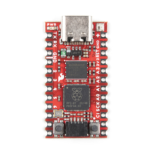

.. _sparkfun_pro_micro_rp2040:

SparkFun Pro Micro RP2040
#########################

Overview
********

The SparkFun Pro Micro RP2040 is a small, low-cost, versatile board from
SparkFun. It is equipped with an RP2040 SoC, an on-board WS2812 addressable
LED, a USB connector, and a Qwiic connector. The USB bootloader allows it
to be flashed without any adapter, in a drag-and-drop manner.

Hardware
********
- Dual core Arm Cortex-M0+ processor running up to 133MHz
- 264KB on-chip SRAM
- 16MB on-board QSPI flash with XIP capabilities
- 18 GPIO pins
- 4 Analog inputs
- 1 UART peripherals
- 1 SPI controllers
- 2 I2C controllers (one via Qwiic connector)
- 16 PWM channels
- USB 1.1 controller (host/device)
- 8 Programmable I/O (PIO) for custom peripherals
- On-board RGB LED
- 1 Watchdog timer peripheral

     SparkFun Pro Micro RP2040 (Image courtesy of SparkFun)

Supported Features
==================

The sparkfun_pro_micro_rp2040 board configuration supports the following
hardware features:

.. list-table::
   :header-rows: 1

   * - Peripheral
     - Kconfig option
     - Devicetree compatible
   * - NVIC
     - N/A
     - :dtcompatible:`arm,v6m-nvic`
   * - UART
     - :kconfig:option:`CONFIG_SERIAL`
     - :dtcompatible:`raspberrypi,pico-uart`
   * - GPIO
     - :kconfig:option:`CONFIG_GPIO`
     - :dtcompatible:`raspberrypi,pico-gpio`
   * - ADC
     - :kconfig:option:`CONFIG_ADC`
     - :dtcompatible:`raspberrypi,pico-adc`
   * - I2C
     - :kconfig:option:`CONFIG_I2C`
     - :dtcompatible:`snps,designware-i2c`
   * - SPI
     - :kconfig:option:`CONFIG_SPI`
     - :dtcompatible:`raspberrypi,pico-spi`
   * - USB Device
     - :kconfig:option:`CONFIG_USB_DEVICE_STACK`
     - :dtcompatible:`raspberrypi,pico-usbd`
   * - HWINFO
     - :kconfig:option:`CONFIG_HWINFO`
     - N/A
   * - Watchdog Timer (WDT)
     - :kconfig:option:`CONFIG_WATCHDOG`
     - :dtcompatible:`raspberrypi,pico-watchdog`
   * - PWM
     - :kconfig:option:`CONFIG_PWM`
     - :dtcompatible:`raspberrypi,pico-pwm`
   * - Flash
     - :kconfig:option:`CONFIG_FLASH`
     - :dtcompatible:`raspberrypi,pico-flash`

Pin Mapping
===========

The peripherals of the RP2040 SoC can be routed to various pins on the board.
The configuration of these routes can be modified through DTS. Please refer to
the datasheet to see the possible routings for each peripheral.

Default Zephyr Peripheral Mapping:
----------------------------------

.. rst-class:: rst-columns

- UART0_TX : P0
- UART0_RX : P1
- I2C1_SDA : P2
- I2C1_SCL : P3
- SPI0_RX : P20
- SPI0_SCK : P18
- SPI0_TX : P19

Programming and Debugging
*************************

Flashing
========

Using UF2
---------

Since it doesn't expose the SWD pins, you must flash the SparkFun Pro Micro
RP2040 with a UF2 file. By default, building an app for this board will
generate a `build/zephyr/zephyr.uf2` file. If the Pro Micro RP2040 is powered
on with the `BOOTSEL` button pressed, it will appear on the host as a mass
storage device. The UF2 file should be drag-and-dropped to the device, which
will flash the Pro Micro RP2040.

.. target-notes::

.. _Getting Started with Raspberry Pi Pico:
  https://datasheets.raspberrypi.com/pico/getting-started-with-pico.pdf

.. _Graphical Datasheet:
  https://cdn.sparkfun.com/assets/e/2/7/6/b/ProMicroRP2040_Graphical_Datasheet.pdf
