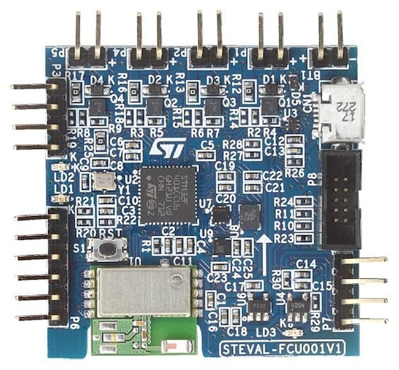

.. _steval_fcu001v1:

ST STM32 Flight Controller Unit
###############################

Overview
********

The STEVAL-FCU001V1 is a Cortex M4 MCU-based flight controller unit for toy quad-copter drones.

Hardware
********

STM32 Flight Controller Unit provides the following hardware components:

- STM32F401CC in UFQFPN48 package
- ARM |reg| 32-bit Cortex |reg|-M4 MCU with FPU
- 84MHz max MCU frequency
- VDD from 1.7 V to 3.6 V
- 256 KB FLASH
- 64 KB SRAM
- General Purpose Timers
- Watchdog Timers (2)
- On board sensors:

  - 3D Accelerometer and 3D Gyroscope: LSM6DSL
  - 3D Magnetometer: LIS2MDL
  - MEMS Pressure sensor: LPS22HD

- 2 User LEDS
- USART/UART (1)
- I2C (1)
- Bluetooth LE over SPI

More information about the STM32 Flight Controller Unit
can be found in these documents:

- `STEVAL_FCU001V1 website`_
- `STM32F401 reference manual`_
- `STM32F401CC on www.st.com`_

Supported Features
==================

The Zephyr steval_fcu001v1 board configuration supports the following hardware features:

+-----------+------------+------------------------------------+
| Interface | Controller | Driver/Component                   |
+===========+============+====================================+
| NVIC      | on-chip    | nested vector interrupt controller |
+-----------+------------+------------------------------------+
| UART      | on-chip    | serial port-polling;               |
|           |            | serial port-interrupt              |
+-----------+------------+------------------------------------+
| PINMUX    | on-chip    | pinmux                             |
+-----------+------------+------------------------------------+
| GPIO      | on-chip    | gpio                               |
+-----------+------------+------------------------------------+
| PWM       | on-chip    | pwm                                |
+-----------+------------+------------------------------------+
| I2C       | on-chip    | i2c                                |
+-----------+------------+------------------------------------+

The default configuration can be found in the defconfig file:
``boards/arm/steval_fcu001v1/steval_fcu001v1_defconfig``

Default Zephyr Peripheral Mapping:
----------------------------------

- UART_1 TX/RX : PA9/PA10
- I2C2 SCL/SDA : PB10/PB3
- PWM_2_CH1    : PA0
- LD1          : PB5
- LD2          : PB4

System Clock
============

The steval_fcu001v1 system clock can be driven by an internal or external oscillator,
as well as by the main PLL clock. By default, the system clock is driven by the PLL clock at 84MHz,
driven by a 16MHz high-speed external clock.

Serial Port
===========

The steval_fcu001v1 board has one UART. The Zephyr console output is assigned to UART1.
Default settings are 115200 8N1.

I2C
===

The steval_fcu001v1 board has one I2C. The default I2C mapping for Zephyr is:

- I2C2_SCL : PB10
- I2C2_SDA : PB3

Programming and Debugging
*************************

Applications for the ``steval_fcu001v1`` board configuration can be built and
flashed in the usual way (see :ref:`build_an_application` and
:ref:`application_run` for more details).

Flashing
========

Flashing Zephyr onto the steval_fcu001v1 board requires an external ST-LINK/V2-1 programmer.
The programmer is attached to the P8 programming header with ARM-JTAG-20-10-Plug-in Adapter.

Flashing an application to STEVAL_FCU001V1
------------------------------------------

Connect the FT232-to-USB port to host system, and RX, TX, Gnd pins to
the P7 header of the steval_fcu001v1 board.  Then run a serial host
program to connect with your steval_fcu001v1 via the FT232 board:

.. code-block:: console

   $ minicom -D /dev/ttyUSB0

Now build and flash an application. Here is an example for :ref:`hello_world`

.. zephyr-app-commands::
   :zephyr-app: samples/hello_world
   :board: steval_fcu001v1
   :goals: build flash

You should see the following message on the console:

.. code-block:: console

   Hello World! steval_fcu001v1

Debugging
=========

You can debug an application in the usual way. Here is an example for the
:ref:`hello_world` application.

.. zephyr-app-commands::
   :zephyr-app: samples/hello_world
   :board: steval_fcu001v1
   :maybe-skip-config:
   :goals: debug

.. _STEVAL_FCU001V1 website:
   https://www.st.com/en/evaluation-tools/steval-fcu001v1.html

.. _STM32F401CC on www.st.com:
   https://www.st.com/en/microcontrollers-microprocessors/stm32f401cc.html

.. _STM32F401 reference manual:
    http://www.st.com/resource/en/reference_manual/dm00096844.pdf
